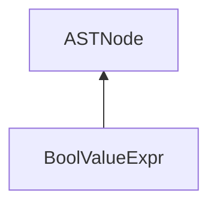

| public |
{:.api_label}

#### Inheritance Graph

## Description

[ [BoolValueExpr](classEScript_1_1AST_1_1BoolValueExpr) ]|> [ [ASTNode](classEScript_1_1AST_1_1ASTNode) ]

## Public Functions

|
| ------: | ----------------- |
|  | |
|  | **[BoolValueExpr](#classEScript_1_1AST_1_1BoolValueExpr_1a5da199b851e5d283ae01f467fb5c1056)**(bool _value, int _line) |
|  | |
|  | **[~BoolValueExpr](#classEScript_1_1AST_1_1BoolValueExpr_1a4085618ec2a8eb1d9df3867bf282bcee)**() |
|  | |
| bool | **[getValue](#classEScript_1_1AST_1_1BoolValueExpr_1a8781961ae3a4df387ef677ed7a1947f7)**() const |
{: .nohead .nowrap1 .api_section }

-------------------------------------------------------------------

## Documentation

### <small>function</small>  EScript::AST::BoolValueExpr::BoolValueExpr {#classEScript_1_1AST_1_1BoolValueExpr_1a5da199b851e5d283ae01f467fb5c1056}

| public | inline |
{:.api_label}

|
| ------: | ----------------- |
|  |
|  **[BoolValueExpr](#classEScript_1_1AST_1_1BoolValueExpr_1a5da199b851e5d283ae01f467fb5c1056)**( | bool | **_value**, |
| | int | **_line** |
|   ) |
{: .nohead .nowrap1 .api_doc }

Defined in `EScript/EScript/Compiler/AST/ValueExpr.h:22`{:style="float: right"}

-------------------------------------------------------------------

### <small>function</small>  EScript::AST::BoolValueExpr::~BoolValueExpr {#classEScript_1_1AST_1_1BoolValueExpr_1a4085618ec2a8eb1d9df3867bf282bcee}

| public | inline | virtual |
{:.api_label}

|
| ------: | ----------------- |
|  |
|  **[~BoolValueExpr](#classEScript_1_1AST_1_1BoolValueExpr_1a4085618ec2a8eb1d9df3867bf282bcee)**( |  ) |
{: .nohead .nowrap1 .api_doc }

Defined in `EScript/EScript/Compiler/AST/ValueExpr.h:24`{:style="float: right"}

-------------------------------------------------------------------

### <small>function</small>  EScript::AST::BoolValueExpr::getValue {#classEScript_1_1AST_1_1BoolValueExpr_1a8781961ae3a4df387ef677ed7a1947f7}

| public | const | inline |
{:.api_label}

|
| ------: | ----------------- |
|  |
| bool **[getValue](#classEScript_1_1AST_1_1BoolValueExpr_1a8781961ae3a4df387ef677ed7a1947f7)**( |  ) const |
{: .nohead .nowrap1 .api_doc }

Defined in `EScript/EScript/Compiler/AST/ValueExpr.h:25`{:style="float: right"}

-------------------------------------------------------------------

