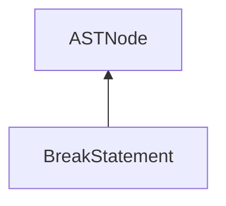

| public |
{:.api_label}

#### Inheritance Graph

## Description

[ [BreakStatement](classEScript_1_1AST_1_1BreakStatement) ]|> [ [ASTNode](classEScript_1_1AST_1_1ASTNode) ]

## Public Functions

|
| ------: | ----------------- |
|  | |
|  | **[BreakStatement](#classEScript_1_1AST_1_1BreakStatement_1a9c1c9fbb812ddf8206494cb52f7946f7)**() |
|  | |
|  | **[~BreakStatement](#classEScript_1_1AST_1_1BreakStatement_1aac4399141e1150d6cdacc52f65998abb)**() |
{: .nohead .nowrap1 .api_section }

-------------------------------------------------------------------

## Documentation

### <small>function</small>  EScript::AST::BreakStatement::BreakStatement {#classEScript_1_1AST_1_1BreakStatement_1a9c1c9fbb812ddf8206494cb52f7946f7}

| public | inline |
{:.api_label}

|
| ------: | ----------------- |
|  |
|  **[BreakStatement](#classEScript_1_1AST_1_1BreakStatement_1a9c1c9fbb812ddf8206494cb52f7946f7)**( |  ) |
{: .nohead .nowrap1 .api_doc }

Defined in `EScript/EScript/Compiler/AST/ControlStatements.h:21`{:style="float: right"}

-------------------------------------------------------------------

### <small>function</small>  EScript::AST::BreakStatement::~BreakStatement {#classEScript_1_1AST_1_1BreakStatement_1aac4399141e1150d6cdacc52f65998abb}

| public | inline | virtual |
{:.api_label}

|
| ------: | ----------------- |
|  |
|  **[~BreakStatement](#classEScript_1_1AST_1_1BreakStatement_1aac4399141e1150d6cdacc52f65998abb)**( |  ) |
{: .nohead .nowrap1 .api_doc }

Defined in `EScript/EScript/Compiler/AST/ControlStatements.h:22`{:style="float: right"}

-------------------------------------------------------------------

