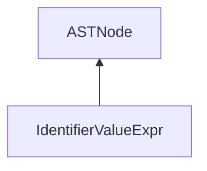

| public |
{:.api_label}

#### Inheritance Graph

## Description

[ [IdentifierValueExpr](classEScript_1_1AST_1_1IdentifierValueExpr) ]|> [ [ASTNode](classEScript_1_1AST_1_1ASTNode) ]

## Public Functions

|
| ------: | ----------------- |
|  | |
|  | **[IdentifierValueExpr](#classEScript_1_1AST_1_1IdentifierValueExpr_1a311b5a00a319f710a2ff3cda64920db0)**(const [StringId](classEScript_1_1StringId) & _value, int _line) |
|  | |
|  | **[~IdentifierValueExpr](#classEScript_1_1AST_1_1IdentifierValueExpr_1a77070bbf6237ceec372dd1db114a13df)**() |
|  | |
| const [StringId](classEScript_1_1StringId) & | **[getValue](#classEScript_1_1AST_1_1IdentifierValueExpr_1a47a2476234ede176471949bb16220b0b)**() const |
{: .nohead .nowrap1 .api_section }

-------------------------------------------------------------------

## Documentation

### <small>function</small>  EScript::AST::IdentifierValueExpr::IdentifierValueExpr {#classEScript_1_1AST_1_1IdentifierValueExpr_1a311b5a00a319f710a2ff3cda64920db0}

| public | inline |
{:.api_label}

|
| ------: | ----------------- |
|  |
|  **[IdentifierValueExpr](#classEScript_1_1AST_1_1IdentifierValueExpr_1a311b5a00a319f710a2ff3cda64920db0)**( | const [StringId](classEScript_1_1StringId) & | **_value**, |
| | int | **_line** |
|   ) |
{: .nohead .nowrap1 .api_doc }

Defined in `EScript/EScript/Compiler/AST/ValueExpr.h:33`{:style="float: right"}

-------------------------------------------------------------------

### <small>function</small>  EScript::AST::IdentifierValueExpr::~IdentifierValueExpr {#classEScript_1_1AST_1_1IdentifierValueExpr_1a77070bbf6237ceec372dd1db114a13df}

| public | inline | virtual |
{:.api_label}

|
| ------: | ----------------- |
|  |
|  **[~IdentifierValueExpr](#classEScript_1_1AST_1_1IdentifierValueExpr_1a77070bbf6237ceec372dd1db114a13df)**( |  ) |
{: .nohead .nowrap1 .api_doc }

Defined in `EScript/EScript/Compiler/AST/ValueExpr.h:35`{:style="float: right"}

-------------------------------------------------------------------

### <small>function</small>  EScript::AST::IdentifierValueExpr::getValue {#classEScript_1_1AST_1_1IdentifierValueExpr_1a47a2476234ede176471949bb16220b0b}

| public | const | inline |
{:.api_label}

|
| ------: | ----------------- |
|  |
| const [StringId](classEScript_1_1StringId) & **[getValue](#classEScript_1_1AST_1_1IdentifierValueExpr_1a47a2476234ede176471949bb16220b0b)**( |  ) const |
{: .nohead .nowrap1 .api_doc }

Defined in `EScript/EScript/Compiler/AST/ValueExpr.h:36`{:style="float: right"}

-------------------------------------------------------------------

