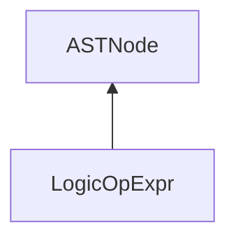

| public |
{:.api_label}

#### Inheritance Graph

## Description

[ [LogicOpExpr](classEScript_1_1AST_1_1LogicOpExpr) ]|> [ [ASTNode](classEScript_1_1AST_1_1ASTNode) ]

## Public Types

|
| ------: | ----------------- |
|  | |
| enum | **[opType_T](#classEScript_1_1AST_1_1LogicOpExpr_1a5ca9afe0b86c5bbaa0d9011ac4b04afb)** {OR, AND, NOT} |
{: .nohead .nowrap1 .api_section }

## Public Static Functions

|
| ------: | ----------------- |
|  | |
| [LogicOpExpr](classEScript_1_1AST_1_1LogicOpExpr) * | **[createAnd](#classEScript_1_1AST_1_1LogicOpExpr_1a6d0e2ca99fe288261a5e339621e34ca0)**( [ptr_t](classEScript_1_1AST_1_1ASTNode#classEScript_1_1AST_1_1ASTNode_1a3b66b4450e328f61c873204f6e4183a5)  _left,  [ptr_t](classEScript_1_1AST_1_1ASTNode#classEScript_1_1AST_1_1ASTNode_1a3b66b4450e328f61c873204f6e4183a5)  _right) |
|  | |
| [LogicOpExpr](classEScript_1_1AST_1_1LogicOpExpr) * | **[createNot](#classEScript_1_1AST_1_1LogicOpExpr_1ac1ff8ded34c282044d0b6fcb4dd98cae)**( [ptr_t](classEScript_1_1AST_1_1ASTNode#classEScript_1_1AST_1_1ASTNode_1a3b66b4450e328f61c873204f6e4183a5)  expr) |
|  | |
| [LogicOpExpr](classEScript_1_1AST_1_1LogicOpExpr) * | **[createOr](#classEScript_1_1AST_1_1LogicOpExpr_1a32995226e9d6a4a2ac47c2982e5ff5a5)**( [ptr_t](classEScript_1_1AST_1_1ASTNode#classEScript_1_1AST_1_1ASTNode_1a3b66b4450e328f61c873204f6e4183a5)  _left,  [ptr_t](classEScript_1_1AST_1_1ASTNode#classEScript_1_1AST_1_1ASTNode_1a3b66b4450e328f61c873204f6e4183a5)  _right) |
{: .nohead .nowrap1 .api_section }

## Public Functions

|
| ------: | ----------------- |
|  | |
|  | **[~LogicOpExpr](#classEScript_1_1AST_1_1LogicOpExpr_1a1fcd414d53e2bd6d555f2027269efcca)**() |
|  | |
| [ptr_t](classEScript_1_1AST_1_1ASTNode#classEScript_1_1AST_1_1ASTNode_1a3b66b4450e328f61c873204f6e4183a5) | **[getLeft](#classEScript_1_1AST_1_1LogicOpExpr_1a76fd22043ace648943a9b6098da8aff4)**() const |
|  | |
| [ptr_t](classEScript_1_1AST_1_1ASTNode#classEScript_1_1AST_1_1ASTNode_1a3b66b4450e328f61c873204f6e4183a5) | **[getRight](#classEScript_1_1AST_1_1LogicOpExpr_1ada73910de6cf0b5327e858abc544aaa8)**() const |
|  | |
| [opType_T](classEScript_1_1AST_1_1LogicOpExpr#classEScript_1_1AST_1_1LogicOpExpr_1a5ca9afe0b86c5bbaa0d9011ac4b04afb) | **[getOperator](#classEScript_1_1AST_1_1LogicOpExpr_1a0c1c696b06a91c580658c0ebb35c6c87)**() const |
{: .nohead .nowrap1 .api_section }

-------------------------------------------------------------------

## Documentation

### <small>enum</small>  EScript::AST::LogicOpExpr::opType_T {#classEScript_1_1AST_1_1LogicOpExpr_1a5ca9afe0b86c5bbaa0d9011ac4b04afb}

| public |
{:.api_label}

|
| ------: | ----------------- |
|  |
| enum **[opType_T](#classEScript_1_1AST_1_1LogicOpExpr_1a5ca9afe0b86c5bbaa0d9011ac4b04afb)** |
{: .nohead .nowrap1 .api_doc }

| Enumerator |  | Description | 
| ---------- | -- | ----------- | 
| Enumerator |  | Description | 
| OR         |  |             | 
| AND        |  |             | 
| NOT        |  |             | 

Defined in `EScript/EScript/Compiler/AST/LogicOpExpr.h:22`{:style="float: right"}

-------------------------------------------------------------------

### <small>function</small>  EScript::AST::LogicOpExpr::createAnd {#classEScript_1_1AST_1_1LogicOpExpr_1a6d0e2ca99fe288261a5e339621e34ca0}

| public | static | inline |
{:.api_label}

|
| ------: | ----------------- |
|  |
| [LogicOpExpr](classEScript_1_1AST_1_1LogicOpExpr) * **[createAnd](#classEScript_1_1AST_1_1LogicOpExpr_1a6d0e2ca99fe288261a5e339621e34ca0)**( |  [ptr_t](classEScript_1_1AST_1_1ASTNode#classEScript_1_1AST_1_1ASTNode_1a3b66b4450e328f61c873204f6e4183a5)  | **_left**, |
| |  [ptr_t](classEScript_1_1AST_1_1ASTNode#classEScript_1_1AST_1_1ASTNode_1a3b66b4450e328f61c873204f6e4183a5)  | **_right** |
|   ) |
{: .nohead .nowrap1 .api_doc }

Defined in `EScript/EScript/Compiler/AST/LogicOpExpr.h:24`{:style="float: right"}

-------------------------------------------------------------------

### <small>function</small>  EScript::AST::LogicOpExpr::createNot {#classEScript_1_1AST_1_1LogicOpExpr_1ac1ff8ded34c282044d0b6fcb4dd98cae}

| public | static | inline |
{:.api_label}

|
| ------: | ----------------- |
|  |
| [LogicOpExpr](classEScript_1_1AST_1_1LogicOpExpr) * **[createNot](#classEScript_1_1AST_1_1LogicOpExpr_1ac1ff8ded34c282044d0b6fcb4dd98cae)**( |  [ptr_t](classEScript_1_1AST_1_1ASTNode#classEScript_1_1AST_1_1ASTNode_1a3b66b4450e328f61c873204f6e4183a5)  | **expr** ) |
{: .nohead .nowrap1 .api_doc }

Defined in `EScript/EScript/Compiler/AST/LogicOpExpr.h:25`{:style="float: right"}

-------------------------------------------------------------------

### <small>function</small>  EScript::AST::LogicOpExpr::createOr {#classEScript_1_1AST_1_1LogicOpExpr_1a32995226e9d6a4a2ac47c2982e5ff5a5}

| public | static | inline |
{:.api_label}

|
| ------: | ----------------- |
|  |
| [LogicOpExpr](classEScript_1_1AST_1_1LogicOpExpr) * **[createOr](#classEScript_1_1AST_1_1LogicOpExpr_1a32995226e9d6a4a2ac47c2982e5ff5a5)**( |  [ptr_t](classEScript_1_1AST_1_1ASTNode#classEScript_1_1AST_1_1ASTNode_1a3b66b4450e328f61c873204f6e4183a5)  | **_left**, |
| |  [ptr_t](classEScript_1_1AST_1_1ASTNode#classEScript_1_1AST_1_1ASTNode_1a3b66b4450e328f61c873204f6e4183a5)  | **_right** |
|   ) |
{: .nohead .nowrap1 .api_doc }

Defined in `EScript/EScript/Compiler/AST/LogicOpExpr.h:26`{:style="float: right"}

-------------------------------------------------------------------

### <small>function</small>  EScript::AST::LogicOpExpr::~LogicOpExpr {#classEScript_1_1AST_1_1LogicOpExpr_1a1fcd414d53e2bd6d555f2027269efcca}

| public | inline | virtual |
{:.api_label}

|
| ------: | ----------------- |
|  |
|  **[~LogicOpExpr](#classEScript_1_1AST_1_1LogicOpExpr_1a1fcd414d53e2bd6d555f2027269efcca)**( |  ) |
{: .nohead .nowrap1 .api_doc }

Defined in `EScript/EScript/Compiler/AST/LogicOpExpr.h:28`{:style="float: right"}

-------------------------------------------------------------------

### <small>function</small>  EScript::AST::LogicOpExpr::getLeft {#classEScript_1_1AST_1_1LogicOpExpr_1a76fd22043ace648943a9b6098da8aff4}

| public | const | inline |
{:.api_label}

|
| ------: | ----------------- |
|  |
| [ptr_t](classEScript_1_1AST_1_1ASTNode#classEScript_1_1AST_1_1ASTNode_1a3b66b4450e328f61c873204f6e4183a5) **[getLeft](#classEScript_1_1AST_1_1LogicOpExpr_1a76fd22043ace648943a9b6098da8aff4)**( |  ) const |
{: .nohead .nowrap1 .api_doc }

Defined in `EScript/EScript/Compiler/AST/LogicOpExpr.h:30`{:style="float: right"}

-------------------------------------------------------------------

### <small>function</small>  EScript::AST::LogicOpExpr::getRight {#classEScript_1_1AST_1_1LogicOpExpr_1ada73910de6cf0b5327e858abc544aaa8}

| public | const | inline |
{:.api_label}

|
| ------: | ----------------- |
|  |
| [ptr_t](classEScript_1_1AST_1_1ASTNode#classEScript_1_1AST_1_1ASTNode_1a3b66b4450e328f61c873204f6e4183a5) **[getRight](#classEScript_1_1AST_1_1LogicOpExpr_1ada73910de6cf0b5327e858abc544aaa8)**( |  ) const |
{: .nohead .nowrap1 .api_doc }

Defined in `EScript/EScript/Compiler/AST/LogicOpExpr.h:31`{:style="float: right"}

-------------------------------------------------------------------

### <small>function</small>  EScript::AST::LogicOpExpr::getOperator {#classEScript_1_1AST_1_1LogicOpExpr_1a0c1c696b06a91c580658c0ebb35c6c87}

| public | const | inline |
{:.api_label}

|
| ------: | ----------------- |
|  |
| [opType_T](classEScript_1_1AST_1_1LogicOpExpr#classEScript_1_1AST_1_1LogicOpExpr_1a5ca9afe0b86c5bbaa0d9011ac4b04afb) **[getOperator](#classEScript_1_1AST_1_1LogicOpExpr_1a0c1c696b06a91c580658c0ebb35c6c87)**( |  ) const |
{: .nohead .nowrap1 .api_doc }

Defined in `EScript/EScript/Compiler/AST/LogicOpExpr.h:32`{:style="float: right"}

-------------------------------------------------------------------

