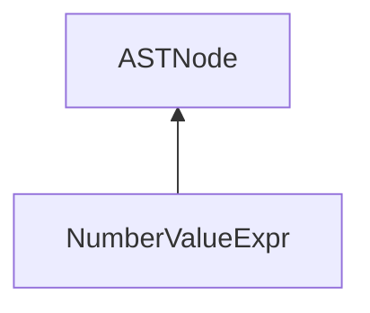

| public |
{:.api_label}

#### Inheritance Graph

## Description

[ [NumberValueExpr](classEScript_1_1AST_1_1NumberValueExpr) ]|> [ [ASTNode](classEScript_1_1AST_1_1ASTNode) ]

## Public Functions

|
| ------: | ----------------- |
|  | |
|  | **[NumberValueExpr](#classEScript_1_1AST_1_1NumberValueExpr_1a34aa8e82251a5458559597a4b5c6a118)**(double _value, int _line) |
|  | |
|  | **[~NumberValueExpr](#classEScript_1_1AST_1_1NumberValueExpr_1aee06839117d774a3a84ca02b3d2fc3e9)**() |
|  | |
| double | **[getValue](#classEScript_1_1AST_1_1NumberValueExpr_1a3c0c3496f27912e09acfb92d88b48697)**() const |
|  | |
| void | **[setValue](#classEScript_1_1AST_1_1NumberValueExpr_1ae8cd5031f79e94da1f28888e3f3d825d)**(const double & v) |
{: .nohead .nowrap1 .api_section }

-------------------------------------------------------------------

## Documentation

### <small>function</small>  EScript::AST::NumberValueExpr::NumberValueExpr {#classEScript_1_1AST_1_1NumberValueExpr_1a34aa8e82251a5458559597a4b5c6a118}

| public | inline |
{:.api_label}

|
| ------: | ----------------- |
|  |
|  **[NumberValueExpr](#classEScript_1_1AST_1_1NumberValueExpr_1a34aa8e82251a5458559597a4b5c6a118)**( | double | **_value**, |
| | int | **_line** |
|   ) |
{: .nohead .nowrap1 .api_doc }

Defined in `EScript/EScript/Compiler/AST/ValueExpr.h:44`{:style="float: right"}

-------------------------------------------------------------------

### <small>function</small>  EScript::AST::NumberValueExpr::~NumberValueExpr {#classEScript_1_1AST_1_1NumberValueExpr_1aee06839117d774a3a84ca02b3d2fc3e9}

| public | inline | virtual |
{:.api_label}

|
| ------: | ----------------- |
|  |
|  **[~NumberValueExpr](#classEScript_1_1AST_1_1NumberValueExpr_1aee06839117d774a3a84ca02b3d2fc3e9)**( |  ) |
{: .nohead .nowrap1 .api_doc }

Defined in `EScript/EScript/Compiler/AST/ValueExpr.h:46`{:style="float: right"}

-------------------------------------------------------------------

### <small>function</small>  EScript::AST::NumberValueExpr::getValue {#classEScript_1_1AST_1_1NumberValueExpr_1a3c0c3496f27912e09acfb92d88b48697}

| public | const | inline |
{:.api_label}

|
| ------: | ----------------- |
|  |
| double **[getValue](#classEScript_1_1AST_1_1NumberValueExpr_1a3c0c3496f27912e09acfb92d88b48697)**( |  ) const |
{: .nohead .nowrap1 .api_doc }

Defined in `EScript/EScript/Compiler/AST/ValueExpr.h:47`{:style="float: right"}

-------------------------------------------------------------------

### <small>function</small>  EScript::AST::NumberValueExpr::setValue {#classEScript_1_1AST_1_1NumberValueExpr_1ae8cd5031f79e94da1f28888e3f3d825d}

| public | inline |
{:.api_label}

|
| ------: | ----------------- |
|  |
| void **[setValue](#classEScript_1_1AST_1_1NumberValueExpr_1ae8cd5031f79e94da1f28888e3f3d825d)**( | const double & | **v** ) |
{: .nohead .nowrap1 .api_doc }

Defined in `EScript/EScript/Compiler/AST/ValueExpr.h:48`{:style="float: right"}

-------------------------------------------------------------------

