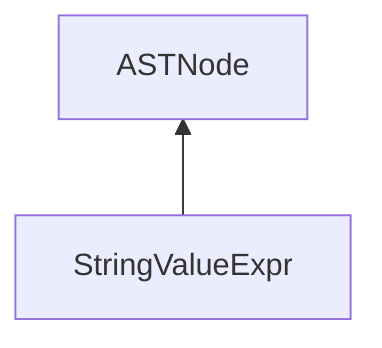

| public |
{:.api_label}

#### Inheritance Graph

## Description

[ [StringValueExpr](classEScript_1_1AST_1_1StringValueExpr) ]|> [ [ASTNode](classEScript_1_1AST_1_1ASTNode) ]

## Public Functions

|
| ------: | ----------------- |
|  | |
|  | **[StringValueExpr](#classEScript_1_1AST_1_1StringValueExpr_1aaa2c1bfd83d3b0ad1ce2b90aa559b809)**(const std::string & _value, int _line) |
|  | |
|  | **[~StringValueExpr](#classEScript_1_1AST_1_1StringValueExpr_1a7a3c2a82c51f0403694c687ad744b7be)**() |
|  | |
| const std::string & | **[getValue](#classEScript_1_1AST_1_1StringValueExpr_1a975ea72fdc7501c1fcf4229d861ade4f)**() const |
{: .nohead .nowrap1 .api_section }

-------------------------------------------------------------------

## Documentation

### <small>function</small>  EScript::AST::StringValueExpr::StringValueExpr {#classEScript_1_1AST_1_1StringValueExpr_1aaa2c1bfd83d3b0ad1ce2b90aa559b809}

| public | inline |
{:.api_label}

|
| ------: | ----------------- |
|  |
|  **[StringValueExpr](#classEScript_1_1AST_1_1StringValueExpr_1aaa2c1bfd83d3b0ad1ce2b90aa559b809)**( | const std::string & | **_value**, |
| | int | **_line** |
|   ) |
{: .nohead .nowrap1 .api_doc }

Defined in `EScript/EScript/Compiler/AST/ValueExpr.h:56`{:style="float: right"}

-------------------------------------------------------------------

### <small>function</small>  EScript::AST::StringValueExpr::~StringValueExpr {#classEScript_1_1AST_1_1StringValueExpr_1a7a3c2a82c51f0403694c687ad744b7be}

| public | inline | virtual |
{:.api_label}

|
| ------: | ----------------- |
|  |
|  **[~StringValueExpr](#classEScript_1_1AST_1_1StringValueExpr_1a7a3c2a82c51f0403694c687ad744b7be)**( |  ) |
{: .nohead .nowrap1 .api_doc }

Defined in `EScript/EScript/Compiler/AST/ValueExpr.h:58`{:style="float: right"}

-------------------------------------------------------------------

### <small>function</small>  EScript::AST::StringValueExpr::getValue {#classEScript_1_1AST_1_1StringValueExpr_1a975ea72fdc7501c1fcf4229d861ade4f}

| public | const | inline |
{:.api_label}

|
| ------: | ----------------- |
|  |
| const std::string & **[getValue](#classEScript_1_1AST_1_1StringValueExpr_1a975ea72fdc7501c1fcf4229d861ade4f)**( |  ) const |
{: .nohead .nowrap1 .api_doc }

Defined in `EScript/EScript/Compiler/AST/ValueExpr.h:59`{:style="float: right"}

-------------------------------------------------------------------

