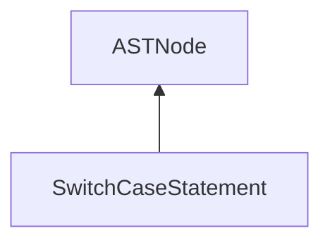

| public |
{:.api_label}

#### Inheritance Graph

## Description

[ [SwitchCaseStatement](classEScript_1_1AST_1_1SwitchCaseStatement) ]|> [ [ASTNode](classEScript_1_1AST_1_1ASTNode) ]

## Public Types

|
| ------: | ----------------- |
|  | |
| typedef std::vector< std::pair< size_t, [ERef](classEScript_1_1ERef) < [AST::ASTNode](classEScript_1_1AST_1_1ASTNode) > > > | **[caseInfoVector_t](#classEScript_1_1AST_1_1SwitchCaseStatement_1a9c0db708035e6632b7440a13ec0c3c9f)**    [ (statementIndex,conditionExpr)* ] |
{: .nohead .nowrap1 .api_section }

## Public Functions

|
| ------: | ----------------- |
|  | |
|  | **[SwitchCaseStatement](#classEScript_1_1AST_1_1SwitchCaseStatement_1af1e4b1808cfeefab8ca12d30adf64748)**( [ptr_t](classEScript_1_1AST_1_1ASTNode#classEScript_1_1AST_1_1ASTNode_1a3b66b4450e328f61c873204f6e4183a5)  _decisionExpr,  [Block](classEScript_1_1AST_1_1Block) * _block,  [caseInfoVector_t](classEScript_1_1AST_1_1SwitchCaseStatement#classEScript_1_1AST_1_1SwitchCaseStatement_1a9c0db708035e6632b7440a13ec0c3c9f) && _caseInfos) |
|  | |
|  | **[~SwitchCaseStatement](#classEScript_1_1AST_1_1SwitchCaseStatement_1a2cca656d1596b5af5e7ebe7718056687)**() |
|  | |
| [ptr_t](classEScript_1_1AST_1_1ASTNode#classEScript_1_1AST_1_1ASTNode_1a3b66b4450e328f61c873204f6e4183a5) | **[getDecisionExpression](#classEScript_1_1AST_1_1SwitchCaseStatement_1af5582ab4f17d2a1d76df210307debb82)**() const |
|  | |
| [Block](classEScript_1_1AST_1_1Block) * | **[getBlock](#classEScript_1_1AST_1_1SwitchCaseStatement_1a31aca769982265d6c5313c5d75f202e4)**() const |
|  | |
| const [caseInfoVector_t](classEScript_1_1AST_1_1SwitchCaseStatement#classEScript_1_1AST_1_1SwitchCaseStatement_1a9c0db708035e6632b7440a13ec0c3c9f) & | **[getCaseInfos](#classEScript_1_1AST_1_1SwitchCaseStatement_1a30708dcf2611ea7b765641fdc53c04cb)**() const |
{: .nohead .nowrap1 .api_section }

-------------------------------------------------------------------

## Documentation

### <small>typedef</small>  EScript::AST::SwitchCaseStatement::caseInfoVector_t {#classEScript_1_1AST_1_1SwitchCaseStatement_1a9c0db708035e6632b7440a13ec0c3c9f}

| public |
{:.api_label}

|
| ------: | ----------------- |
|  |
| typedef std::vector< std::pair< size_t, [ERef](classEScript_1_1ERef) < [AST::ASTNode](classEScript_1_1AST_1_1ASTNode) > > > **[caseInfoVector_t](#classEScript_1_1AST_1_1SwitchCaseStatement_1a9c0db708035e6632b7440a13ec0c3c9f)**  |
{: .nohead .nowrap1 .api_doc }

[ (statementIndex,conditionExpr)* ]

Defined in `EScript/EScript/Compiler/AST/SwitchCaseStatement.h:22`{:style="float: right"}

-------------------------------------------------------------------

### <small>function</small>  EScript::AST::SwitchCaseStatement::SwitchCaseStatement {#classEScript_1_1AST_1_1SwitchCaseStatement_1af1e4b1808cfeefab8ca12d30adf64748}

| public | inline |
{:.api_label}

|
| ------: | ----------------- |
|  |
|  **[SwitchCaseStatement](#classEScript_1_1AST_1_1SwitchCaseStatement_1af1e4b1808cfeefab8ca12d30adf64748)**( |  [ptr_t](classEScript_1_1AST_1_1ASTNode#classEScript_1_1AST_1_1ASTNode_1a3b66b4450e328f61c873204f6e4183a5)  | **_decisionExpr**, |
| |  [Block](classEScript_1_1AST_1_1Block) * | **_block**, |
| |  [caseInfoVector_t](classEScript_1_1AST_1_1SwitchCaseStatement#classEScript_1_1AST_1_1SwitchCaseStatement_1a9c0db708035e6632b7440a13ec0c3c9f) && | **_caseInfos** |
|   ) |
{: .nohead .nowrap1 .api_doc }

Defined in `EScript/EScript/Compiler/AST/SwitchCaseStatement.h:23`{:style="float: right"}

-------------------------------------------------------------------

### <small>function</small>  EScript::AST::SwitchCaseStatement::~SwitchCaseStatement {#classEScript_1_1AST_1_1SwitchCaseStatement_1a2cca656d1596b5af5e7ebe7718056687}

| public | inline | virtual |
{:.api_label}

|
| ------: | ----------------- |
|  |
|  **[~SwitchCaseStatement](#classEScript_1_1AST_1_1SwitchCaseStatement_1a2cca656d1596b5af5e7ebe7718056687)**( |  ) |
{: .nohead .nowrap1 .api_doc }

Defined in `EScript/EScript/Compiler/AST/SwitchCaseStatement.h:29`{:style="float: right"}

-------------------------------------------------------------------

### <small>function</small>  EScript::AST::SwitchCaseStatement::getDecisionExpression {#classEScript_1_1AST_1_1SwitchCaseStatement_1af5582ab4f17d2a1d76df210307debb82}

| public | const | inline |
{:.api_label}

|
| ------: | ----------------- |
|  |
| [ptr_t](classEScript_1_1AST_1_1ASTNode#classEScript_1_1AST_1_1ASTNode_1a3b66b4450e328f61c873204f6e4183a5) **[getDecisionExpression](#classEScript_1_1AST_1_1SwitchCaseStatement_1af5582ab4f17d2a1d76df210307debb82)**( |  ) const |
{: .nohead .nowrap1 .api_doc }

Defined in `EScript/EScript/Compiler/AST/SwitchCaseStatement.h:31`{:style="float: right"}

-------------------------------------------------------------------

### <small>function</small>  EScript::AST::SwitchCaseStatement::getBlock {#classEScript_1_1AST_1_1SwitchCaseStatement_1a31aca769982265d6c5313c5d75f202e4}

| public | const | inline |
{:.api_label}

|
| ------: | ----------------- |
|  |
| [Block](classEScript_1_1AST_1_1Block) * **[getBlock](#classEScript_1_1AST_1_1SwitchCaseStatement_1a31aca769982265d6c5313c5d75f202e4)**( |  ) const |
{: .nohead .nowrap1 .api_doc }

Defined in `EScript/EScript/Compiler/AST/SwitchCaseStatement.h:32`{:style="float: right"}

-------------------------------------------------------------------

### <small>function</small>  EScript::AST::SwitchCaseStatement::getCaseInfos {#classEScript_1_1AST_1_1SwitchCaseStatement_1a30708dcf2611ea7b765641fdc53c04cb}

| public | const | inline |
{:.api_label}

|
| ------: | ----------------- |
|  |
| const [caseInfoVector_t](classEScript_1_1AST_1_1SwitchCaseStatement#classEScript_1_1AST_1_1SwitchCaseStatement_1a9c0db708035e6632b7440a13ec0c3c9f) & **[getCaseInfos](#classEScript_1_1AST_1_1SwitchCaseStatement_1a30708dcf2611ea7b765641fdc53c04cb)**( |  ) const |
{: .nohead .nowrap1 .api_doc }

Defined in `EScript/EScript/Compiler/AST/SwitchCaseStatement.h:33`{:style="float: right"}

-------------------------------------------------------------------

