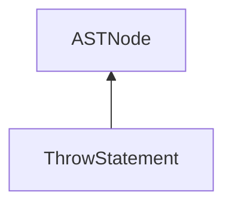

| public |
{:.api_label}

#### Inheritance Graph

## Description

[ [ThrowStatement](classEScript_1_1AST_1_1ThrowStatement) ]|> [ [ASTNode](classEScript_1_1AST_1_1ASTNode) ]

## Public Functions

|
| ------: | ----------------- |
|  | |
|  | **[ThrowStatement](#classEScript_1_1AST_1_1ThrowStatement_1ace316b06002a4fba75333dd94fd5f160)**( [ptr_t](classEScript_1_1AST_1_1ASTNode#classEScript_1_1AST_1_1ASTNode_1a3b66b4450e328f61c873204f6e4183a5)  _valueExpr) |
|  | |
|  | **[~ThrowStatement](#classEScript_1_1AST_1_1ThrowStatement_1a05aed9a027965bcd604d3a13d7859024)**() |
|  | |
| [ptr_t](classEScript_1_1AST_1_1ASTNode#classEScript_1_1AST_1_1ASTNode_1a3b66b4450e328f61c873204f6e4183a5) | **[getValueExpression](#classEScript_1_1AST_1_1ThrowStatement_1a08be9805419acf2e50944be2014c3aba)**() |
{: .nohead .nowrap1 .api_section }

-------------------------------------------------------------------

## Documentation

### <small>function</small>  EScript::AST::ThrowStatement::ThrowStatement {#classEScript_1_1AST_1_1ThrowStatement_1ace316b06002a4fba75333dd94fd5f160}

| public | inline |
{:.api_label}

|
| ------: | ----------------- |
|  |
|  **[ThrowStatement](#classEScript_1_1AST_1_1ThrowStatement_1ace316b06002a4fba75333dd94fd5f160)**( |  [ptr_t](classEScript_1_1AST_1_1ASTNode#classEScript_1_1AST_1_1ASTNode_1a3b66b4450e328f61c873204f6e4183a5)  | **_valueExpr** ) |
{: .nohead .nowrap1 .api_doc }

Defined in `EScript/EScript/Compiler/AST/ControlStatements.h:58`{:style="float: right"}

-------------------------------------------------------------------

### <small>function</small>  EScript::AST::ThrowStatement::~ThrowStatement {#classEScript_1_1AST_1_1ThrowStatement_1a05aed9a027965bcd604d3a13d7859024}

| public | inline | virtual |
{:.api_label}

|
| ------: | ----------------- |
|  |
|  **[~ThrowStatement](#classEScript_1_1AST_1_1ThrowStatement_1a05aed9a027965bcd604d3a13d7859024)**( |  ) |
{: .nohead .nowrap1 .api_doc }

Defined in `EScript/EScript/Compiler/AST/ControlStatements.h:59`{:style="float: right"}

-------------------------------------------------------------------

### <small>function</small>  EScript::AST::ThrowStatement::getValueExpression {#classEScript_1_1AST_1_1ThrowStatement_1a08be9805419acf2e50944be2014c3aba}

| public | inline |
{:.api_label}

|
| ------: | ----------------- |
|  |
| [ptr_t](classEScript_1_1AST_1_1ASTNode#classEScript_1_1AST_1_1ASTNode_1a3b66b4450e328f61c873204f6e4183a5) **[getValueExpression](#classEScript_1_1AST_1_1ThrowStatement_1a08be9805419acf2e50944be2014c3aba)**( |  ) |
{: .nohead .nowrap1 .api_doc }

Defined in `EScript/EScript/Compiler/AST/ControlStatements.h:60`{:style="float: right"}

-------------------------------------------------------------------

