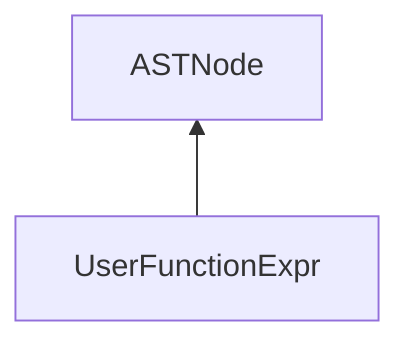

| public |
{:.api_label}

#### Inheritance Graph

## Description

[ [UserFunctionExpr](classEScript_1_1AST_1_1UserFunctionExpr) ]|> [ [ExtObject](classEScript_1_1ExtObject) ]

## Classes

|
| ----- | ----------------------------------------------------------------------------------------------------------------------------------------------------------------------------- | 
| class | [EScript::AST::UserFunctionExpr::Parameter](classEScript_1_1AST_1_1UserFunctionExpr_1_1Parameter)   [ [Parameter](classEScript_1_1AST_1_1UserFunctionExpr_1_1Parameter) ] | 
{: .nohead }

## Parameter

|
| ------: | ----------------- |
|  | |
| typedef std::vector< [Parameter](classEScript_1_1AST_1_1UserFunctionExpr_1_1Parameter) > | **[parameterList_t](#classEScript_1_1AST_1_1UserFunctionExpr_1a548fca4d605a663d1db2cea6fdb466be)**  |
{: .nohead .nowrap1 .api_section }

## Main

|
| ------: | ----------------- |
|  | |
|  | **[UserFunctionExpr](#classEScript_1_1AST_1_1UserFunctionExpr_1adef5ccbb06c11e50cbda0a2eacc81948)**( [Block](classEScript_1_1AST_1_1Block) * block, const [refArray_t](classEScript_1_1AST_1_1ASTNode#classEScript_1_1AST_1_1ASTNode_1a58bb954e7423bffee86185de70bcfb36) & _sConstrExpressions, int line) |
|  | |
|  | **[~UserFunctionExpr](#classEScript_1_1AST_1_1UserFunctionExpr_1a11b113fe0d654f2401de4e45a5271af4)**() |
|  | |
| [Block](classEScript_1_1AST_1_1Block) * | **[getBlock](#classEScript_1_1AST_1_1UserFunctionExpr_1afee533886d24374b893063161a7d3045)**() const |
|  | |
| const [CodeFragment](classEScript_1_1CodeFragment) & | **[getCode](#classEScript_1_1AST_1_1UserFunctionExpr_1ab59398348f86df726f981696fe4ee3ed)**() const |
|  | |
| const [parameterList_t](classEScript_1_1AST_1_1UserFunctionExpr#classEScript_1_1AST_1_1UserFunctionExpr_1a548fca4d605a663d1db2cea6fdb466be) & | **[getParamList](#classEScript_1_1AST_1_1UserFunctionExpr_1aeb1b218134b1f8bed724c98a451c07c1)**() const |
|  | |
| void | **[emplaceParameterExpressions](#classEScript_1_1AST_1_1UserFunctionExpr_1a5a497a7beed1a3cac7b7fd05c2330a79)**( [parameterList_t](classEScript_1_1AST_1_1UserFunctionExpr#classEScript_1_1AST_1_1UserFunctionExpr_1a548fca4d605a663d1db2cea6fdb466be) && _params) |
|  | |
| [refArray_t](classEScript_1_1AST_1_1ASTNode#classEScript_1_1AST_1_1ASTNode_1a58bb954e7423bffee86185de70bcfb36) & | **[getSConstructorExpressions](#classEScript_1_1AST_1_1UserFunctionExpr_1acd2d2cf183b1b55e28fcf0b7e237aaa8)**() |
|  | |
| const [refArray_t](classEScript_1_1AST_1_1ASTNode#classEScript_1_1AST_1_1ASTNode_1a58bb954e7423bffee86185de70bcfb36) & | **[getSConstructorExpressions](#classEScript_1_1AST_1_1UserFunctionExpr_1a4aed579a22660e211fa5d422cefaec70)**() const |
|  | |
| void | **[setCode](#classEScript_1_1AST_1_1UserFunctionExpr_1a1453d370b5a03c1c7f8592e1215ffa35)**(const [CodeFragment](classEScript_1_1CodeFragment) & _code) |
{: .nohead .nowrap1 .api_section }

-------------------------------------------------------------------

## Documentation

### <small>typedef</small>  EScript::AST::UserFunctionExpr::parameterList_t {#classEScript_1_1AST_1_1UserFunctionExpr_1a548fca4d605a663d1db2cea6fdb466be}

| public |
{:.api_label}

|
| ------: | ----------------- |
|  |
| typedef std::vector< [Parameter](classEScript_1_1AST_1_1UserFunctionExpr_1_1Parameter) > **[parameterList_t](#classEScript_1_1AST_1_1UserFunctionExpr_1a548fca4d605a663d1db2cea6fdb466be)**  |
{: .nohead .nowrap1 .api_doc }

Defined in `EScript/EScript/Compiler/AST/UserFunctionExpr.h:52`{:style="float: right"}

-------------------------------------------------------------------

### <small>function</small>  EScript::AST::UserFunctionExpr::UserFunctionExpr {#classEScript_1_1AST_1_1UserFunctionExpr_1adef5ccbb06c11e50cbda0a2eacc81948}

| public |
{:.api_label}

|
| ------: | ----------------- |
|  |
|  **[UserFunctionExpr](#classEScript_1_1AST_1_1UserFunctionExpr_1adef5ccbb06c11e50cbda0a2eacc81948)**( |  [Block](classEScript_1_1AST_1_1Block) * | **block**, |
| | const [refArray_t](classEScript_1_1AST_1_1ASTNode#classEScript_1_1AST_1_1ASTNode_1a58bb954e7423bffee86185de70bcfb36) & | **_sConstrExpressions**, |
| | int | **line** |
|   ) |
{: .nohead .nowrap1 .api_doc }

Defined in `EScript/EScript/Compiler/AST/UserFunctionExpr.h:59`{:style="float: right"}

-------------------------------------------------------------------

### <small>function</small>  EScript::AST::UserFunctionExpr::~UserFunctionExpr {#classEScript_1_1AST_1_1UserFunctionExpr_1a11b113fe0d654f2401de4e45a5271af4}

| public | inline | virtual |
{:.api_label}

|
| ------: | ----------------- |
|  |
|  **[~UserFunctionExpr](#classEScript_1_1AST_1_1UserFunctionExpr_1a11b113fe0d654f2401de4e45a5271af4)**( |  ) |
{: .nohead .nowrap1 .api_doc }

Defined in `EScript/EScript/Compiler/AST/UserFunctionExpr.h:60`{:style="float: right"}

-------------------------------------------------------------------

### <small>function</small>  EScript::AST::UserFunctionExpr::getBlock {#classEScript_1_1AST_1_1UserFunctionExpr_1afee533886d24374b893063161a7d3045}

| public | const | inline |
{:.api_label}

|
| ------: | ----------------- |
|  |
| [Block](classEScript_1_1AST_1_1Block) * **[getBlock](#classEScript_1_1AST_1_1UserFunctionExpr_1afee533886d24374b893063161a7d3045)**( |  ) const |
{: .nohead .nowrap1 .api_doc }

Defined in `EScript/EScript/Compiler/AST/UserFunctionExpr.h:62`{:style="float: right"}

-------------------------------------------------------------------

### <small>function</small>  EScript::AST::UserFunctionExpr::getCode {#classEScript_1_1AST_1_1UserFunctionExpr_1ab59398348f86df726f981696fe4ee3ed}

| public | const | inline |
{:.api_label}

|
| ------: | ----------------- |
|  |
| const [CodeFragment](classEScript_1_1CodeFragment) & **[getCode](#classEScript_1_1AST_1_1UserFunctionExpr_1ab59398348f86df726f981696fe4ee3ed)**( |  ) const |
{: .nohead .nowrap1 .api_doc }

Defined in `EScript/EScript/Compiler/AST/UserFunctionExpr.h:63`{:style="float: right"}

-------------------------------------------------------------------

### <small>function</small>  EScript::AST::UserFunctionExpr::getParamList {#classEScript_1_1AST_1_1UserFunctionExpr_1aeb1b218134b1f8bed724c98a451c07c1}

| public | const | inline |
{:.api_label}

|
| ------: | ----------------- |
|  |
| const [parameterList_t](classEScript_1_1AST_1_1UserFunctionExpr#classEScript_1_1AST_1_1UserFunctionExpr_1a548fca4d605a663d1db2cea6fdb466be) & **[getParamList](#classEScript_1_1AST_1_1UserFunctionExpr_1aeb1b218134b1f8bed724c98a451c07c1)**( |  ) const |
{: .nohead .nowrap1 .api_doc }

Defined in `EScript/EScript/Compiler/AST/UserFunctionExpr.h:65`{:style="float: right"}

-------------------------------------------------------------------

### <small>function</small>  EScript::AST::UserFunctionExpr::emplaceParameterExpressions {#classEScript_1_1AST_1_1UserFunctionExpr_1a5a497a7beed1a3cac7b7fd05c2330a79}

| public | inline |
{:.api_label}

|
| ------: | ----------------- |
|  |
| void **[emplaceParameterExpressions](#classEScript_1_1AST_1_1UserFunctionExpr_1a5a497a7beed1a3cac7b7fd05c2330a79)**( |  [parameterList_t](classEScript_1_1AST_1_1UserFunctionExpr#classEScript_1_1AST_1_1UserFunctionExpr_1a548fca4d605a663d1db2cea6fdb466be) && | **_params** ) |
{: .nohead .nowrap1 .api_doc }

Defined in `EScript/EScript/Compiler/AST/UserFunctionExpr.h:66`{:style="float: right"}

-------------------------------------------------------------------

### <small>function</small>  EScript::AST::UserFunctionExpr::getSConstructorExpressions {#classEScript_1_1AST_1_1UserFunctionExpr_1acd2d2cf183b1b55e28fcf0b7e237aaa8}

| public | inline |
{:.api_label}

|
| ------: | ----------------- |
|  |
| [refArray_t](classEScript_1_1AST_1_1ASTNode#classEScript_1_1AST_1_1ASTNode_1a58bb954e7423bffee86185de70bcfb36) & **[getSConstructorExpressions](#classEScript_1_1AST_1_1UserFunctionExpr_1acd2d2cf183b1b55e28fcf0b7e237aaa8)**( |  ) |
{: .nohead .nowrap1 .api_doc }

Defined in `EScript/EScript/Compiler/AST/UserFunctionExpr.h:68`{:style="float: right"}

-------------------------------------------------------------------

### <small>function</small>  EScript::AST::UserFunctionExpr::getSConstructorExpressions {#classEScript_1_1AST_1_1UserFunctionExpr_1a4aed579a22660e211fa5d422cefaec70}

| public | const | inline |
{:.api_label}

|
| ------: | ----------------- |
|  |
| const [refArray_t](classEScript_1_1AST_1_1ASTNode#classEScript_1_1AST_1_1ASTNode_1a58bb954e7423bffee86185de70bcfb36) & **[getSConstructorExpressions](#classEScript_1_1AST_1_1UserFunctionExpr_1a4aed579a22660e211fa5d422cefaec70)**( |  ) const |
{: .nohead .nowrap1 .api_doc }

Defined in `EScript/EScript/Compiler/AST/UserFunctionExpr.h:69`{:style="float: right"}

-------------------------------------------------------------------

### <small>function</small>  EScript::AST::UserFunctionExpr::setCode {#classEScript_1_1AST_1_1UserFunctionExpr_1a1453d370b5a03c1c7f8592e1215ffa35}

| public | inline |
{:.api_label}

|
| ------: | ----------------- |
|  |
| void **[setCode](#classEScript_1_1AST_1_1UserFunctionExpr_1a1453d370b5a03c1c7f8592e1215ffa35)**( | const [CodeFragment](classEScript_1_1CodeFragment) & | **_code** ) |
{: .nohead .nowrap1 .api_doc }

Defined in `EScript/EScript/Compiler/AST/UserFunctionExpr.h:71`{:style="float: right"}

-------------------------------------------------------------------

