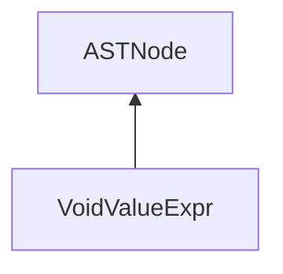

| public |
{:.api_label}

#### Inheritance Graph

## Description

[ [VoidValueExpr](classEScript_1_1AST_1_1VoidValueExpr) ]|> [ [ASTNode](classEScript_1_1AST_1_1ASTNode) ]

## Public Functions

|
| ------: | ----------------- |
|  | |
|  | **[VoidValueExpr](#classEScript_1_1AST_1_1VoidValueExpr_1acc6a42f0e3ac41aa9595b654946be56c)**(int _line) |
|  | |
|  | **[~VoidValueExpr](#classEScript_1_1AST_1_1VoidValueExpr_1aa3d981da804ffcb8b4f78d58b0693db5)**() |
{: .nohead .nowrap1 .api_section }

-------------------------------------------------------------------

## Documentation

### <small>function</small>  EScript::AST::VoidValueExpr::VoidValueExpr {#classEScript_1_1AST_1_1VoidValueExpr_1acc6a42f0e3ac41aa9595b654946be56c}

| public | inline |
{:.api_label}

|
| ------: | ----------------- |
|  |
|  **[VoidValueExpr](#classEScript_1_1AST_1_1VoidValueExpr_1acc6a42f0e3ac41aa9595b654946be56c)**( | int | **_line** ) |
{: .nohead .nowrap1 .api_doc }

Defined in `EScript/EScript/Compiler/AST/ValueExpr.h:67`{:style="float: right"}

-------------------------------------------------------------------

### <small>function</small>  EScript::AST::VoidValueExpr::~VoidValueExpr {#classEScript_1_1AST_1_1VoidValueExpr_1aa3d981da804ffcb8b4f78d58b0693db5}

| public | inline | virtual |
{:.api_label}

|
| ------: | ----------------- |
|  |
|  **[~VoidValueExpr](#classEScript_1_1AST_1_1VoidValueExpr_1aa3d981da804ffcb8b4f78d58b0693db5)**( |  ) |
{: .nohead .nowrap1 .api_doc }

Defined in `EScript/EScript/Compiler/AST/ValueExpr.h:69`{:style="float: right"}

-------------------------------------------------------------------

