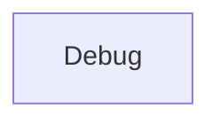

| public |
{:.api_label}

#### Inheritance Graph

## Description

## Public Static Functions

|
| ------: | ----------------- |
|  | |
| void | **[registerObj](#classEScript_1_1Debug_1a3e0df816b86e419b6647afe0a15694ad)**( [Object](classEScript_1_1Object) * v) |
|  | |
| void | **[unRegisterObj](#classEScript_1_1Debug_1aabdb279233118f13bf043304898d2363)**( [Object](classEScript_1_1Object) * v) |
|  | |
| void | **[showObjects](#classEScript_1_1Debug_1a66bb4a16e4b90a53420f61018efef05d)**() |
|  | |
| void | **[clearObjects](#classEScript_1_1Debug_1af8bd5c30b633d21d21cdf4780fad1200)**() |
{: .nohead .nowrap1 .api_section }

-------------------------------------------------------------------

## Documentation

### <small>function</small>  EScript::Debug::registerObj {#classEScript_1_1Debug_1a3e0df816b86e419b6647afe0a15694ad}

| public | static |
{:.api_label}

|
| ------: | ----------------- |
|  |
| void **[registerObj](#classEScript_1_1Debug_1a3e0df816b86e419b6647afe0a15694ad)**( |  [Object](classEScript_1_1Object) * | **v** ) |
{: .nohead .nowrap1 .api_doc }

Defined in `EScript/EScript/Utils/Debug.h:19`{:style="float: right"}

-------------------------------------------------------------------

### <small>function</small>  EScript::Debug::unRegisterObj {#classEScript_1_1Debug_1aabdb279233118f13bf043304898d2363}

| public | static |
{:.api_label}

|
| ------: | ----------------- |
|  |
| void **[unRegisterObj](#classEScript_1_1Debug_1aabdb279233118f13bf043304898d2363)**( |  [Object](classEScript_1_1Object) * | **v** ) |
{: .nohead .nowrap1 .api_doc }

Defined in `EScript/EScript/Utils/Debug.h:20`{:style="float: right"}

-------------------------------------------------------------------

### <small>function</small>  EScript::Debug::showObjects {#classEScript_1_1Debug_1a66bb4a16e4b90a53420f61018efef05d}

| public | static |
{:.api_label}

|
| ------: | ----------------- |
|  |
| void **[showObjects](#classEScript_1_1Debug_1a66bb4a16e4b90a53420f61018efef05d)**( |  ) |
{: .nohead .nowrap1 .api_doc }

Defined in `EScript/EScript/Utils/Debug.h:21`{:style="float: right"}

-------------------------------------------------------------------

### <small>function</small>  EScript::Debug::clearObjects {#classEScript_1_1Debug_1af8bd5c30b633d21d21cdf4780fad1200}

| public | static |
{:.api_label}

|
| ------: | ----------------- |
|  |
| void **[clearObjects](#classEScript_1_1Debug_1af8bd5c30b633d21d21cdf4780fad1200)**( |  ) |
{: .nohead .nowrap1 .api_doc }

Defined in `EScript/EScript/Utils/Debug.h:22`{:style="float: right"}

-------------------------------------------------------------------

