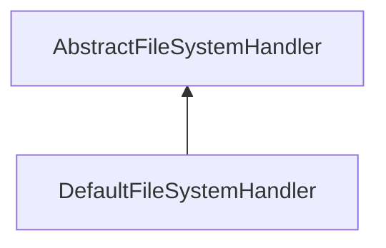

| public |
{:.api_label}

#### Inheritance Graph

## Description

A FileSystemHandler servers as interface to the file system. Exchaninging this handler allows to globally add support for additional file systems (e.g. by implementing a http interface), or to add an access restriction to file operations (e.g. limit all operations to certain folders).

## Protected Functions

|
| ------: | ----------------- |
|  | |
|  | **[AbstractFileSystemHandler](#classEScript_1_1IO_1_1AbstractFileSystemHandler_1a3574bae5d59cd2786e78691edc96c4bd)**() |
{: .nohead .nowrap1 .api_section }

## Public Functions

|
| ------: | ----------------- |
|  | |
|  | **[~AbstractFileSystemHandler](#classEScript_1_1IO_1_1AbstractFileSystemHandler_1a8fa4b3dc4acff3ba3aabc26995f2d3fb)**() |
|  | |
| void | **[deleteFile](#classEScript_1_1IO_1_1AbstractFileSystemHandler_1a1d9d914dc075e7b3be29b77bacf092b4)**(const std::string & void)   o |
|  | |
| std::vector< std::string > | **[dir](#classEScript_1_1IO_1_1AbstractFileSystemHandler_1a4708f1377cfd61b9d92bc3f57a5e04fd)**(const std::string & void, uint8_t void) |
|  | |
| [entryType_t](namespaceEScript_1_1IO#namespaceEScript_1_1IO_1a27f8713c56bd065727308933b394fe2e) | **[getEntryType](#classEScript_1_1IO_1_1AbstractFileSystemHandler_1a315a5eb7c1697b9bf82e273286c8a3fa)**(const std::string & path)   o |
|  | |
| [EntryInfo](structEScript_1_1IO_1_1EntryInfo) | **[getEntryInfo](#classEScript_1_1IO_1_1AbstractFileSystemHandler_1a01baf7e35bf57011c051b53d47fd0709)**(const std::string & void)   o |
|  | |
| uint32_t | **[getFileCTime](#classEScript_1_1IO_1_1AbstractFileSystemHandler_1af1a65db09089ca4af2c82a307f8040ab)**(const std::string & path)   o |
|  | |
| uint32_t | **[getFileMTime](#classEScript_1_1IO_1_1AbstractFileSystemHandler_1a63bc27791a1f6d39dd54635595325203)**(const std::string & path)   o |
|  | |
| uint64_t | **[getFileSize](#classEScript_1_1IO_1_1AbstractFileSystemHandler_1a813a90abf98a4823f9a3eda9e64fcd4f)**(const std::string & path)   o |
|  | |
| void | **[makeDir](#classEScript_1_1IO_1_1AbstractFileSystemHandler_1a7c1b3b1723cb3af6c2cff9be04efd562)**(const std::string & void)   o |
|  | |
| [StringData](classEScript_1_1StringData) | **[loadFile](#classEScript_1_1IO_1_1AbstractFileSystemHandler_1abf8a3e962f166993e02a25fab27dd3e8)**(const std::string & void)   o |
|  | |
| void | **[saveFile](#classEScript_1_1IO_1_1AbstractFileSystemHandler_1afc6ffd8e502ad7d7159d6f7b5432aa89)**(const std::string & void, const std::string & void, bool void)   o |
{: .nohead .nowrap1 .api_section }

-------------------------------------------------------------------

## Documentation

### <small>function</small>  EScript::IO::AbstractFileSystemHandler::AbstractFileSystemHandler {#classEScript_1_1IO_1_1AbstractFileSystemHandler_1a3574bae5d59cd2786e78691edc96c4bd}

| protected | inline |
{:.api_label}

|
| ------: | ----------------- |
|  |
|  **[AbstractFileSystemHandler](#classEScript_1_1IO_1_1AbstractFileSystemHandler_1a3574bae5d59cd2786e78691edc96c4bd)**( |  ) |
{: .nohead .nowrap1 .api_doc }

Defined in `EScript/EScript/Utils/IO/AbstractFileSystemHandler.h:35`{:style="float: right"}

-------------------------------------------------------------------

### <small>function</small>  EScript::IO::AbstractFileSystemHandler::~AbstractFileSystemHandler {#classEScript_1_1IO_1_1AbstractFileSystemHandler_1a8fa4b3dc4acff3ba3aabc26995f2d3fb}

| public | inline | virtual |
{:.api_label}

|
| ------: | ----------------- |
|  |
|  **[~AbstractFileSystemHandler](#classEScript_1_1IO_1_1AbstractFileSystemHandler_1a8fa4b3dc4acff3ba3aabc26995f2d3fb)**( |  ) |
{: .nohead .nowrap1 .api_doc }

Defined in `EScript/EScript/Utils/IO/AbstractFileSystemHandler.h:37`{:style="float: right"}

-------------------------------------------------------------------

### <small>function</small>  EScript::IO::AbstractFileSystemHandler::deleteFile {#classEScript_1_1IO_1_1AbstractFileSystemHandler_1a1d9d914dc075e7b3be29b77bacf092b4}

| public | inline | virtual |
{:.api_label}

|
| ------: | ----------------- |
|  |
| void **[deleteFile](#classEScript_1_1IO_1_1AbstractFileSystemHandler_1a1d9d914dc075e7b3be29b77bacf092b4)**( | const std::string & | **void** ) |
{: .nohead .nowrap1 .api_doc }

o

Defined in `EScript/EScript/Utils/IO/AbstractFileSystemHandler.h:40`{:style="float: right"}

-------------------------------------------------------------------

### <small>function</small>  EScript::IO::AbstractFileSystemHandler::dir {#classEScript_1_1IO_1_1AbstractFileSystemHandler_1a4708f1377cfd61b9d92bc3f57a5e04fd}

| public | inline | virtual |
{:.api_label}

|
| ------: | ----------------- |
|  |
| std::vector< std::string > **[dir](#classEScript_1_1IO_1_1AbstractFileSystemHandler_1a4708f1377cfd61b9d92bc3f57a5e04fd)**( | const std::string & | **void**, |
| | uint8_t | **void** |
|   ) |
{: .nohead .nowrap1 .api_doc }

o
#### Parameters
**dirname**
:  

**flags**
:  1 ... Files 2 ... Directories 4 ... Recurse Subdirectories

#### Exceptions
**std::ios_base::failure**
:  on failure.

Defined in `EScript/EScript/Utils/IO/AbstractFileSystemHandler.h:49`{:style="float: right"}

-------------------------------------------------------------------

### <small>function</small>  EScript::IO::AbstractFileSystemHandler::getEntryType {#classEScript_1_1IO_1_1AbstractFileSystemHandler_1a315a5eb7c1697b9bf82e273286c8a3fa}

| public | inline | virtual |
{:.api_label}

|
| ------: | ----------------- |
|  |
| [entryType_t](namespaceEScript_1_1IO#namespaceEScript_1_1IO_1a27f8713c56bd065727308933b394fe2e) **[getEntryType](#classEScript_1_1IO_1_1AbstractFileSystemHandler_1a315a5eb7c1697b9bf82e273286c8a3fa)**( | const std::string & | **path** ) |
{: .nohead .nowrap1 .api_doc }

o

Defined in `EScript/EScript/Utils/IO/AbstractFileSystemHandler.h:53`{:style="float: right"}

-------------------------------------------------------------------

### <small>function</small>  EScript::IO::AbstractFileSystemHandler::getEntryInfo {#classEScript_1_1IO_1_1AbstractFileSystemHandler_1a01baf7e35bf57011c051b53d47fd0709}

| public | inline | virtual |
{:.api_label}

|
| ------: | ----------------- |
|  |
| [EntryInfo](structEScript_1_1IO_1_1EntryInfo) **[getEntryInfo](#classEScript_1_1IO_1_1AbstractFileSystemHandler_1a01baf7e35bf57011c051b53d47fd0709)**( | const std::string & | **void** ) |
{: .nohead .nowrap1 .api_doc }

o

Defined in `EScript/EScript/Utils/IO/AbstractFileSystemHandler.h:57`{:style="float: right"}

-------------------------------------------------------------------

### <small>function</small>  EScript::IO::AbstractFileSystemHandler::getFileCTime {#classEScript_1_1IO_1_1AbstractFileSystemHandler_1af1a65db09089ca4af2c82a307f8040ab}

| public | inline | virtual |
{:.api_label}

|
| ------: | ----------------- |
|  |
| uint32_t **[getFileCTime](#classEScript_1_1IO_1_1AbstractFileSystemHandler_1af1a65db09089ca4af2c82a307f8040ab)**( | const std::string & | **path** ) |
{: .nohead .nowrap1 .api_doc }

o

Defined in `EScript/EScript/Utils/IO/AbstractFileSystemHandler.h:61`{:style="float: right"}

-------------------------------------------------------------------

### <small>function</small>  EScript::IO::AbstractFileSystemHandler::getFileMTime {#classEScript_1_1IO_1_1AbstractFileSystemHandler_1a63bc27791a1f6d39dd54635595325203}

| public | inline | virtual |
{:.api_label}

|
| ------: | ----------------- |
|  |
| uint32_t **[getFileMTime](#classEScript_1_1IO_1_1AbstractFileSystemHandler_1a63bc27791a1f6d39dd54635595325203)**( | const std::string & | **path** ) |
{: .nohead .nowrap1 .api_doc }

o

Defined in `EScript/EScript/Utils/IO/AbstractFileSystemHandler.h:65`{:style="float: right"}

-------------------------------------------------------------------

### <small>function</small>  EScript::IO::AbstractFileSystemHandler::getFileSize {#classEScript_1_1IO_1_1AbstractFileSystemHandler_1a813a90abf98a4823f9a3eda9e64fcd4f}

| public | inline | virtual |
{:.api_label}

|
| ------: | ----------------- |
|  |
| uint64_t **[getFileSize](#classEScript_1_1IO_1_1AbstractFileSystemHandler_1a813a90abf98a4823f9a3eda9e64fcd4f)**( | const std::string & | **path** ) |
{: .nohead .nowrap1 .api_doc }

o

Defined in `EScript/EScript/Utils/IO/AbstractFileSystemHandler.h:69`{:style="float: right"}

-------------------------------------------------------------------

### <small>function</small>  EScript::IO::AbstractFileSystemHandler::makeDir {#classEScript_1_1IO_1_1AbstractFileSystemHandler_1a7c1b3b1723cb3af6c2cff9be04efd562}

| public | inline | virtual |
{:.api_label}

|
| ------: | ----------------- |
|  |
| void **[makeDir](#classEScript_1_1IO_1_1AbstractFileSystemHandler_1a7c1b3b1723cb3af6c2cff9be04efd562)**( | const std::string & | **void** ) |
{: .nohead .nowrap1 .api_doc }

o

Defined in `EScript/EScript/Utils/IO/AbstractFileSystemHandler.h:74`{:style="float: right"}

-------------------------------------------------------------------

### <small>function</small>  EScript::IO::AbstractFileSystemHandler::loadFile {#classEScript_1_1IO_1_1AbstractFileSystemHandler_1abf8a3e962f166993e02a25fab27dd3e8}

| public | inline | virtual |
{:.api_label}

|
| ------: | ----------------- |
|  |
| [StringData](classEScript_1_1StringData) **[loadFile](#classEScript_1_1IO_1_1AbstractFileSystemHandler_1abf8a3e962f166993e02a25fab27dd3e8)**( | const std::string & | **void** ) |
{: .nohead .nowrap1 .api_doc }

o

Defined in `EScript/EScript/Utils/IO/AbstractFileSystemHandler.h:78`{:style="float: right"}

-------------------------------------------------------------------

### <small>function</small>  EScript::IO::AbstractFileSystemHandler::saveFile {#classEScript_1_1IO_1_1AbstractFileSystemHandler_1afc6ffd8e502ad7d7159d6f7b5432aa89}

| public | inline | virtual |
{:.api_label}

|
| ------: | ----------------- |
|  |
| void **[saveFile](#classEScript_1_1IO_1_1AbstractFileSystemHandler_1afc6ffd8e502ad7d7159d6f7b5432aa89)**( | const std::string & | **void**, |
| | const std::string & | **void**, |
| | bool | **void** |
|   ) |
{: .nohead .nowrap1 .api_doc }

o

Defined in `EScript/EScript/Utils/IO/AbstractFileSystemHandler.h:82`{:style="float: right"}

-------------------------------------------------------------------

