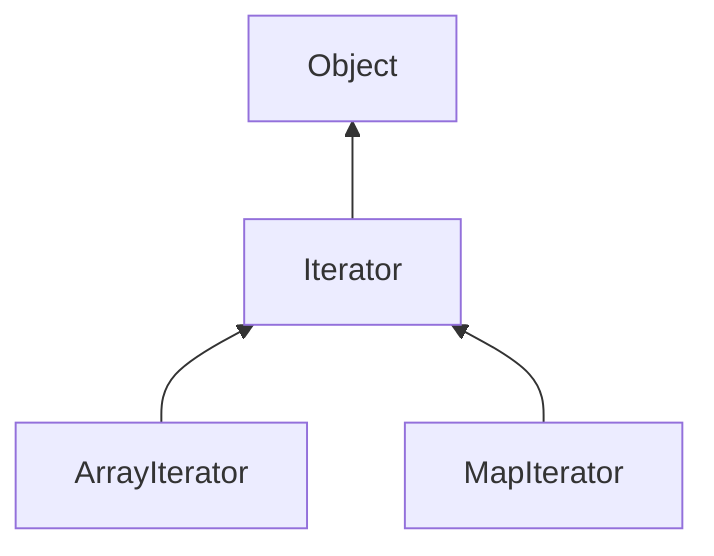

| public |
{:.api_label}

#### Inheritance Graph

## Description

(abstract) [ [Iterator](classEScript_1_1Iterator) ]|> [ [Object](classEScript_1_1Object) ]

## Public Static Functions

|
| ------: | ----------------- |
|  | |
| [Type](classEScript_1_1Type) * | **[getTypeObject](#classEScript_1_1Iterator_1a0dbe5b5dd6888d805d604f7868bbf8c1)**() |
|  | |
| void | **[init](#classEScript_1_1Iterator_1a2c7a3864e2968df3383dce6184d79318)**( [EScript::Namespace](classEScript_1_1Namespace) & globals) |
{: .nohead .nowrap1 .api_section }

## Public Functions

|
| ------: | ----------------- |
|  | |
|  | **[Iterator](#classEScript_1_1Iterator_1a274f47428541b40531646e9936b684dc)**( [Type](classEScript_1_1Type) * type) |
|  | |
|  | **[~Iterator](#classEScript_1_1Iterator_1a10199305a4c8f4be2895e7b0918111b7)**() |
|  | |
| [Object](classEScript_1_1Object) * | **[key](#classEScript_1_1Iterator_1a5505a1e0af494232455daf7fe487a8ec)**()   o |
|  | |
| [Object](classEScript_1_1Object) * | **[value](#classEScript_1_1Iterator_1a0097b916482a156c7c45c8615d829100)**() |
|  | |
| void | **[reset](#classEScript_1_1Iterator_1ae53c923e25ad0a039782930a530cba12)**() |
|  | |
| void | **[next](#classEScript_1_1Iterator_1ab6fd313c7247309bac0d3857dee6c1c4)**() |
|  | |
| bool | **[end](#classEScript_1_1Iterator_1a287d6f533026d0394643fc6b2eb29219)**() |
{: .nohead .nowrap1 .api_section }

-------------------------------------------------------------------

## Documentation

### <small>function</small>  EScript::Iterator::getTypeObject {#classEScript_1_1Iterator_1a0dbe5b5dd6888d805d604f7868bbf8c1}

| public | static |
{:.api_label}

|
| ------: | ----------------- |
|  |
| [Type](classEScript_1_1Type) * **[getTypeObject](#classEScript_1_1Iterator_1a0dbe5b5dd6888d805d604f7868bbf8c1)**( |  ) |
{: .nohead .nowrap1 .api_doc }

Defined in `EScript/EScript/Objects/Iterator.h:19`{:style="float: right"}

-------------------------------------------------------------------

### <small>function</small>  EScript::Iterator::init {#classEScript_1_1Iterator_1a2c7a3864e2968df3383dce6184d79318}

| public | static |
{:.api_label}

|
| ------: | ----------------- |
|  |
| void **[init](#classEScript_1_1Iterator_1a2c7a3864e2968df3383dce6184d79318)**( |  [EScript::Namespace](classEScript_1_1Namespace) & | **globals** ) |
{: .nohead .nowrap1 .api_doc }

Defined in `EScript/EScript/Objects/Iterator.h:20`{:style="float: right"}

-------------------------------------------------------------------

### <small>function</small>  EScript::Iterator::Iterator {#classEScript_1_1Iterator_1a274f47428541b40531646e9936b684dc}

| public | inline |
{:.api_label}

|
| ------: | ----------------- |
|  |
|  **[Iterator](#classEScript_1_1Iterator_1a274f47428541b40531646e9936b684dc)**( |  [Type](classEScript_1_1Type) * | **type** ) |
{: .nohead .nowrap1 .api_doc }

Defined in `EScript/EScript/Objects/Iterator.h:23`{:style="float: right"}

-------------------------------------------------------------------

### <small>function</small>  EScript::Iterator::~Iterator {#classEScript_1_1Iterator_1a10199305a4c8f4be2895e7b0918111b7}

| public | inline | virtual |
{:.api_label}

|
| ------: | ----------------- |
|  |
|  **[~Iterator](#classEScript_1_1Iterator_1a10199305a4c8f4be2895e7b0918111b7)**( |  ) |
{: .nohead .nowrap1 .api_doc }

Defined in `EScript/EScript/Objects/Iterator.h:24`{:style="float: right"}

-------------------------------------------------------------------

### <small>function</small>  EScript::Iterator::key {#classEScript_1_1Iterator_1a5505a1e0af494232455daf7fe487a8ec}

| public | inline | virtual |
{:.api_label}

|
| ------: | ----------------- |
|  |
| [Object](classEScript_1_1Object) * **[key](#classEScript_1_1Iterator_1a5505a1e0af494232455daf7fe487a8ec)**( |  ) |
{: .nohead .nowrap1 .api_doc }

o

Defined in `EScript/EScript/Objects/Iterator.h:27`{:style="float: right"}

-------------------------------------------------------------------

### <small>function</small>  EScript::Iterator::value {#classEScript_1_1Iterator_1a0097b916482a156c7c45c8615d829100}

| public | inline | virtual |
{:.api_label}

|
| ------: | ----------------- |
|  |
| [Object](classEScript_1_1Object) * **[value](#classEScript_1_1Iterator_1a0097b916482a156c7c45c8615d829100)**( |  ) |
{: .nohead .nowrap1 .api_doc }

Defined in `EScript/EScript/Objects/Iterator.h:28`{:style="float: right"}

-------------------------------------------------------------------

### <small>function</small>  EScript::Iterator::reset {#classEScript_1_1Iterator_1ae53c923e25ad0a039782930a530cba12}

| public | inline | virtual |
{:.api_label}

|
| ------: | ----------------- |
|  |
| void **[reset](#classEScript_1_1Iterator_1ae53c923e25ad0a039782930a530cba12)**( |  ) |
{: .nohead .nowrap1 .api_doc }

Defined in `EScript/EScript/Objects/Iterator.h:29`{:style="float: right"}

-------------------------------------------------------------------

### <small>function</small>  EScript::Iterator::next {#classEScript_1_1Iterator_1ab6fd313c7247309bac0d3857dee6c1c4}

| public | inline | virtual |
{:.api_label}

|
| ------: | ----------------- |
|  |
| void **[next](#classEScript_1_1Iterator_1ab6fd313c7247309bac0d3857dee6c1c4)**( |  ) |
{: .nohead .nowrap1 .api_doc }

Defined in `EScript/EScript/Objects/Iterator.h:30`{:style="float: right"}

-------------------------------------------------------------------

### <small>function</small>  EScript::Iterator::end {#classEScript_1_1Iterator_1a287d6f533026d0394643fc6b2eb29219}

| public | inline | virtual |
{:.api_label}

|
| ------: | ----------------- |
|  |
| bool **[end](#classEScript_1_1Iterator_1a287d6f533026d0394643fc6b2eb29219)**( |  ) |
{: .nohead .nowrap1 .api_doc }

Defined in `EScript/EScript/Objects/Iterator.h:31`{:style="float: right"}

-------------------------------------------------------------------

