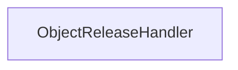

| public |
{:.api_label}

#### Inheritance Graph

## Description

## Public Static Functions

|
| ------: | ----------------- |
|  | |
| void | **[release](#classEScript_1_1ObjectReleaseHandler_1a4bc3eef15608fe0182fe4a1c9b6534c1)**( [Object](classEScript_1_1Object) * obj) |
{: .nohead .nowrap1 .api_section }

-------------------------------------------------------------------

## Documentation

### <small>function</small>  EScript::ObjectReleaseHandler::release {#classEScript_1_1ObjectReleaseHandler_1a4bc3eef15608fe0182fe4a1c9b6534c1}

| public | static |
{:.api_label}

|
| ------: | ----------------- |
|  |
| void **[release](#classEScript_1_1ObjectReleaseHandler_1a4bc3eef15608fe0182fe4a1c9b6534c1)**( |  [Object](classEScript_1_1Object) * | **obj** ) |
{: .nohead .nowrap1 .api_doc }

Defined in `EScript/EScript/Objects/Object.h:183`{:style="float: right"}

-------------------------------------------------------------------

