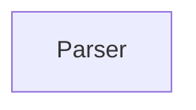

| public |
{:.api_label}

#### Inheritance Graph

## Description

[ [Parser](classEScript_1_1Parser) ]

## Public Functions

|
| ------: | ----------------- |
|  | |
|  | **[Parser](#classEScript_1_1Parser_1a86d7383b547d8e14437f0e362c76f6c7)**( [Logger](classEScript_1_1Logger) * logger) |
|  | |
| [ERef](classEScript_1_1ERef) < [AST::Block](classEScript_1_1AST_1_1Block) > | **[parse](#classEScript_1_1Parser_1afa2b1c2f742b862cfd3c8cf7300ace11)**(const [CodeFragment](classEScript_1_1CodeFragment) & code) |
{: .nohead .nowrap1 .api_section }

-------------------------------------------------------------------

## Documentation

### <small>function</small>  EScript::Parser::Parser {#classEScript_1_1Parser_1a86d7383b547d8e14437f0e362c76f6c7}

| public |
{:.api_label}

|
| ------: | ----------------- |
|  |
|  **[Parser](#classEScript_1_1Parser_1a86d7383b547d8e14437f0e362c76f6c7)**( |  [Logger](classEScript_1_1Logger) * | **logger** ) |
{: .nohead .nowrap1 .api_doc }

Defined in `EScript/EScript/Compiler/Parser.h:32`{:style="float: right"}

-------------------------------------------------------------------

### <small>function</small>  EScript::Parser::parse {#classEScript_1_1Parser_1afa2b1c2f742b862cfd3c8cf7300ace11}

| public |
{:.api_label}

|
| ------: | ----------------- |
|  |
| [ERef](classEScript_1_1ERef) < [AST::Block](classEScript_1_1AST_1_1Block) > **[parse](#classEScript_1_1Parser_1afa2b1c2f742b862cfd3c8cf7300ace11)**( | const [CodeFragment](classEScript_1_1CodeFragment) & | **code** ) |
{: .nohead .nowrap1 .api_doc }

Defined in `EScript/EScript/Compiler/Parser.h:33`{:style="float: right"}

-------------------------------------------------------------------

