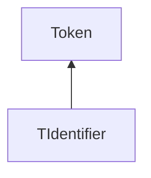

| public |
{:.api_label}

#### Inheritance Graph

## Description

## Public Static Attributes

|
| ------: | ----------------- |
|  | |
| const uint32_t | **[TYPE_ID](#classEScript_1_1TIdentifier_1afd096c924784d7844bd73135430c13d1)**  |
{: .nohead .nowrap1 .api_section }

## Public Static Functions

|
| ------: | ----------------- |
|  | |
| uint32_t | **[getTypeId](#classEScript_1_1TIdentifier_1af59317a50a92301b7857ee00c4fbfab1)**() |
{: .nohead .nowrap1 .api_section }

## Public Functions

|
| ------: | ----------------- |
|  | |
|  | **[TIdentifier](#classEScript_1_1TIdentifier_1a2975a0af1cd67cd4014e36335d340f7b)**( [StringId](classEScript_1_1StringId)  _id) |
|  | |
| std::string | **[toString](#classEScript_1_1TIdentifier_1a89790e96c420078391223bf4629b6d77)**() const |
|  | |
| [StringId](classEScript_1_1StringId) | **[getId](#classEScript_1_1TIdentifier_1a6f71658165e2c9f539bf512538f022a7)**() const |
|  | |
| [Token](classEScript_1_1Token) * | **[clone](#classEScript_1_1TIdentifier_1adbee6a172bcf56da688f745363356273)**() const |
{: .nohead .nowrap1 .api_section }

-------------------------------------------------------------------

## Documentation

### <small>variable</small>  EScript::TIdentifier::TYPE_ID {#classEScript_1_1TIdentifier_1afd096c924784d7844bd73135430c13d1}

| public | static |
{:.api_label}

|
| ------: | ----------------- |
|  |
| const uint32_t **[TYPE_ID](#classEScript_1_1TIdentifier_1afd096c924784d7844bd73135430c13d1)**  |
{: .nohead .nowrap1 .api_doc }

Defined in `EScript/EScript/Compiler/Token.h:77`{:style="float: right"}

-------------------------------------------------------------------

### <small>function</small>  EScript::TIdentifier::getTypeId {#classEScript_1_1TIdentifier_1af59317a50a92301b7857ee00c4fbfab1}

| public | static | inline |
{:.api_label}

|
| ------: | ----------------- |
|  |
| uint32_t **[getTypeId](#classEScript_1_1TIdentifier_1af59317a50a92301b7857ee00c4fbfab1)**( |  ) |
{: .nohead .nowrap1 .api_doc }

Defined in `EScript/EScript/Compiler/Token.h:78`{:style="float: right"}

-------------------------------------------------------------------

### <small>function</small>  EScript::TIdentifier::TIdentifier {#classEScript_1_1TIdentifier_1a2975a0af1cd67cd4014e36335d340f7b}

| public | inline |
{:.api_label}

|
| ------: | ----------------- |
|  |
|  **[TIdentifier](#classEScript_1_1TIdentifier_1a2975a0af1cd67cd4014e36335d340f7b)**( |  [StringId](classEScript_1_1StringId)  | **_id** ) |
{: .nohead .nowrap1 .api_doc }

Defined in `EScript/EScript/Compiler/Token.h:80`{:style="float: right"}

-------------------------------------------------------------------

### <small>function</small>  EScript::TIdentifier::toString {#classEScript_1_1TIdentifier_1a89790e96c420078391223bf4629b6d77}

| public | const | inline | virtual |
{:.api_label}

|
| ------: | ----------------- |
|  |
| std::string **[toString](#classEScript_1_1TIdentifier_1a89790e96c420078391223bf4629b6d77)**( |  ) const |
{: .nohead .nowrap1 .api_doc }

Defined in `EScript/EScript/Compiler/Token.h:81`{:style="float: right"}

-------------------------------------------------------------------

### <small>function</small>  EScript::TIdentifier::getId {#classEScript_1_1TIdentifier_1a6f71658165e2c9f539bf512538f022a7}

| public | const | inline |
{:.api_label}

|
| ------: | ----------------- |
|  |
| [StringId](classEScript_1_1StringId) **[getId](#classEScript_1_1TIdentifier_1a6f71658165e2c9f539bf512538f022a7)**( |  ) const |
{: .nohead .nowrap1 .api_doc }

Defined in `EScript/EScript/Compiler/Token.h:83`{:style="float: right"}

-------------------------------------------------------------------

### <small>function</small>  EScript::TIdentifier::clone {#classEScript_1_1TIdentifier_1adbee6a172bcf56da688f745363356273}

| public | const | inline | virtual |
{:.api_label}

|
| ------: | ----------------- |
|  |
| [Token](classEScript_1_1Token) * **[clone](#classEScript_1_1TIdentifier_1adbee6a172bcf56da688f745363356273)**( |  ) const |
{: .nohead .nowrap1 .api_doc }

Defined in `EScript/EScript/Compiler/Token.h:84`{:style="float: right"}

-------------------------------------------------------------------

