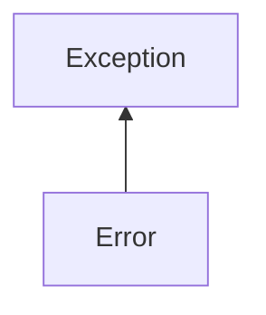

| public |
{:.api_label}

#### Inheritance Graph

## Description

[ [Tokenizer::Error](classEScript_1_1Tokenizer_1_1Error) ]|> [ [Exception](classEScript_1_1Exception) ]|> [ [Object](classEScript_1_1Object) ]

## Public Functions

|
| ------: | ----------------- |
|  | |
|  | **[Error](#classEScript_1_1Tokenizer_1_1Error_1a7821eea651cefacfe6c7ec7005be2688)**(const std::string & s, int _line) |
{: .nohead .nowrap1 .api_section }

-------------------------------------------------------------------

## Documentation

### <small>function</small>  EScript::Tokenizer::Error::Error {#classEScript_1_1Tokenizer_1_1Error_1a7821eea651cefacfe6c7ec7005be2688}

| public | inline | explicit |
{:.api_label}

|
| ------: | ----------------- |
|  |
|  **[Error](#classEScript_1_1Tokenizer_1_1Error_1a7821eea651cefacfe6c7ec7005be2688)**( | const std::string & | **s**, |
| | int | **_line** |
|   ) |
{: .nohead .nowrap1 .api_doc }

Defined in `EScript/EScript/Compiler/Tokenizer.h:35`{:style="float: right"}

-------------------------------------------------------------------

