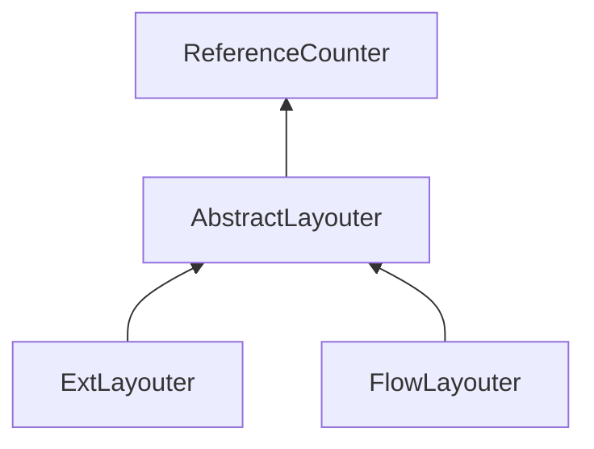

| public | abstract |
{:.api_label}

#### Inheritance Graph

## Description

[AbstractLayouter](classGUI_1_1AbstractLayouter) .

## Public Functions

|
| ------: | ----------------- |
|  | |
|  | **[~AbstractLayouter](#classGUI_1_1AbstractLayouter_1a0195f96359411cf41563d2e0903d4329)**() |
|  | |
| void | **[layout](#classGUI_1_1AbstractLayouter_1ae5da8f0f38c4248fe6e1f4df9c0c1ae1)**( [Util::WeakPointer](classUtil_1_1WeakPointer) < [Component](classGUI_1_1Component) > component) |
{: .nohead .nowrap1 .api_section }

-------------------------------------------------------------------

## Documentation

### <small>function</small>  GUI::AbstractLayouter::~AbstractLayouter {#classGUI_1_1AbstractLayouter_1a0195f96359411cf41563d2e0903d4329}

| public | inline | virtual |
{:.api_label}

|
| ------: | ----------------- |
|  |
|  **[~AbstractLayouter](#classGUI_1_1AbstractLayouter_1a0195f96359411cf41563d2e0903d4329)**( |  ) |
{: .nohead .nowrap1 .api_doc }

Defined in `GUI/Base/Layouters/AbstractLayouter.h:26`{:style="float: right"}

-------------------------------------------------------------------

### <small>function</small>  GUI::AbstractLayouter::layout {#classGUI_1_1AbstractLayouter_1ae5da8f0f38c4248fe6e1f4df9c0c1ae1}

| public | virtual |
{:.api_label}

|
| ------: | ----------------- |
|  |
| void **[layout](#classGUI_1_1AbstractLayouter_1ae5da8f0f38c4248fe6e1f4df9c0c1ae1)**( |  [Util::WeakPointer](classUtil_1_1WeakPointer) < [Component](classGUI_1_1Component) > | **component** ) |
{: .nohead .nowrap1 .api_doc }

Defined in `GUI/Base/Layouters/AbstractLayouter.h:28`{:style="float: right"}

-------------------------------------------------------------------

