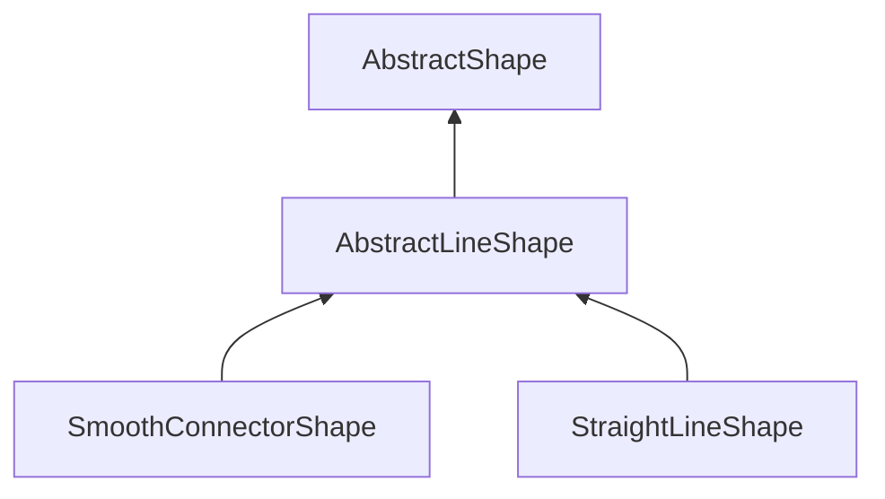

| public | abstract |
{:.api_label}

#### Inheritance Graph

## Description

## Public Functions

|
| ------: | ----------------- |
|  | |
|  | **[AbstractLineShape](#classGUI_1_1AbstractLineShape_1a7bce808a9d33eda07a6cb3a91a6efe85)**() |
|  | |
|  | **[~AbstractLineShape](#classGUI_1_1AbstractLineShape_1a5e4647d171f952d4c75eb0dedd2f368c)**() |
|  | |
| void | **[display](#classGUI_1_1AbstractLineShape_1a47689e641d5f1b78e93349ff0f59cb6e)**(const [Geometry::Rect](namespaceGeometry#namespaceGeometry_1acedeea2f6bddd99f077df6f73901a875) & void,  [flag_t](classGUI_1_1AbstractShape#classGUI_1_1AbstractShape_1a30ae7217ac48efbb16cf6053706fead5)  void) |
|  | |
| void | **[displayLine](#classGUI_1_1AbstractLineShape_1a327f089fab2dd9d5fd38b26c7b3ebafe)**(const std::vector< [Geometry::Vec2](namespaceGeometry#namespaceGeometry_1aa9c56320691770d4bc53916868f15e6d) > & points,  [flag_t](classGUI_1_1AbstractShape#classGUI_1_1AbstractShape_1a30ae7217ac48efbb16cf6053706fead5)  flag) |
{: .nohead .nowrap1 .api_section }

-------------------------------------------------------------------

## Documentation

### <small>function</small>  GUI::AbstractLineShape::AbstractLineShape {#classGUI_1_1AbstractLineShape_1a7bce808a9d33eda07a6cb3a91a6efe85}

| public | inline |
{:.api_label}

|
| ------: | ----------------- |
|  |
|  **[AbstractLineShape](#classGUI_1_1AbstractLineShape_1a7bce808a9d33eda07a6cb3a91a6efe85)**( |  ) |
{: .nohead .nowrap1 .api_doc }

Defined in `GUI/Base/AbstractShape.h:50`{:style="float: right"}

-------------------------------------------------------------------

### <small>function</small>  GUI::AbstractLineShape::~AbstractLineShape {#classGUI_1_1AbstractLineShape_1a5e4647d171f952d4c75eb0dedd2f368c}

| public | inline | virtual |
{:.api_label}

|
| ------: | ----------------- |
|  |
|  **[~AbstractLineShape](#classGUI_1_1AbstractLineShape_1a5e4647d171f952d4c75eb0dedd2f368c)**( |  ) |
{: .nohead .nowrap1 .api_doc }

Defined in `GUI/Base/AbstractShape.h:51`{:style="float: right"}

-------------------------------------------------------------------

### <small>function</small>  GUI::AbstractLineShape::display {#classGUI_1_1AbstractLineShape_1a47689e641d5f1b78e93349ff0f59cb6e}

| public | inline | virtual |
{:.api_label}

|
| ------: | ----------------- |
|  |
| void **[display](#classGUI_1_1AbstractLineShape_1a47689e641d5f1b78e93349ff0f59cb6e)**( | const [Geometry::Rect](namespaceGeometry#namespaceGeometry_1acedeea2f6bddd99f077df6f73901a875) & | **void**, |
| |  [flag_t](classGUI_1_1AbstractShape#classGUI_1_1AbstractShape_1a30ae7217ac48efbb16cf6053706fead5)  | **void** |
|   ) |
{: .nohead .nowrap1 .api_doc }

Defined in `GUI/Base/AbstractShape.h:54`{:style="float: right"}

-------------------------------------------------------------------

### <small>function</small>  GUI::AbstractLineShape::displayLine {#classGUI_1_1AbstractLineShape_1a327f089fab2dd9d5fd38b26c7b3ebafe}

| public | virtual |
{:.api_label}

|
| ------: | ----------------- |
|  |
| void **[displayLine](#classGUI_1_1AbstractLineShape_1a327f089fab2dd9d5fd38b26c7b3ebafe)**( | const std::vector< [Geometry::Vec2](namespaceGeometry#namespaceGeometry_1aa9c56320691770d4bc53916868f15e6d) > & | **points**, |
| |  [flag_t](classGUI_1_1AbstractShape#classGUI_1_1AbstractShape_1a30ae7217ac48efbb16cf6053706fead5)  | **flag** |
|   ) |
{: .nohead .nowrap1 .api_doc }

Defined in `GUI/Base/AbstractShape.h:56`{:style="float: right"}

-------------------------------------------------------------------

