| public | abstract |
{:.api_label}

#### Inheritance Graph

```mermaid
graph BT
	AbstractShape
	AbstractShape --> ReferenceCounter
	AbstractLineShape --> AbstractShape
	CrossShape --> AbstractShape
	GridShape --> AbstractShape
	NullShape --> AbstractShape
	OuterRectShadowShape --> AbstractShape
	Rect3dShape --> AbstractShape
	RectShape --> AbstractShape
	ResizerShape --> AbstractShape
	Rounded3dRectShape --> AbstractShape
	ScrollableMarkerShape --> AbstractShape
	ShadowedRectShape --> AbstractShape
	SliderMarkerShape --> AbstractShape
	TabHeaderShape --> AbstractShape
	TriangleAtCornerShape --> AbstractShape
	TriangleSelectorShape --> AbstractShape
	click AbstractShape "classGUI_1_1AbstractShape"
	click ReferenceCounter "classUtil_1_1ReferenceCounter"
	click AbstractLineShape "classGUI_1_1AbstractLineShape"
	click CrossShape "classGUI_1_1CrossShape"
	click GridShape "classGUI_1_1GridShape"
	click NullShape "classGUI_1_1NullShape"
	click OuterRectShadowShape "classGUI_1_1OuterRectShadowShape"
	click Rect3dShape "classGUI_1_1Rect3dShape"
	click RectShape "classGUI_1_1RectShape"
	click ResizerShape "classGUI_1_1ResizerShape"
	click Rounded3dRectShape "classGUI_1_1Rounded3dRectShape"
	click ScrollableMarkerShape "classGUI_1_1ScrollableMarkerShape"
	click ShadowedRectShape "classGUI_1_1ShadowedRectShape"
	click SliderMarkerShape "classGUI_1_1SliderMarkerShape"
	click TabHeaderShape "classGUI_1_1TabHeaderShape"
	click TriangleAtCornerShape "classGUI_1_1TriangleAtCornerShape"
	click TriangleSelectorShape "classGUI_1_1TriangleSelectorShape"
```

## Description

## Public Types

|
| ------: | ----------------- |
|  | |
| typedef uint16_t | **[flag_t](#classGUI_1_1AbstractShape_1a30ae7217ac48efbb16cf6053706fead5)**  |
{: .nohead .nowrap1 .api_section }

## Public Static Attributes

|
| ------: | ----------------- |
|  | |
| const [flag_t](classGUI_1_1AbstractShape#classGUI_1_1AbstractShape_1a30ae7217ac48efbb16cf6053706fead5) | **[ACTIVE](#classGUI_1_1AbstractShape_1ab05143fca45bd256d692f69dce1e2dfd)**  |
{: .nohead .nowrap1 .api_section }

## Public Functions

|
| ------: | ----------------- |
|  | |
|  | **[AbstractShape](#classGUI_1_1AbstractShape_1a704b2769b87072bc493e3c73c41685b4)**() |
|  | |
|  | **[~AbstractShape](#classGUI_1_1AbstractShape_1a5e3ac271b87406cce17ca22a4fd989e6)**() |
|  | |
| void | **[display](#classGUI_1_1AbstractShape_1abf231946c55c8bd4b8054e516f6ece72)**(const [Geometry::Rect](namespaceGeometry#namespaceGeometry_1acedeea2f6bddd99f077df6f73901a875) & rect,  [flag_t](classGUI_1_1AbstractShape#classGUI_1_1AbstractShape_1a30ae7217ac48efbb16cf6053706fead5)  flag) |
|  | |
| [AbstractShape](classGUI_1_1AbstractShape) * | **[clone](#classGUI_1_1AbstractShape_1a8d1a760857b7dae8b5c0f48230f09360)**() |
{: .nohead .nowrap1 .api_section }

-------------------------------------------------------------------

## Documentation

### <small>typedef</small>  GUI::AbstractShape::flag_t {#classGUI_1_1AbstractShape_1a30ae7217ac48efbb16cf6053706fead5}

| public |
{:.api_label}

|
| ------: | ----------------- |
|  |
| typedef uint16_t **[flag_t](#classGUI_1_1AbstractShape_1a30ae7217ac48efbb16cf6053706fead5)**  |
{: .nohead .nowrap1 .api_doc }

Defined in `GUI/Base/AbstractShape.h:31`{:style="float: right"}

-------------------------------------------------------------------

### <small>variable</small>  GUI::AbstractShape::ACTIVE {#classGUI_1_1AbstractShape_1ab05143fca45bd256d692f69dce1e2dfd}

| public | static |
{:.api_label}

|
| ------: | ----------------- |
|  |
| const [flag_t](classGUI_1_1AbstractShape#classGUI_1_1AbstractShape_1a30ae7217ac48efbb16cf6053706fead5) **[ACTIVE](#classGUI_1_1AbstractShape_1ab05143fca45bd256d692f69dce1e2dfd)**  |
{: .nohead .nowrap1 .api_doc }

Defined in `GUI/Base/AbstractShape.h:33`{:style="float: right"}

-------------------------------------------------------------------

### <small>function</small>  GUI::AbstractShape::AbstractShape {#classGUI_1_1AbstractShape_1a704b2769b87072bc493e3c73c41685b4}

| public | inline |
{:.api_label}

|
| ------: | ----------------- |
|  |
|  **[AbstractShape](#classGUI_1_1AbstractShape_1a704b2769b87072bc493e3c73c41685b4)**( |  ) |
{: .nohead .nowrap1 .api_doc }

Defined in `GUI/Base/AbstractShape.h:35`{:style="float: right"}

-------------------------------------------------------------------

### <small>function</small>  GUI::AbstractShape::~AbstractShape {#classGUI_1_1AbstractShape_1a5e3ac271b87406cce17ca22a4fd989e6}

| public | inline | virtual |
{:.api_label}

|
| ------: | ----------------- |
|  |
|  **[~AbstractShape](#classGUI_1_1AbstractShape_1a5e3ac271b87406cce17ca22a4fd989e6)**( |  ) |
{: .nohead .nowrap1 .api_doc }

Defined in `GUI/Base/AbstractShape.h:36`{:style="float: right"}

-------------------------------------------------------------------

### <small>function</small>  GUI::AbstractShape::display {#classGUI_1_1AbstractShape_1abf231946c55c8bd4b8054e516f6ece72}

| public | virtual |
{:.api_label}

|
| ------: | ----------------- |
|  |
| void **[display](#classGUI_1_1AbstractShape_1abf231946c55c8bd4b8054e516f6ece72)**( | const [Geometry::Rect](namespaceGeometry#namespaceGeometry_1acedeea2f6bddd99f077df6f73901a875) & | **rect**, |
| |  [flag_t](classGUI_1_1AbstractShape#classGUI_1_1AbstractShape_1a30ae7217ac48efbb16cf6053706fead5)  | **flag** |
|   ) |
{: .nohead .nowrap1 .api_doc }

Defined in `GUI/Base/AbstractShape.h:39`{:style="float: right"}

-------------------------------------------------------------------

### <small>function</small>  GUI::AbstractShape::clone {#classGUI_1_1AbstractShape_1a8d1a760857b7dae8b5c0f48230f09360}

| public | virtual |
{:.api_label}

|
| ------: | ----------------- |
|  |
| [AbstractShape](classGUI_1_1AbstractShape) * **[clone](#classGUI_1_1AbstractShape_1a8d1a760857b7dae8b5c0f48230f09360)**( |  ) |
{: .nohead .nowrap1 .api_doc }

Defined in `GUI/Base/AbstractShape.h:40`{:style="float: right"}

-------------------------------------------------------------------

