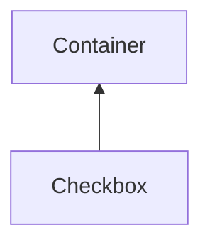

| public |
{:.api_label}

#### Inheritance Graph

## Description

## Public Functions

|
| ------: | ----------------- |
|  | |
|  | **[Checkbox](#classGUI_1_1Checkbox_1ac1c0a159623759dd72972831990ef3c1)**( [GUI_Manager](classGUI_1_1GUI%5F%5FManager) & gui, bool checked, const std::string & text,  [flag_t](classGUI_1_1Component#classGUI_1_1Component_1aa86a1fd78119640545900da0f8f620bd)  flags) |
|  | |
|  | **[~Checkbox](#classGUI_1_1Checkbox_1a294c700f61af96916e5809fd514ff438)**() |
|  | |
| void | **[setChecked](#classGUI_1_1Checkbox_1af3f5ce64c48b94363e25e0a577b24067)**(bool b) |
|  | |
| bool | **[isChecked](#classGUI_1_1Checkbox_1a31bb46c2be4ad318d31f0fad52b1bf31)**() const |
|  | |
| void | **[setValueRef](#classGUI_1_1Checkbox_1a34ffa72341cb7ba626a0a68e04cb7ec7)**(bool * boolRef) |
|  | |
| void | **[setValueRef](#classGUI_1_1Checkbox_1a83b2c9e4ace085ba7c9106fec852250f)**(unsigned int * intValueRef, unsigned int intBitMask) |
|  | |
| void | **[setText](#classGUI_1_1Checkbox_1a13d744d231f81284c6ca1dfd8c637835)**(const std::string & text) |
|  | |
| std::string | **[getText](#classGUI_1_1Checkbox_1a667041dc1a1fdd22d378ce56d6488bbb)**() const |
|  | |
| void | **[setFont](#classGUI_1_1Checkbox_1a713d19283b9486e58068618e0cf0eb7f)**( [AbstractFont](classGUI_1_1AbstractFont) * newFont) |
|  | |
| void | **[setTextStyle](#classGUI_1_1Checkbox_1afc9fc4e587ea6651175783eba8bb0de5)**(unsigned int style) |
|  | |
| void | **[action](#classGUI_1_1Checkbox_1a0dcf77cb21236ee779b5c97439ee9309)**() |
|  | |
| void | **[doLayout](#classGUI_1_1Checkbox_1a3467adf386623b73162ba37d2513d5c6)**() |
{: .nohead .nowrap1 .api_section }

-------------------------------------------------------------------

## Documentation

### <small>function</small>  GUI::Checkbox::Checkbox {#classGUI_1_1Checkbox_1ac1c0a159623759dd72972831990ef3c1}

| public |
{:.api_label}

|
| ------: | ----------------- |
|  |
|  **[Checkbox](#classGUI_1_1Checkbox_1ac1c0a159623759dd72972831990ef3c1)**( |  [GUI_Manager](classGUI_1_1GUI%5F%5FManager) & | **gui**, |
| | bool | **checked**, |
| | const std::string & | **text**, |
| |  [flag_t](classGUI_1_1Component#classGUI_1_1Component_1aa86a1fd78119640545900da0f8f620bd)  | **flags** |
|   ) |
{: .nohead .nowrap1 .api_doc }

Defined in `GUI/Components/Checkbox.h:26`{:style="float: right"}

-------------------------------------------------------------------

### <small>function</small>  GUI::Checkbox::~Checkbox {#classGUI_1_1Checkbox_1a294c700f61af96916e5809fd514ff438}

| public | virtual |
{:.api_label}

|
| ------: | ----------------- |
|  |
|  **[~Checkbox](#classGUI_1_1Checkbox_1a294c700f61af96916e5809fd514ff438)**( |  ) |
{: .nohead .nowrap1 .api_doc }

Defined in `GUI/Components/Checkbox.h:27`{:style="float: right"}

-------------------------------------------------------------------

### <small>function</small>  GUI::Checkbox::setChecked {#classGUI_1_1Checkbox_1af3f5ce64c48b94363e25e0a577b24067}

| public |
{:.api_label}

|
| ------: | ----------------- |
|  |
| void **[setChecked](#classGUI_1_1Checkbox_1af3f5ce64c48b94363e25e0a577b24067)**( | bool | **b** ) |
{: .nohead .nowrap1 .api_doc }

Defined in `GUI/Components/Checkbox.h:29`{:style="float: right"}

-------------------------------------------------------------------

### <small>function</small>  GUI::Checkbox::isChecked {#classGUI_1_1Checkbox_1a31bb46c2be4ad318d31f0fad52b1bf31}

| public | const |
{:.api_label}

|
| ------: | ----------------- |
|  |
| bool **[isChecked](#classGUI_1_1Checkbox_1a31bb46c2be4ad318d31f0fad52b1bf31)**( |  ) const |
{: .nohead .nowrap1 .api_doc }

Defined in `GUI/Components/Checkbox.h:30`{:style="float: right"}

-------------------------------------------------------------------

### <small>function</small>  GUI::Checkbox::setValueRef {#classGUI_1_1Checkbox_1a34ffa72341cb7ba626a0a68e04cb7ec7}

| public |
{:.api_label}

|
| ------: | ----------------- |
|  |
| void **[setValueRef](#classGUI_1_1Checkbox_1a34ffa72341cb7ba626a0a68e04cb7ec7)**( | bool * | **boolRef** ) |
{: .nohead .nowrap1 .api_doc }

Defined in `GUI/Components/Checkbox.h:32`{:style="float: right"}

-------------------------------------------------------------------

### <small>function</small>  GUI::Checkbox::setValueRef {#classGUI_1_1Checkbox_1a83b2c9e4ace085ba7c9106fec852250f}

| public |
{:.api_label}

|
| ------: | ----------------- |
|  |
| void **[setValueRef](#classGUI_1_1Checkbox_1a83b2c9e4ace085ba7c9106fec852250f)**( | unsigned int * | **intValueRef**, |
| | unsigned int | **intBitMask** |
|   ) |
{: .nohead .nowrap1 .api_doc }

Defined in `GUI/Components/Checkbox.h:33`{:style="float: right"}

-------------------------------------------------------------------

### <small>function</small>  GUI::Checkbox::setText {#classGUI_1_1Checkbox_1a13d744d231f81284c6ca1dfd8c637835}

| public |
{:.api_label}

|
| ------: | ----------------- |
|  |
| void **[setText](#classGUI_1_1Checkbox_1a13d744d231f81284c6ca1dfd8c637835)**( | const std::string & | **text** ) |
{: .nohead .nowrap1 .api_doc }

Defined in `GUI/Components/Checkbox.h:35`{:style="float: right"}

-------------------------------------------------------------------

### <small>function</small>  GUI::Checkbox::getText {#classGUI_1_1Checkbox_1a667041dc1a1fdd22d378ce56d6488bbb}

| public | const |
{:.api_label}

|
| ------: | ----------------- |
|  |
| std::string **[getText](#classGUI_1_1Checkbox_1a667041dc1a1fdd22d378ce56d6488bbb)**( |  ) const |
{: .nohead .nowrap1 .api_doc }

Defined in `GUI/Components/Checkbox.h:36`{:style="float: right"}

-------------------------------------------------------------------

### <small>function</small>  GUI::Checkbox::setFont {#classGUI_1_1Checkbox_1a713d19283b9486e58068618e0cf0eb7f}

| public | inline |
{:.api_label}

|
| ------: | ----------------- |
|  |
| void **[setFont](#classGUI_1_1Checkbox_1a713d19283b9486e58068618e0cf0eb7f)**( |  [AbstractFont](classGUI_1_1AbstractFont) * | **newFont** ) |
{: .nohead .nowrap1 .api_doc }

Defined in `GUI/Components/Checkbox.h:38`{:style="float: right"}

-------------------------------------------------------------------

### <small>function</small>  GUI::Checkbox::setTextStyle {#classGUI_1_1Checkbox_1afc9fc4e587ea6651175783eba8bb0de5}

| public | inline |
{:.api_label}

|
| ------: | ----------------- |
|  |
| void **[setTextStyle](#classGUI_1_1Checkbox_1afc9fc4e587ea6651175783eba8bb0de5)**( | unsigned int | **style** ) |
{: .nohead .nowrap1 .api_doc }

Defined in `GUI/Components/Checkbox.h:39`{:style="float: right"}

-------------------------------------------------------------------

### <small>function</small>  GUI::Checkbox::action {#classGUI_1_1Checkbox_1a0dcf77cb21236ee779b5c97439ee9309}

| public | virtual |
{:.api_label}

|
| ------: | ----------------- |
|  |
| void **[action](#classGUI_1_1Checkbox_1a0dcf77cb21236ee779b5c97439ee9309)**( |  ) |
{: .nohead .nowrap1 .api_doc }

Defined in `GUI/Components/Checkbox.h:42`{:style="float: right"}

-------------------------------------------------------------------

### <small>function</small>  GUI::Checkbox::doLayout {#classGUI_1_1Checkbox_1a3467adf386623b73162ba37d2513d5c6}

| public | virtual |
{:.api_label}

|
| ------: | ----------------- |
|  |
| void **[doLayout](#classGUI_1_1Checkbox_1a3467adf386623b73162ba37d2513d5c6)**( |  ) |
{: .nohead .nowrap1 .api_doc }

Defined in `GUI/Components/Checkbox.h:45`{:style="float: right"}

-------------------------------------------------------------------

