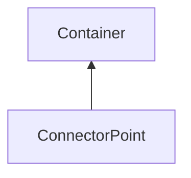

| public |
{:.api_label}

#### Inheritance Graph

## Description

(internal) One pont on a path of a component-Connector.

## Public Functions

|
| ------: | ----------------- |
|  | |
|  | **[ConnectorPoint](#classGUI_1_1Connector_1_1ConnectorPoint_1aa4d61f92f09603f2a4c6c2b148b6162d)**( [GUI_Manager](classGUI_1_1GUI%5F%5FManager) & gui,  [flag_t](classGUI_1_1Component#classGUI_1_1Component_1aa86a1fd78119640545900da0f8f620bd)  flags) |
|  | |
|  | **[ConnectorPoint](#classGUI_1_1Connector_1_1ConnectorPoint_1a94e7a7f45805af699920c89b7058e542)**(const [ConnectorPoint](classGUI_1_1Connector_1_1ConnectorPoint) & c) |
|  | |
|  | **[~ConnectorPoint](#classGUI_1_1Connector_1_1ConnectorPoint_1adb6bb052f7d45d21a8728d3a6ce82868)**() |
{: .nohead .nowrap1 .api_section }

-------------------------------------------------------------------

## Documentation

### <small>function</small>  GUI::Connector::ConnectorPoint::ConnectorPoint {#classGUI_1_1Connector_1_1ConnectorPoint_1aa4d61f92f09603f2a4c6c2b148b6162d}

| public |
{:.api_label}

|
| ------: | ----------------- |
|  |
|  **[ConnectorPoint](#classGUI_1_1Connector_1_1ConnectorPoint_1aa4d61f92f09603f2a4c6c2b148b6162d)**( |  [GUI_Manager](classGUI_1_1GUI%5F%5FManager) & | **gui**, |
| |  [flag_t](classGUI_1_1Component#classGUI_1_1Component_1aa86a1fd78119640545900da0f8f620bd)  | **flags** |
|   ) |
{: .nohead .nowrap1 .api_doc }

Defined in `GUI/Components/Connector.h:54`{:style="float: right"}

-------------------------------------------------------------------

### <small>function</small>  GUI::Connector::ConnectorPoint::ConnectorPoint {#classGUI_1_1Connector_1_1ConnectorPoint_1a94e7a7f45805af699920c89b7058e542}

| public |
{:.api_label}

|
| ------: | ----------------- |
|  |
|  **[ConnectorPoint](#classGUI_1_1Connector_1_1ConnectorPoint_1a94e7a7f45805af699920c89b7058e542)**( | const [ConnectorPoint](classGUI_1_1Connector_1_1ConnectorPoint) & | **c** ) |
{: .nohead .nowrap1 .api_doc }

Defined in `GUI/Components/Connector.h:55`{:style="float: right"}

-------------------------------------------------------------------

### <small>function</small>  GUI::Connector::ConnectorPoint::~ConnectorPoint {#classGUI_1_1Connector_1_1ConnectorPoint_1adb6bb052f7d45d21a8728d3a6ce82868}

| public | virtual |
{:.api_label}

|
| ------: | ----------------- |
|  |
|  **[~ConnectorPoint](#classGUI_1_1Connector_1_1ConnectorPoint_1adb6bb052f7d45d21a8728d3a6ce82868)**( |  ) |
{: .nohead .nowrap1 .api_doc }

Defined in `GUI/Components/Connector.h:56`{:style="float: right"}

-------------------------------------------------------------------

