| public |
{:.api_label}

#### Inheritance Graph

```mermaid
graph BT
	Container
	Container --> Component
	Button --> Container
	Checkbox --> Container
	Connector --> Container
	ConnectorPoint --> Container
	EditorPanel --> Container
	ListView --> Container
	Menu --> Container
	ScrollableContainer --> Container
	Scrollbar --> Container
	Slider --> Container
	TabbedPanel --> Container
	Tab --> Container
	Textarea --> Container
	TreeView --> Container
	TreeViewEntry --> Container
	Window --> Container
	click Container "classGUI_1_1Container"
	click Component "classGUI_1_1Component"
	click Button "classGUI_1_1Button"
	click Checkbox "classGUI_1_1Checkbox"
	click Connector "classGUI_1_1Connector"
	click ConnectorPoint "classGUI_1_1Connector_1_1ConnectorPoint"
	click EditorPanel "classGUI_1_1EditorPanel"
	click ListView "classGUI_1_1ListView"
	click Menu "classGUI_1_1Menu"
	click ScrollableContainer "classGUI_1_1ScrollableContainer"
	click Scrollbar "classGUI_1_1Scrollbar"
	click Slider "classGUI_1_1Slider"
	click TabbedPanel "classGUI_1_1TabbedPanel"
	click Tab "classGUI_1_1TabbedPanel_1_1Tab"
	click Textarea "classGUI_1_1Textarea"
	click TreeView "classGUI_1_1TreeView"
	click TreeViewEntry "classGUI_1_1TreeView_1_1TreeViewEntry"
	click Window "classGUI_1_1Window"
```

## Description

## Public Types

|
| ------: | ----------------- |
|  | |
| typedef [Util::Reference](classUtil_1_1Reference) < [Container](classGUI_1_1Container) > | **[ContainerRef](#classGUI_1_1Container_1a6cec1e4694b85bb99e0a0cd29d6efa77)**  |
{: .nohead .nowrap1 .api_section }

## Protected Attributes

|
| ------: | ----------------- |
|  | |
| [Ref](classGUI_1_1Component#classGUI_1_1Component_1a9811a53d9b6fcdab386cb3ece74e6bbd) | **[firstChild](#classGUI_1_1Container_1a911698f9c996fc273711da8d5aca3e46)**  |
|  | |
| [Ref](classGUI_1_1Component#classGUI_1_1Component_1a9811a53d9b6fcdab386cb3ece74e6bbd) | **[lastChild](#classGUI_1_1Container_1aaaff46f6efae2b95d63e1636d9fd0ab4)**  |
|  | |
| size_t | **[contentsCount](#classGUI_1_1Container_1a0a127b827ae3ee99bc8f7c859b3bfe0d)**  |
{: .nohead .nowrap1 .api_section }

## Public Functions

|
| ------: | ----------------- |
|  | |
|  | **[Container](#classGUI_1_1Container_1ad2ebd9a35af52e5a04cfb14f030dfe3b)**( [GUI_Manager](classGUI_1_1GUI%5F%5FManager) & gui,  [flag_t](classGUI_1_1Component#classGUI_1_1Component_1aa86a1fd78119640545900da0f8f620bd)  flags) |
|  | |
|  | **[Container](#classGUI_1_1Container_1a1dc4b5df5b9768b67111cb51739987bc)**( [GUI_Manager](classGUI_1_1GUI%5F%5FManager) & gui, const [Geometry::Rect](namespaceGeometry#namespaceGeometry_1acedeea2f6bddd99f077df6f73901a875) & r,  [flag_t](classGUI_1_1Component#classGUI_1_1Component_1aa86a1fd78119640545900da0f8f620bd)  flags) |
|  | |
| void | **[_addChild](#classGUI_1_1Container_1a98ab738521adb0b2a9f214bd8616d6a7)**(const [Ref](classGUI_1_1Component#classGUI_1_1Component_1a9811a53d9b6fcdab386cb3ece74e6bbd) & child) |
|  | |
| void | **[_insertAfter](#classGUI_1_1Container_1ad41a8097db94a1036c2f5b63710e62b5)**(const [Ref](classGUI_1_1Component#classGUI_1_1Component_1a9811a53d9b6fcdab386cb3ece74e6bbd) & child, const [Ref](classGUI_1_1Component#classGUI_1_1Component_1a9811a53d9b6fcdab386cb3ece74e6bbd) & after) |
|  | |
| void | **[_insertBefore](#classGUI_1_1Container_1aece39fa92c6632208cf74e33d0b22e2a)**(const [Ref](classGUI_1_1Component#classGUI_1_1Component_1a9811a53d9b6fcdab386cb3ece74e6bbd) & child, const [Ref](classGUI_1_1Component#classGUI_1_1Component_1a9811a53d9b6fcdab386cb3ece74e6bbd) & before) |
|  | |
| void | **[_removeChild](#classGUI_1_1Container_1a5e203d24ec79177e0fced8d40c06aa25)**(const [Ref](classGUI_1_1Component#classGUI_1_1Component_1a9811a53d9b6fcdab386cb3ece74e6bbd) & child) |
|  | |
| [Component](classGUI_1_1Component) * | **[getFirstChild](#classGUI_1_1Container_1a9e4a96a043b4f9073ab1f21d2cf9bae6)**() const |
|  | |
| [Component](classGUI_1_1Component) * | **[getLastChild](#classGUI_1_1Container_1ae343300d42499d6813ddc7d032298d1b)**() const |
|  | |
| void | **[childRectChanged](#classGUI_1_1Container_1ac06b15615aa5b107327c35a473a9478e)**( [Component](classGUI_1_1Component) * c) |
|  | |
| void | **[addContent](#classGUI_1_1Container_1a4ed7c8edeedad4519ad3fb3c5f88112e)**(const [Ref](classGUI_1_1Component#classGUI_1_1Component_1a9811a53d9b6fcdab386cb3ece74e6bbd) & child) |
|  | |
| void | **[removeContent](#classGUI_1_1Container_1ab09f7abd16fc596c3cf5168caf9ddb8c)**(const [Ref](classGUI_1_1Component#classGUI_1_1Component_1a9811a53d9b6fcdab386cb3ece74e6bbd) & child) |
|  | |
| void | **[clearContents](#classGUI_1_1Container_1ade02435bd92bb1984abf4cd5160328ac)**() |
|  | |
| void | **[destroyContents](#classGUI_1_1Container_1a59368bd93f7014ab86c12bc8cba82bb8)**() |
|  | |
| size_t | **[getContentsCount](#classGUI_1_1Container_1a3bea6a1f5786c246bb1f1e73d94a4c50)**() const |
|  | |
| void | **[bringChildToFront](#classGUI_1_1Container_1ac50cb48631f606b1e2d319ba8575645f)**( [Component](classGUI_1_1Component) * c) |
|  | |
| std::vector< [Component](classGUI_1_1Component) * > | **[getContents](#classGUI_1_1Container_1abd5207e58756304fc3bf382392855429)**() |
|  | |
| void | **[insertAfter](#classGUI_1_1Container_1a1051041874c2529972b917b0b1ab1b71)**(const [Ref](classGUI_1_1Component#classGUI_1_1Component_1a9811a53d9b6fcdab386cb3ece74e6bbd) & child, const [Ref](classGUI_1_1Component#classGUI_1_1Component_1a9811a53d9b6fcdab386cb3ece74e6bbd) & after) |
|  | |
| void | **[insertBefore](#classGUI_1_1Container_1af838dd9e63990602eacd122b1d507b6a)**(const [Ref](classGUI_1_1Component#classGUI_1_1Component_1a9811a53d9b6fcdab386cb3ece74e6bbd) & child, const [Ref](classGUI_1_1Component#classGUI_1_1Component_1a9811a53d9b6fcdab386cb3ece74e6bbd) & after) |
|  | |
| std::string | **[toString](#classGUI_1_1Container_1a09bab5d5d42bbc5bf25a0de24e58128b)**() const |
|  | |
| [visitorResult_t](classGUI_1_1Component#classGUI_1_1Component_1afc331644e4e3f97542614f2cd08e4363) | **[traverseChildren](#classGUI_1_1Container_1a8192844ee7ea8dd5a689bba8de80e56f)**( [Visitor](structGUI_1_1Component_1_1Visitor) & v) |
|  | |
| [visitorResult_t](classGUI_1_1Component#classGUI_1_1Component_1afc331644e4e3f97542614f2cd08e4363) | **[traverseSubtree](#classGUI_1_1Container_1ad9c9bf6c481f55b6bc5800abce59f9f9)**( [Visitor](structGUI_1_1Component_1_1Visitor) & v) |
{: .nohead .nowrap1 .api_section }

## Protected Functions

|
| ------: | ----------------- |
|  | |
|  | **[~Container](#classGUI_1_1Container_1a1e1d5603ed9a9932be3a39acf4e7fa72)**() |
|  | |
| void | **[displayChildren](#classGUI_1_1Container_1a81a42e145ae6b1de6814a7daa62aa510)**(const [Geometry::Rect](namespaceGeometry#namespaceGeometry_1acedeea2f6bddd99f077df6f73901a875) & region, bool useScissor) |
|  | |
| void | **[copyChildrenTo](#classGUI_1_1Container_1a9ffb040fb997428334f76e36b061862b)**( [Container](classGUI_1_1Container) & target) const |
{: .nohead .nowrap1 .api_section }

-------------------------------------------------------------------

## Documentation

### <small>typedef</small>  GUI::Container::ContainerRef {#classGUI_1_1Container_1a6cec1e4694b85bb99e0a0cd29d6efa77}

| public |
{:.api_label}

|
| ------: | ----------------- |
|  |
| typedef [Util::Reference](classUtil_1_1Reference) < [Container](classGUI_1_1Container) > **[ContainerRef](#classGUI_1_1Container_1a6cec1e4694b85bb99e0a0cd29d6efa77)**  |
{: .nohead .nowrap1 .api_doc }

Defined in `GUI/Components/Container.h:28`{:style="float: right"}

-------------------------------------------------------------------

### <small>variable</small>  GUI::Container::firstChild {#classGUI_1_1Container_1a911698f9c996fc273711da8d5aca3e46}

| protected |
{:.api_label}

|
| ------: | ----------------- |
|  |
| [Ref](classGUI_1_1Component#classGUI_1_1Component_1a9811a53d9b6fcdab386cb3ece74e6bbd) **[firstChild](#classGUI_1_1Container_1a911698f9c996fc273711da8d5aca3e46)**  |
{: .nohead .nowrap1 .api_doc }

Defined in `GUI/Components/Container.h:85`{:style="float: right"}

-------------------------------------------------------------------

### <small>variable</small>  GUI::Container::lastChild {#classGUI_1_1Container_1aaaff46f6efae2b95d63e1636d9fd0ab4}

| protected |
{:.api_label}

|
| ------: | ----------------- |
|  |
| [Ref](classGUI_1_1Component#classGUI_1_1Component_1a9811a53d9b6fcdab386cb3ece74e6bbd) **[lastChild](#classGUI_1_1Container_1aaaff46f6efae2b95d63e1636d9fd0ab4)**  |
{: .nohead .nowrap1 .api_doc }

Defined in `GUI/Components/Container.h:86`{:style="float: right"}

-------------------------------------------------------------------

### <small>variable</small>  GUI::Container::contentsCount {#classGUI_1_1Container_1a0a127b827ae3ee99bc8f7c859b3bfe0d}

| protected |
{:.api_label}

|
| ------: | ----------------- |
|  |
| size_t **[contentsCount](#classGUI_1_1Container_1a0a127b827ae3ee99bc8f7c859b3bfe0d)**  |
{: .nohead .nowrap1 .api_doc }

Defined in `GUI/Components/Container.h:87`{:style="float: right"}

-------------------------------------------------------------------

### <small>function</small>  GUI::Container::Container {#classGUI_1_1Container_1ad2ebd9a35af52e5a04cfb14f030dfe3b}

| public |
{:.api_label}

|
| ------: | ----------------- |
|  |
|  **[Container](#classGUI_1_1Container_1ad2ebd9a35af52e5a04cfb14f030dfe3b)**( |  [GUI_Manager](classGUI_1_1GUI%5F%5FManager) & | **gui**, |
| |  [flag_t](classGUI_1_1Component#classGUI_1_1Component_1aa86a1fd78119640545900da0f8f620bd)  | **flags** |
|   ) |
{: .nohead .nowrap1 .api_doc }

Defined in `GUI/Components/Container.h:25`{:style="float: right"}

-------------------------------------------------------------------

### <small>function</small>  GUI::Container::Container {#classGUI_1_1Container_1a1dc4b5df5b9768b67111cb51739987bc}

| public |
{:.api_label}

|
| ------: | ----------------- |
|  |
|  **[Container](#classGUI_1_1Container_1a1dc4b5df5b9768b67111cb51739987bc)**( |  [GUI_Manager](classGUI_1_1GUI%5F%5FManager) & | **gui**, |
| | const [Geometry::Rect](namespaceGeometry#namespaceGeometry_1acedeea2f6bddd99f077df6f73901a875) & | **r**, |
| |  [flag_t](classGUI_1_1Component#classGUI_1_1Component_1aa86a1fd78119640545900da0f8f620bd)  | **flags** |
|   ) |
{: .nohead .nowrap1 .api_doc }

Defined in `GUI/Components/Container.h:26`{:style="float: right"}

-------------------------------------------------------------------

### <small>function</small>  GUI::Container::_addChild {#classGUI_1_1Container_1a98ab738521adb0b2a9f214bd8616d6a7}

| public | inline |
{:.api_label}

|
| ------: | ----------------- |
|  |
| void **[_addChild](#classGUI_1_1Container_1a98ab738521adb0b2a9f214bd8616d6a7)**( | const [Ref](classGUI_1_1Component#classGUI_1_1Component_1a9811a53d9b6fcdab386cb3ece74e6bbd) & | **child** ) |
{: .nohead .nowrap1 .api_doc }

Defined in `GUI/Components/Container.h:34`{:style="float: right"}

-------------------------------------------------------------------

### <small>function</small>  GUI::Container::_insertAfter {#classGUI_1_1Container_1ad41a8097db94a1036c2f5b63710e62b5}

| public |
{:.api_label}

|
| ------: | ----------------- |
|  |
| void **[_insertAfter](#classGUI_1_1Container_1ad41a8097db94a1036c2f5b63710e62b5)**( | const [Ref](classGUI_1_1Component#classGUI_1_1Component_1a9811a53d9b6fcdab386cb3ece74e6bbd) & | **child**, |
| | const [Ref](classGUI_1_1Component#classGUI_1_1Component_1a9811a53d9b6fcdab386cb3ece74e6bbd) & | **after** |
|   ) |
{: .nohead .nowrap1 .api_doc }

Defined in `GUI/Components/Container.h:35`{:style="float: right"}

-------------------------------------------------------------------

### <small>function</small>  GUI::Container::_insertBefore {#classGUI_1_1Container_1aece39fa92c6632208cf74e33d0b22e2a}

| public |
{:.api_label}

|
| ------: | ----------------- |
|  |
| void **[_insertBefore](#classGUI_1_1Container_1aece39fa92c6632208cf74e33d0b22e2a)**( | const [Ref](classGUI_1_1Component#classGUI_1_1Component_1a9811a53d9b6fcdab386cb3ece74e6bbd) & | **child**, |
| | const [Ref](classGUI_1_1Component#classGUI_1_1Component_1a9811a53d9b6fcdab386cb3ece74e6bbd) & | **before** |
|   ) |
{: .nohead .nowrap1 .api_doc }

Defined in `GUI/Components/Container.h:36`{:style="float: right"}

-------------------------------------------------------------------

### <small>function</small>  GUI::Container::_removeChild {#classGUI_1_1Container_1a5e203d24ec79177e0fced8d40c06aa25}

| public |
{:.api_label}

|
| ------: | ----------------- |
|  |
| void **[_removeChild](#classGUI_1_1Container_1a5e203d24ec79177e0fced8d40c06aa25)**( | const [Ref](classGUI_1_1Component#classGUI_1_1Component_1a9811a53d9b6fcdab386cb3ece74e6bbd) & | **child** ) |
{: .nohead .nowrap1 .api_doc }

Defined in `GUI/Components/Container.h:37`{:style="float: right"}

-------------------------------------------------------------------

### <small>function</small>  GUI::Container::getFirstChild {#classGUI_1_1Container_1a9e4a96a043b4f9073ab1f21d2cf9bae6}

| public | const | inline |
{:.api_label}

|
| ------: | ----------------- |
|  |
| [Component](classGUI_1_1Component) * **[getFirstChild](#classGUI_1_1Container_1a9e4a96a043b4f9073ab1f21d2cf9bae6)**( |  ) const |
{: .nohead .nowrap1 .api_doc }

Defined in `GUI/Components/Container.h:39`{:style="float: right"}

-------------------------------------------------------------------

### <small>function</small>  GUI::Container::getLastChild {#classGUI_1_1Container_1ae343300d42499d6813ddc7d032298d1b}

| public | const | inline |
{:.api_label}

|
| ------: | ----------------- |
|  |
| [Component](classGUI_1_1Component) * **[getLastChild](#classGUI_1_1Container_1ae343300d42499d6813ddc7d032298d1b)**( |  ) const |
{: .nohead .nowrap1 .api_doc }

Defined in `GUI/Components/Container.h:40`{:style="float: right"}

-------------------------------------------------------------------

### <small>function</small>  GUI::Container::childRectChanged {#classGUI_1_1Container_1ac06b15615aa5b107327c35a473a9478e}

| public |
{:.api_label}

|
| ------: | ----------------- |
|  |
| void **[childRectChanged](#classGUI_1_1Container_1ac06b15615aa5b107327c35a473a9478e)**( |  [Component](classGUI_1_1Component) * | **c** ) |
{: .nohead .nowrap1 .api_doc }

This is called by a child`c`whenever its rect is changed, it's added or it's removed. The LAYOUT_VALID flag is cleared.

Defined in `GUI/Components/Container.h:44`{:style="float: right"}

-------------------------------------------------------------------

### <small>function</small>  GUI::Container::addContent {#classGUI_1_1Container_1a4ed7c8edeedad4519ad3fb3c5f88112e}

| public | inline | virtual |
{:.api_label}

|
| ------: | ----------------- |
|  |
| void **[addContent](#classGUI_1_1Container_1a4ed7c8edeedad4519ad3fb3c5f88112e)**( | const [Ref](classGUI_1_1Component#classGUI_1_1Component_1a9811a53d9b6fcdab386cb3ece74e6bbd) & | **child** ) |
{: .nohead .nowrap1 .api_doc }

Defined in `GUI/Components/Container.h:47`{:style="float: right"}

-------------------------------------------------------------------

### <small>function</small>  GUI::Container::removeContent {#classGUI_1_1Container_1ab09f7abd16fc596c3cf5168caf9ddb8c}

| public | inline | virtual |
{:.api_label}

|
| ------: | ----------------- |
|  |
| void **[removeContent](#classGUI_1_1Container_1ab09f7abd16fc596c3cf5168caf9ddb8c)**( | const [Ref](classGUI_1_1Component#classGUI_1_1Component_1a9811a53d9b6fcdab386cb3ece74e6bbd) & | **child** ) |
{: .nohead .nowrap1 .api_doc }

Defined in `GUI/Components/Container.h:49`{:style="float: right"}

-------------------------------------------------------------------

### <small>function</small>  GUI::Container::clearContents {#classGUI_1_1Container_1ade02435bd92bb1984abf4cd5160328ac}

| public | virtual |
{:.api_label}

|
| ------: | ----------------- |
|  |
| void **[clearContents](#classGUI_1_1Container_1ade02435bd92bb1984abf4cd5160328ac)**( |  ) |
{: .nohead .nowrap1 .api_doc }

Defined in `GUI/Components/Container.h:51`{:style="float: right"}

-------------------------------------------------------------------

### <small>function</small>  GUI::Container::destroyContents {#classGUI_1_1Container_1a59368bd93f7014ab86c12bc8cba82bb8}

| public |
{:.api_label}

|
| ------: | ----------------- |
|  |
| void **[destroyContents](#classGUI_1_1Container_1a59368bd93f7014ab86c12bc8cba82bb8)**( |  ) |
{: .nohead .nowrap1 .api_doc }

Remove all children and mark them for removal . The childrens' subtrees will be dissolved and their attributes will be removed.
> **Note**: this does (or should not) not remove the internal children like scroll bars.

Defined in `GUI/Components/Container.h:56`{:style="float: right"}

-------------------------------------------------------------------

### <small>function</small>  GUI::Container::getContentsCount {#classGUI_1_1Container_1a3bea6a1f5786c246bb1f1e73d94a4c50}

| public | const | inline | virtual |
{:.api_label}

|
| ------: | ----------------- |
|  |
| size_t **[getContentsCount](#classGUI_1_1Container_1a3bea6a1f5786c246bb1f1e73d94a4c50)**( |  ) const |
{: .nohead .nowrap1 .api_doc }

Defined in `GUI/Components/Container.h:59`{:style="float: right"}

-------------------------------------------------------------------

### <small>function</small>  GUI::Container::bringChildToFront {#classGUI_1_1Container_1ac50cb48631f606b1e2d319ba8575645f}

| public | virtual |
{:.api_label}

|
| ------: | ----------------- |
|  |
| void **[bringChildToFront](#classGUI_1_1Container_1ac50cb48631f606b1e2d319ba8575645f)**( |  [Component](classGUI_1_1Component) * | **c** ) |
{: .nohead .nowrap1 .api_doc }

Defined in `GUI/Components/Container.h:61`{:style="float: right"}

-------------------------------------------------------------------

### <small>function</small>  GUI::Container::getContents {#classGUI_1_1Container_1abd5207e58756304fc3bf382392855429}

| public | virtual |
{:.api_label}

|
| ------: | ----------------- |
|  |
| std::vector< [Component](classGUI_1_1Component) * > **[getContents](#classGUI_1_1Container_1abd5207e58756304fc3bf382392855429)**( |  ) |
{: .nohead .nowrap1 .api_doc }

Defined in `GUI/Components/Container.h:63`{:style="float: right"}

-------------------------------------------------------------------

### <small>function</small>  GUI::Container::insertAfter {#classGUI_1_1Container_1a1051041874c2529972b917b0b1ab1b71}

| public | inline | virtual |
{:.api_label}

|
| ------: | ----------------- |
|  |
| void **[insertAfter](#classGUI_1_1Container_1a1051041874c2529972b917b0b1ab1b71)**( | const [Ref](classGUI_1_1Component#classGUI_1_1Component_1a9811a53d9b6fcdab386cb3ece74e6bbd) & | **child**, |
| | const [Ref](classGUI_1_1Component#classGUI_1_1Component_1a9811a53d9b6fcdab386cb3ece74e6bbd) & | **after** |
|   ) |
{: .nohead .nowrap1 .api_doc }

Defined in `GUI/Components/Container.h:65`{:style="float: right"}

-------------------------------------------------------------------

### <small>function</small>  GUI::Container::insertBefore {#classGUI_1_1Container_1af838dd9e63990602eacd122b1d507b6a}

| public | inline | virtual |
{:.api_label}

|
| ------: | ----------------- |
|  |
| void **[insertBefore](#classGUI_1_1Container_1af838dd9e63990602eacd122b1d507b6a)**( | const [Ref](classGUI_1_1Component#classGUI_1_1Component_1a9811a53d9b6fcdab386cb3ece74e6bbd) & | **child**, |
| | const [Ref](classGUI_1_1Component#classGUI_1_1Component_1a9811a53d9b6fcdab386cb3ece74e6bbd) & | **after** |
|   ) |
{: .nohead .nowrap1 .api_doc }

Defined in `GUI/Components/Container.h:69`{:style="float: right"}

-------------------------------------------------------------------

### <small>function</small>  GUI::Container::toString {#classGUI_1_1Container_1a09bab5d5d42bbc5bf25a0de24e58128b}

| public | const | virtual |
{:.api_label}

|
| ------: | ----------------- |
|  |
| std::string **[toString](#classGUI_1_1Container_1a09bab5d5d42bbc5bf25a0de24e58128b)**( |  ) const |
{: .nohead .nowrap1 .api_doc }

Defined in `GUI/Components/Container.h:74`{:style="float: right"}

-------------------------------------------------------------------

### <small>function</small>  GUI::Container::traverseChildren {#classGUI_1_1Container_1a8192844ee7ea8dd5a689bba8de80e56f}

| public | virtual |
{:.api_label}

|
| ------: | ----------------- |
|  |
| [visitorResult_t](classGUI_1_1Component#classGUI_1_1Component_1afc331644e4e3f97542614f2cd08e4363) **[traverseChildren](#classGUI_1_1Container_1a8192844ee7ea8dd5a689bba8de80e56f)**( |  [Visitor](structGUI_1_1Component_1_1Visitor) & | **v** ) |
{: .nohead .nowrap1 .api_doc }

Defined in `GUI/Components/Container.h:75`{:style="float: right"}

-------------------------------------------------------------------

### <small>function</small>  GUI::Container::traverseSubtree {#classGUI_1_1Container_1ad9c9bf6c481f55b6bc5800abce59f9f9}

| public | virtual |
{:.api_label}

|
| ------: | ----------------- |
|  |
| [visitorResult_t](classGUI_1_1Component#classGUI_1_1Component_1afc331644e4e3f97542614f2cd08e4363) **[traverseSubtree](#classGUI_1_1Container_1ad9c9bf6c481f55b6bc5800abce59f9f9)**( |  [Visitor](structGUI_1_1Component_1_1Visitor) & | **v** ) |
{: .nohead .nowrap1 .api_doc }

Defined in `GUI/Components/Container.h:76`{:style="float: right"}

-------------------------------------------------------------------

### <small>function</small>  GUI::Container::~Container {#classGUI_1_1Container_1a1e1d5603ed9a9932be3a39acf4e7fa72}

| protected | virtual |
{:.api_label}

|
| ------: | ----------------- |
|  |
|  **[~Container](#classGUI_1_1Container_1a1e1d5603ed9a9932be3a39acf4e7fa72)**( |  ) |
{: .nohead .nowrap1 .api_doc }

Defined in `GUI/Components/Container.h:31`{:style="float: right"}

-------------------------------------------------------------------

### <small>function</small>  GUI::Container::displayChildren {#classGUI_1_1Container_1a81a42e145ae6b1de6814a7daa62aa510}

| protected |
{:.api_label}

|
| ------: | ----------------- |
|  |
| void **[displayChildren](#classGUI_1_1Container_1a81a42e145ae6b1de6814a7daa62aa510)**( | const [Geometry::Rect](namespaceGeometry#namespaceGeometry_1acedeea2f6bddd99f077df6f73901a875) & | **region**, |
| | bool | **useScissor** |
|   ) |
{: .nohead .nowrap1 .api_doc }

Defined in `GUI/Components/Container.h:82`{:style="float: right"}

-------------------------------------------------------------------

### <small>function</small>  GUI::Container::copyChildrenTo {#classGUI_1_1Container_1a9ffb040fb997428334f76e36b061862b}

| protected | const |
{:.api_label}

|
| ------: | ----------------- |
|  |
| void **[copyChildrenTo](#classGUI_1_1Container_1a9ffb040fb997428334f76e36b061862b)**( |  [Container](classGUI_1_1Container) & | **target** ) const |
{: .nohead .nowrap1 .api_doc }

Defined in `GUI/Components/Container.h:83`{:style="float: right"}

-------------------------------------------------------------------

