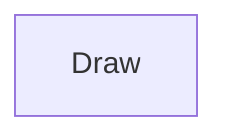

| public |
{:.api_label}

#### Inheritance Graph

## Description

## Public Static Attributes

|
| ------: | ----------------- |
|  | |
| const unsigned int | **[TEXT_ALIGN_LEFT](#classGUI_1_1Draw_1a911f5a71a735137d012e798c3c4241fc)**  |
|  | |
| const unsigned int | **[TEXT_ALIGN_RIGHT](#classGUI_1_1Draw_1a27b189639b6fa4ccb2440326ea5c1185)**  |
|  | |
| const unsigned int | **[TEXT_ALIGN_CENTER](#classGUI_1_1Draw_1adef79b7c099f2a1c51f6209c2189b9a9)**  |
|  | |
| const unsigned int | **[TEXT_ALIGN_MIDDLE](#classGUI_1_1Draw_1a5056f2502f02d20f5529dab887516957)**  |
{: .nohead .nowrap1 .api_section }

## Public Static Functions

|
| ------: | ----------------- |
|  | |
| void | **[beginDrawing](#classGUI_1_1Draw_1ab62fdca69625f66ebf615e4ca11a4ac6)**( [Rendering::RenderingContext](classRendering_1_1RenderingContext) & rc, const [Geometry::Vec2i](namespaceGeometry#namespaceGeometry_1af5c374694b0993fb291b80677f10c64c) & screenSize) |
|  | |
| [Rendering::RenderingContext](classRendering_1_1RenderingContext) & | **[getRenderingContext](#classGUI_1_1Draw_1ad2c1aa15419a1014ed6393d0d061cf32)**() |
|  | |
| void | **[endDrawing](#classGUI_1_1Draw_1a10dff1e212991a10936fa5602f452298)**() |
|  | |
| void | **[flush](#classGUI_1_1Draw_1a53ae8580fa7de1e93073dafca4dff27f)**() |
|  | |
| void | **[moveCursor](#classGUI_1_1Draw_1a3a6ee9d3a4eaa25e4dbdfc6c97855219)**(const [Geometry::Vec2i](namespaceGeometry#namespaceGeometry_1af5c374694b0993fb291b80677f10c64c) & pos) |
|  | |
| void | **[setScissor](#classGUI_1_1Draw_1ac3380cad2865a3599bec0e447d9f8154)**(const [Geometry::Rect_i](namespaceGeometry#namespaceGeometry_1a22750be67fc5d15a039c6db8ef7406ad) & rect) |
|  | |
| void | **[resetScissor](#classGUI_1_1Draw_1a30c16fb0d17dcf3ee1b7a2cca16ad158)**() |
|  | |
| void | **[clearScreen](#classGUI_1_1Draw_1ac098ffb7e2a4fb96bd63dca7034a45c2)**(const [Util::Color4ub](classUtil_1_1Color4ub) & color) |
|  | |
| [Geometry::Rect_i](namespaceGeometry#namespaceGeometry_1a22750be67fc5d15a039c6db8ef7406ad) | **[queryViewport](#classGUI_1_1Draw_1a5ef2c8033c80a7fad2da8a01340a7b1e)**() |
|  | |
| void | **[drawText](#classGUI_1_1Draw_1a4cb8c86561945629cbe37d2b49e337e1)**(const std::string & text, const [Geometry::Vec2](namespaceGeometry#namespaceGeometry_1aa9c56320691770d4bc53916868f15e6d)  pos,  [AbstractFont](classGUI_1_1AbstractFont) * font, const [Util::Color4ub](classUtil_1_1Color4ub) & c) |
|  | |
| void | **[drawText](#classGUI_1_1Draw_1ae82fee52c28b48009da0a0259bdfc09a)**(const std::string & text, const [Geometry::Rect](namespaceGeometry#namespaceGeometry_1acedeea2f6bddd99f077df6f73901a875) & r,  [AbstractFont](classGUI_1_1AbstractFont) * font, const [Util::Color4ub](classUtil_1_1Color4ub) & c, unsigned int style) |
|  | |
| float | **[getTextWidth](#classGUI_1_1Draw_1a8650228f59e46599dd7088058f98b4ce)**(const std::string & text,  [AbstractFont](classGUI_1_1AbstractFont) * font) |
|  | |
| [Geometry::Vec2](namespaceGeometry#namespaceGeometry_1aa9c56320691770d4bc53916868f15e6d) | **[getTextSize](#classGUI_1_1Draw_1a0549bae08e0651dfd459fc052f027da4)**(const std::string & text,  [AbstractFont](classGUI_1_1AbstractFont) * font) |
|  | |
| void | **[drawCross](#classGUI_1_1Draw_1ab57b96ac51c21483186aa9046258ba93)**(const [Geometry::Rect](namespaceGeometry#namespaceGeometry_1acedeea2f6bddd99f077df6f73901a875) & r, const [Util::Color4ub](classUtil_1_1Color4ub) & c, float lineWidth) |
|  | |
| void | **[draw3DRect](#classGUI_1_1Draw_1aa8235ab2228f0e5a6831087972d672ee)**(const [Geometry::Rect](namespaceGeometry#namespaceGeometry_1acedeea2f6bddd99f077df6f73901a875) & r, bool down, const [Util::Color4ub](classUtil_1_1Color4ub) & bgColor1, const [Util::Color4ub](classUtil_1_1Color4ub) & bgColor2) |
|  | |
| void | **[drawFilledRect](#classGUI_1_1Draw_1ab780de98bad71792f1f1f7f8a5049d11)**(const [Geometry::Rect](namespaceGeometry#namespaceGeometry_1acedeea2f6bddd99f077df6f73901a875) & r, const [Util::Color4ub](classUtil_1_1Color4ub) & bgColor, bool blend) |
|  | |
| void | **[drawFilledRect](#classGUI_1_1Draw_1a22255c215f28c7d1e4d2426bae733fa0)**(const [Geometry::Rect](namespaceGeometry#namespaceGeometry_1acedeea2f6bddd99f077df6f73901a875) & r, const [Util::Color4ub](classUtil_1_1Color4ub) & bgColorTL, const [Util::Color4ub](classUtil_1_1Color4ub) & bgColorBL, const [Util::Color4ub](classUtil_1_1Color4ub) & bgColorBR, const [Util::Color4ub](classUtil_1_1Color4ub) & bgColorTR, bool blend) |
|  | |
| void | **[drawLineRect](#classGUI_1_1Draw_1a7323c6051f59587cde5397a5a2329348)**(const [Geometry::Rect](namespaceGeometry#namespaceGeometry_1acedeea2f6bddd99f077df6f73901a875) & r, const [Util::Color4ub](classUtil_1_1Color4ub) & lineColor, bool blend) |
|  | |
| void | **[drawTab](#classGUI_1_1Draw_1a3383c43919315bc8f8afce5cea249046)**(const [Geometry::Rect](namespaceGeometry#namespaceGeometry_1acedeea2f6bddd99f077df6f73901a875) & r, const [Util::Color4ub](classUtil_1_1Color4ub) & lineColor, const [Util::Color4ub](classUtil_1_1Color4ub) & bgColor1, const [Util::Color4ub](classUtil_1_1Color4ub) & bgColor2) |
|  | |
| void | **[dropShadow](#classGUI_1_1Draw_1ac9b9d0df623ad43390cac0e15736fc4c)**(const [Geometry::Rect](namespaceGeometry#namespaceGeometry_1acedeea2f6bddd99f077df6f73901a875) & r) |
|  | |
| void | **[dropShadow](#classGUI_1_1Draw_1a4f87a71971038463bb07e89f3153958b)**(const [Geometry::Rect](namespaceGeometry#namespaceGeometry_1acedeea2f6bddd99f077df6f73901a875) & r, const [Geometry::Rect](namespaceGeometry#namespaceGeometry_1acedeea2f6bddd99f077df6f73901a875) & r2, const [Util::Color4ub](classUtil_1_1Color4ub)  c) |
|  | |
| void | **[drawTexturedRect](#classGUI_1_1Draw_1ab69d1afee39d9c4a0766488b81d87451)**(const [Geometry::Rect_i](namespaceGeometry#namespaceGeometry_1a22750be67fc5d15a039c6db8ef7406ad) & screenRect, const [Geometry::Rect](namespaceGeometry#namespaceGeometry_1acedeea2f6bddd99f077df6f73901a875) & uvRect, const [Util::Color4ub](classUtil_1_1Color4ub) & c, bool blend) |
|  | |
| void | **[drawTexturedTriangles](#classGUI_1_1Draw_1a1369ec0a6bd95ac98635599e4683e775)**(const std::vector< float > & posAndUV, const [Util::Color4ub](classUtil_1_1Color4ub) & c, bool blend)   `posAndUV:`{ x0,y0,u0,v0, x1,y1,u1,v1, x2,y2,u2,v2, ... } |
|  | |
| void | **[drawLine](#classGUI_1_1Draw_1a0b75e1306532f67e03146cc043c55e04)**(const std::vector< float > & vertices, const std::vector< uint32_t > & colors, const float lineWidth, bool lineSmooth)   `vertices:`{ x0,y0, x1,y1, x2,y2, ... }`color`{c0, c1, c2, ...} |
|  | |
| void | **[drawLines](#classGUI_1_1Draw_1ad91a3df96b189fd6427143f75010b90c)**(const std::vector< float > & vertices, const std::vector< uint32_t > & colors, const float lineWidth)   `vertices:`{ x0a,y0a, x0b,y0b, x1a,y1a, x1a,x1b, ... }`color`{c0a, c0b, c1a, c1b, c2a, c2b ...} |
|  | |
| void | **[drawTriangleFan](#classGUI_1_1Draw_1a025317a99c7a0400fb1c003afe64039b)**(const std::vector< float > & vertices, const std::vector< uint32_t > & colors)   `vertices:`{ x0,y0, x1,y1, x2,y2, ... }`color`{c0, c1, c2, ...} |
|  | |
| void | **[enableTexture](#classGUI_1_1Draw_1a51747f9938553df722f0893756d3df1c)**( [ImageData](classGUI_1_1ImageData) * texture) |
|  | |
| void | **[disableTexture](#classGUI_1_1Draw_1a485fab2a60b9793d1a09b18e9865e793)**() |
{: .nohead .nowrap1 .api_section }

-------------------------------------------------------------------

## Documentation

### <small>variable</small>  GUI::Draw::TEXT_ALIGN_LEFT {#classGUI_1_1Draw_1a911f5a71a735137d012e798c3c4241fc}

| public | static |
{:.api_label}

|
| ------: | ----------------- |
|  |
| const unsigned int **[TEXT_ALIGN_LEFT](#classGUI_1_1Draw_1a911f5a71a735137d012e798c3c4241fc)**  |
{: .nohead .nowrap1 .api_doc }

Defined in `GUI/Base/Draw.h:47`{:style="float: right"}

-------------------------------------------------------------------

### <small>variable</small>  GUI::Draw::TEXT_ALIGN_RIGHT {#classGUI_1_1Draw_1a27b189639b6fa4ccb2440326ea5c1185}

| public | static |
{:.api_label}

|
| ------: | ----------------- |
|  |
| const unsigned int **[TEXT_ALIGN_RIGHT](#classGUI_1_1Draw_1a27b189639b6fa4ccb2440326ea5c1185)**  |
{: .nohead .nowrap1 .api_doc }

Defined in `GUI/Base/Draw.h:48`{:style="float: right"}

-------------------------------------------------------------------

### <small>variable</small>  GUI::Draw::TEXT_ALIGN_CENTER {#classGUI_1_1Draw_1adef79b7c099f2a1c51f6209c2189b9a9}

| public | static |
{:.api_label}

|
| ------: | ----------------- |
|  |
| const unsigned int **[TEXT_ALIGN_CENTER](#classGUI_1_1Draw_1adef79b7c099f2a1c51f6209c2189b9a9)**  |
{: .nohead .nowrap1 .api_doc }

Defined in `GUI/Base/Draw.h:49`{:style="float: right"}

-------------------------------------------------------------------

### <small>variable</small>  GUI::Draw::TEXT_ALIGN_MIDDLE {#classGUI_1_1Draw_1a5056f2502f02d20f5529dab887516957}

| public | static |
{:.api_label}

|
| ------: | ----------------- |
|  |
| const unsigned int **[TEXT_ALIGN_MIDDLE](#classGUI_1_1Draw_1a5056f2502f02d20f5529dab887516957)**  |
{: .nohead .nowrap1 .api_doc }

Defined in `GUI/Base/Draw.h:50`{:style="float: right"}

-------------------------------------------------------------------

### <small>function</small>  GUI::Draw::beginDrawing {#classGUI_1_1Draw_1ab62fdca69625f66ebf615e4ca11a4ac6}

| public | static |
{:.api_label}

|
| ------: | ----------------- |
|  |
| void **[beginDrawing](#classGUI_1_1Draw_1ab62fdca69625f66ebf615e4ca11a4ac6)**( |  [Rendering::RenderingContext](classRendering_1_1RenderingContext) & | **rc**, |
| | const [Geometry::Vec2i](namespaceGeometry#namespaceGeometry_1af5c374694b0993fb291b80677f10c64c) & | **screenSize** |
|   ) |
{: .nohead .nowrap1 .api_doc }

Defined in `GUI/Base/Draw.h:33`{:style="float: right"}

-------------------------------------------------------------------

### <small>function</small>  GUI::Draw::getRenderingContext {#classGUI_1_1Draw_1ad2c1aa15419a1014ed6393d0d061cf32}

| public | static |
{:.api_label}

|
| ------: | ----------------- |
|  |
| [Rendering::RenderingContext](classRendering_1_1RenderingContext) & **[getRenderingContext](#classGUI_1_1Draw_1ad2c1aa15419a1014ed6393d0d061cf32)**( |  ) |
{: .nohead .nowrap1 .api_doc }

Defined in `GUI/Base/Draw.h:34`{:style="float: right"}

-------------------------------------------------------------------

### <small>function</small>  GUI::Draw::endDrawing {#classGUI_1_1Draw_1a10dff1e212991a10936fa5602f452298}

| public | static |
{:.api_label}

|
| ------: | ----------------- |
|  |
| void **[endDrawing](#classGUI_1_1Draw_1a10dff1e212991a10936fa5602f452298)**( |  ) |
{: .nohead .nowrap1 .api_doc }

Defined in `GUI/Base/Draw.h:38`{:style="float: right"}

-------------------------------------------------------------------

### <small>function</small>  GUI::Draw::flush {#classGUI_1_1Draw_1a53ae8580fa7de1e93073dafca4dff27f}

| public | static |
{:.api_label}

|
| ------: | ----------------- |
|  |
| void **[flush](#classGUI_1_1Draw_1a53ae8580fa7de1e93073dafca4dff27f)**( |  ) |
{: .nohead .nowrap1 .api_doc }

Defined in `GUI/Base/Draw.h:39`{:style="float: right"}

-------------------------------------------------------------------

### <small>function</small>  GUI::Draw::moveCursor {#classGUI_1_1Draw_1a3a6ee9d3a4eaa25e4dbdfc6c97855219}

| public | static |
{:.api_label}

|
| ------: | ----------------- |
|  |
| void **[moveCursor](#classGUI_1_1Draw_1a3a6ee9d3a4eaa25e4dbdfc6c97855219)**( | const [Geometry::Vec2i](namespaceGeometry#namespaceGeometry_1af5c374694b0993fb291b80677f10c64c) & | **pos** ) |
{: .nohead .nowrap1 .api_doc }

Defined in `GUI/Base/Draw.h:40`{:style="float: right"}

-------------------------------------------------------------------

### <small>function</small>  GUI::Draw::setScissor {#classGUI_1_1Draw_1ac3380cad2865a3599bec0e447d9f8154}

| public | static |
{:.api_label}

|
| ------: | ----------------- |
|  |
| void **[setScissor](#classGUI_1_1Draw_1ac3380cad2865a3599bec0e447d9f8154)**( | const [Geometry::Rect_i](namespaceGeometry#namespaceGeometry_1a22750be67fc5d15a039c6db8ef7406ad) & | **rect** ) |
{: .nohead .nowrap1 .api_doc }

Defined in `GUI/Base/Draw.h:41`{:style="float: right"}

-------------------------------------------------------------------

### <small>function</small>  GUI::Draw::resetScissor {#classGUI_1_1Draw_1a30c16fb0d17dcf3ee1b7a2cca16ad158}

| public | static |
{:.api_label}

|
| ------: | ----------------- |
|  |
| void **[resetScissor](#classGUI_1_1Draw_1a30c16fb0d17dcf3ee1b7a2cca16ad158)**( |  ) |
{: .nohead .nowrap1 .api_doc }

Defined in `GUI/Base/Draw.h:42`{:style="float: right"}

-------------------------------------------------------------------

### <small>function</small>  GUI::Draw::clearScreen {#classGUI_1_1Draw_1ac098ffb7e2a4fb96bd63dca7034a45c2}

| public | static |
{:.api_label}

|
| ------: | ----------------- |
|  |
| void **[clearScreen](#classGUI_1_1Draw_1ac098ffb7e2a4fb96bd63dca7034a45c2)**( | const [Util::Color4ub](classUtil_1_1Color4ub) & | **color** ) |
{: .nohead .nowrap1 .api_doc }

Defined in `GUI/Base/Draw.h:43`{:style="float: right"}

-------------------------------------------------------------------

### <small>function</small>  GUI::Draw::queryViewport {#classGUI_1_1Draw_1a5ef2c8033c80a7fad2da8a01340a7b1e}

| public | static |
{:.api_label}

|
| ------: | ----------------- |
|  |
| [Geometry::Rect_i](namespaceGeometry#namespaceGeometry_1a22750be67fc5d15a039c6db8ef7406ad) **[queryViewport](#classGUI_1_1Draw_1a5ef2c8033c80a7fad2da8a01340a7b1e)**( |  ) |
{: .nohead .nowrap1 .api_doc }

Defined in `GUI/Base/Draw.h:44`{:style="float: right"}

-------------------------------------------------------------------

### <small>function</small>  GUI::Draw::drawText {#classGUI_1_1Draw_1a4cb8c86561945629cbe37d2b49e337e1}

| public | static |
{:.api_label}

|
| ------: | ----------------- |
|  |
| void **[drawText](#classGUI_1_1Draw_1a4cb8c86561945629cbe37d2b49e337e1)**( | const std::string & | **text**, |
| | const [Geometry::Vec2](namespaceGeometry#namespaceGeometry_1aa9c56320691770d4bc53916868f15e6d)  | **pos**, |
| |  [AbstractFont](classGUI_1_1AbstractFont) * | **font**, |
| | const [Util::Color4ub](classUtil_1_1Color4ub) & | **c** |
|   ) |
{: .nohead .nowrap1 .api_doc }

Defined in `GUI/Base/Draw.h:52`{:style="float: right"}

-------------------------------------------------------------------

### <small>function</small>  GUI::Draw::drawText {#classGUI_1_1Draw_1ae82fee52c28b48009da0a0259bdfc09a}

| public | static |
{:.api_label}

|
| ------: | ----------------- |
|  |
| void **[drawText](#classGUI_1_1Draw_1ae82fee52c28b48009da0a0259bdfc09a)**( | const std::string & | **text**, |
| | const [Geometry::Rect](namespaceGeometry#namespaceGeometry_1acedeea2f6bddd99f077df6f73901a875) & | **r**, |
| |  [AbstractFont](classGUI_1_1AbstractFont) * | **font**, |
| | const [Util::Color4ub](classUtil_1_1Color4ub) & | **c**, |
| | unsigned int | **style** |
|   ) |
{: .nohead .nowrap1 .api_doc }

Defined in `GUI/Base/Draw.h:55`{:style="float: right"}

-------------------------------------------------------------------

### <small>function</small>  GUI::Draw::getTextWidth {#classGUI_1_1Draw_1a8650228f59e46599dd7088058f98b4ce}

| public | static |
{:.api_label}

|
| ------: | ----------------- |
|  |
| float **[getTextWidth](#classGUI_1_1Draw_1a8650228f59e46599dd7088058f98b4ce)**( | const std::string & | **text**, |
| |  [AbstractFont](classGUI_1_1AbstractFont) * | **font** |
|   ) |
{: .nohead .nowrap1 .api_doc }

Defined in `GUI/Base/Draw.h:58`{:style="float: right"}

-------------------------------------------------------------------

### <small>function</small>  GUI::Draw::getTextSize {#classGUI_1_1Draw_1a0549bae08e0651dfd459fc052f027da4}

| public | static |
{:.api_label}

|
| ------: | ----------------- |
|  |
| [Geometry::Vec2](namespaceGeometry#namespaceGeometry_1aa9c56320691770d4bc53916868f15e6d) **[getTextSize](#classGUI_1_1Draw_1a0549bae08e0651dfd459fc052f027da4)**( | const std::string & | **text**, |
| |  [AbstractFont](classGUI_1_1AbstractFont) * | **font** |
|   ) |
{: .nohead .nowrap1 .api_doc }

Defined in `GUI/Base/Draw.h:59`{:style="float: right"}

-------------------------------------------------------------------

### <small>function</small>  GUI::Draw::drawCross {#classGUI_1_1Draw_1ab57b96ac51c21483186aa9046258ba93}

| public | static |
{:.api_label}

|
| ------: | ----------------- |
|  |
| void **[drawCross](#classGUI_1_1Draw_1ab57b96ac51c21483186aa9046258ba93)**( | const [Geometry::Rect](namespaceGeometry#namespaceGeometry_1acedeea2f6bddd99f077df6f73901a875) & | **r**, |
| | const [Util::Color4ub](classUtil_1_1Color4ub) & | **c**, |
| | float | **lineWidth** |
|   ) |
{: .nohead .nowrap1 .api_doc }

Defined in `GUI/Base/Draw.h:63`{:style="float: right"}

-------------------------------------------------------------------

### <small>function</small>  GUI::Draw::draw3DRect {#classGUI_1_1Draw_1aa8235ab2228f0e5a6831087972d672ee}

| public | static |
{:.api_label}

|
| ------: | ----------------- |
|  |
| void **[draw3DRect](#classGUI_1_1Draw_1aa8235ab2228f0e5a6831087972d672ee)**( | const [Geometry::Rect](namespaceGeometry#namespaceGeometry_1acedeea2f6bddd99f077df6f73901a875) & | **r**, |
| | bool | **down**, |
| | const [Util::Color4ub](classUtil_1_1Color4ub) & | **bgColor1**, |
| | const [Util::Color4ub](classUtil_1_1Color4ub) & | **bgColor2** |
|   ) |
{: .nohead .nowrap1 .api_doc }

Defined in `GUI/Base/Draw.h:65`{:style="float: right"}

-------------------------------------------------------------------

### <small>function</small>  GUI::Draw::drawFilledRect {#classGUI_1_1Draw_1ab780de98bad71792f1f1f7f8a5049d11}

| public | static |
{:.api_label}

|
| ------: | ----------------- |
|  |
| void **[drawFilledRect](#classGUI_1_1Draw_1ab780de98bad71792f1f1f7f8a5049d11)**( | const [Geometry::Rect](namespaceGeometry#namespaceGeometry_1acedeea2f6bddd99f077df6f73901a875) & | **r**, |
| | const [Util::Color4ub](classUtil_1_1Color4ub) & | **bgColor**, |
| | bool | **blend** |
|   ) |
{: .nohead .nowrap1 .api_doc }

Defined in `GUI/Base/Draw.h:67`{:style="float: right"}

-------------------------------------------------------------------

### <small>function</small>  GUI::Draw::drawFilledRect {#classGUI_1_1Draw_1a22255c215f28c7d1e4d2426bae733fa0}

| public | static |
{:.api_label}

|
| ------: | ----------------- |
|  |
| void **[drawFilledRect](#classGUI_1_1Draw_1a22255c215f28c7d1e4d2426bae733fa0)**( | const [Geometry::Rect](namespaceGeometry#namespaceGeometry_1acedeea2f6bddd99f077df6f73901a875) & | **r**, |
| | const [Util::Color4ub](classUtil_1_1Color4ub) & | **bgColorTL**, |
| | const [Util::Color4ub](classUtil_1_1Color4ub) & | **bgColorBL**, |
| | const [Util::Color4ub](classUtil_1_1Color4ub) & | **bgColorBR**, |
| | const [Util::Color4ub](classUtil_1_1Color4ub) & | **bgColorTR**, |
| | bool | **blend** |
|   ) |
{: .nohead .nowrap1 .api_doc }

Defined in `GUI/Base/Draw.h:68`{:style="float: right"}

-------------------------------------------------------------------

### <small>function</small>  GUI::Draw::drawLineRect {#classGUI_1_1Draw_1a7323c6051f59587cde5397a5a2329348}

| public | static |
{:.api_label}

|
| ------: | ----------------- |
|  |
| void **[drawLineRect](#classGUI_1_1Draw_1a7323c6051f59587cde5397a5a2329348)**( | const [Geometry::Rect](namespaceGeometry#namespaceGeometry_1acedeea2f6bddd99f077df6f73901a875) & | **r**, |
| | const [Util::Color4ub](classUtil_1_1Color4ub) & | **lineColor**, |
| | bool | **blend** |
|   ) |
{: .nohead .nowrap1 .api_doc }

Defined in `GUI/Base/Draw.h:70`{:style="float: right"}

-------------------------------------------------------------------

### <small>function</small>  GUI::Draw::drawTab {#classGUI_1_1Draw_1a3383c43919315bc8f8afce5cea249046}

| public | static |
{:.api_label}

|
| ------: | ----------------- |
|  |
| void **[drawTab](#classGUI_1_1Draw_1a3383c43919315bc8f8afce5cea249046)**( | const [Geometry::Rect](namespaceGeometry#namespaceGeometry_1acedeea2f6bddd99f077df6f73901a875) & | **r**, |
| | const [Util::Color4ub](classUtil_1_1Color4ub) & | **lineColor**, |
| | const [Util::Color4ub](classUtil_1_1Color4ub) & | **bgColor1**, |
| | const [Util::Color4ub](classUtil_1_1Color4ub) & | **bgColor2** |
|   ) |
{: .nohead .nowrap1 .api_doc }

Defined in `GUI/Base/Draw.h:72`{:style="float: right"}

-------------------------------------------------------------------

### <small>function</small>  GUI::Draw::dropShadow {#classGUI_1_1Draw_1ac9b9d0df623ad43390cac0e15736fc4c}

| public | static |
{:.api_label}

|
| ------: | ----------------- |
|  |
| void **[dropShadow](#classGUI_1_1Draw_1ac9b9d0df623ad43390cac0e15736fc4c)**( | const [Geometry::Rect](namespaceGeometry#namespaceGeometry_1acedeea2f6bddd99f077df6f73901a875) & | **r** ) |
{: .nohead .nowrap1 .api_doc }

Defined in `GUI/Base/Draw.h:73`{:style="float: right"}

-------------------------------------------------------------------

### <small>function</small>  GUI::Draw::dropShadow {#classGUI_1_1Draw_1a4f87a71971038463bb07e89f3153958b}

| public | static |
{:.api_label}

|
| ------: | ----------------- |
|  |
| void **[dropShadow](#classGUI_1_1Draw_1a4f87a71971038463bb07e89f3153958b)**( | const [Geometry::Rect](namespaceGeometry#namespaceGeometry_1acedeea2f6bddd99f077df6f73901a875) & | **r**, |
| | const [Geometry::Rect](namespaceGeometry#namespaceGeometry_1acedeea2f6bddd99f077df6f73901a875) & | **r2**, |
| | const [Util::Color4ub](classUtil_1_1Color4ub)  | **c** |
|   ) |
{: .nohead .nowrap1 .api_doc }

Defined in `GUI/Base/Draw.h:74`{:style="float: right"}

-------------------------------------------------------------------

### <small>function</small>  GUI::Draw::drawTexturedRect {#classGUI_1_1Draw_1ab69d1afee39d9c4a0766488b81d87451}

| public | static |
{:.api_label}

|
| ------: | ----------------- |
|  |
| void **[drawTexturedRect](#classGUI_1_1Draw_1ab69d1afee39d9c4a0766488b81d87451)**( | const [Geometry::Rect_i](namespaceGeometry#namespaceGeometry_1a22750be67fc5d15a039c6db8ef7406ad) & | **screenRect**, |
| | const [Geometry::Rect](namespaceGeometry#namespaceGeometry_1acedeea2f6bddd99f077df6f73901a875) & | **uvRect**, |
| | const [Util::Color4ub](classUtil_1_1Color4ub) & | **c**, |
| | bool | **blend** |
|   ) |
{: .nohead .nowrap1 .api_doc }

Defined in `GUI/Base/Draw.h:76`{:style="float: right"}

-------------------------------------------------------------------

### <small>function</small>  GUI::Draw::drawTexturedTriangles {#classGUI_1_1Draw_1a1369ec0a6bd95ac98635599e4683e775}

| public | static |
{:.api_label}

|
| ------: | ----------------- |
|  |
| void **[drawTexturedTriangles](#classGUI_1_1Draw_1a1369ec0a6bd95ac98635599e4683e775)**( | const std::vector< float > & | **posAndUV**, |
| | const [Util::Color4ub](classUtil_1_1Color4ub) & | **c**, |
| | bool | **blend** |
|   ) |
{: .nohead .nowrap1 .api_doc }

`posAndUV:`{ x0,y0,u0,v0, x1,y1,u1,v1, x2,y2,u2,v2, ... }

Defined in `GUI/Base/Draw.h:79`{:style="float: right"}

-------------------------------------------------------------------

### <small>function</small>  GUI::Draw::drawLine {#classGUI_1_1Draw_1a0b75e1306532f67e03146cc043c55e04}

| public | static |
{:.api_label}

|
| ------: | ----------------- |
|  |
| void **[drawLine](#classGUI_1_1Draw_1a0b75e1306532f67e03146cc043c55e04)**( | const std::vector< float > & | **vertices**, |
| | const std::vector< uint32_t > & | **colors**, |
| | const float | **lineWidth**, |
| | bool | **lineSmooth** |
|   ) |
{: .nohead .nowrap1 .api_doc }

`vertices:`{ x0,y0, x1,y1, x2,y2, ... }`color`{c0, c1, c2, ...}

Defined in `GUI/Base/Draw.h:82`{:style="float: right"}

-------------------------------------------------------------------

### <small>function</small>  GUI::Draw::drawLines {#classGUI_1_1Draw_1ad91a3df96b189fd6427143f75010b90c}

| public | static |
{:.api_label}

|
| ------: | ----------------- |
|  |
| void **[drawLines](#classGUI_1_1Draw_1ad91a3df96b189fd6427143f75010b90c)**( | const std::vector< float > & | **vertices**, |
| | const std::vector< uint32_t > & | **colors**, |
| | const float | **lineWidth** |
|   ) |
{: .nohead .nowrap1 .api_doc }

`vertices:`{ x0a,y0a, x0b,y0b, x1a,y1a, x1a,x1b, ... }`color`{c0a, c0b, c1a, c1b, c2a, c2b ...}

Defined in `GUI/Base/Draw.h:85`{:style="float: right"}

-------------------------------------------------------------------

### <small>function</small>  GUI::Draw::drawTriangleFan {#classGUI_1_1Draw_1a025317a99c7a0400fb1c003afe64039b}

| public | static |
{:.api_label}

|
| ------: | ----------------- |
|  |
| void **[drawTriangleFan](#classGUI_1_1Draw_1a025317a99c7a0400fb1c003afe64039b)**( | const std::vector< float > & | **vertices**, |
| | const std::vector< uint32_t > & | **colors** |
|   ) |
{: .nohead .nowrap1 .api_doc }

`vertices:`{ x0,y0, x1,y1, x2,y2, ... }`color`{c0, c1, c2, ...}

Defined in `GUI/Base/Draw.h:88`{:style="float: right"}

-------------------------------------------------------------------

### <small>function</small>  GUI::Draw::enableTexture {#classGUI_1_1Draw_1a51747f9938553df722f0893756d3df1c}

| public | static |
{:.api_label}

|
| ------: | ----------------- |
|  |
| void **[enableTexture](#classGUI_1_1Draw_1a51747f9938553df722f0893756d3df1c)**( |  [ImageData](classGUI_1_1ImageData) * | **texture** ) |
{: .nohead .nowrap1 .api_doc }

Defined in `GUI/Base/Draw.h:91`{:style="float: right"}

-------------------------------------------------------------------

### <small>function</small>  GUI::Draw::disableTexture {#classGUI_1_1Draw_1a485fab2a60b9793d1a09b18e9865e793}

| public | static |
{:.api_label}

|
| ------: | ----------------- |
|  |
| void **[disableTexture](#classGUI_1_1Draw_1a485fab2a60b9793d1a09b18e9865e793)**( |  ) |
{: .nohead .nowrap1 .api_doc }

Defined in `GUI/Base/Draw.h:92`{:style="float: right"}

-------------------------------------------------------------------

