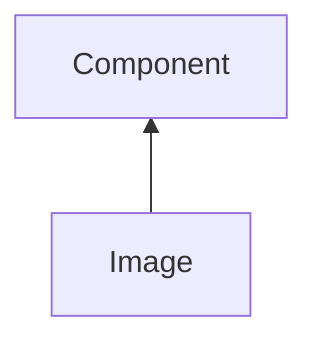

| public |
{:.api_label}

#### Inheritance Graph

## Description

## Public Functions

|
| ------: | ----------------- |
|  | |
|  | **[Image](#classGUI_1_1Image_1a5b3408ac068ccf56095094b315bea467)**( [GUI_Manager](classGUI_1_1GUI%5F%5FManager) & gui, const [Geometry::Rect](namespaceGeometry#namespaceGeometry_1acedeea2f6bddd99f077df6f73901a875) & relRect,  [flag_t](classGUI_1_1Component#classGUI_1_1Component_1aa86a1fd78119640545900da0f8f620bd)  flags) |
|  | |
|  | **[Image](#classGUI_1_1Image_1a905dd3789ef63d6801cef3b41a478b68)**( [GUI_Manager](classGUI_1_1GUI%5F%5FManager) & gui, const [Util::Bitmap](classUtil_1_1Bitmap) & bitmap,  [flag_t](classGUI_1_1Component#classGUI_1_1Component_1aa86a1fd78119640545900da0f8f620bd)  flags) |
|  | |
|  | **[~Image](#classGUI_1_1Image_1a159d8ff928300a1b77f6eaf1fbd24bec)**() |
|  | |
| [Util::Reference](classUtil_1_1Reference) < [Util::PixelAccessor](classUtil_1_1PixelAccessor) > | **[createPixelAccessor](#classGUI_1_1Image_1a88744f059e2a8b473a230425127f47ef)**() |
|  | |
| void | **[dataChanged](#classGUI_1_1Image_1a39e1059b6110fdf736c4913c0406af0b)**() |
|  | |
| [ImageData](classGUI_1_1ImageData) * | **[getImageData](#classGUI_1_1Image_1aec6932eb2f9626667b6ff86aa1232b18)**() const |
|  | |
| const [Util::Reference](classUtil_1_1Reference) < [Util::Bitmap](classUtil_1_1Bitmap) > | **[getBitmap](#classGUI_1_1Image_1aa22f6ad6d87801522d24f1189bc5ac65)**() const |
|  | |
| void | **[updateData](#classGUI_1_1Image_1a79bd0fef4e3d509308753339ed317099)**(const [Util::Bitmap](classUtil_1_1Bitmap) & bitmap) |
{: .nohead .nowrap1 .api_section }

-------------------------------------------------------------------

## Documentation

### <small>function</small>  GUI::Image::Image {#classGUI_1_1Image_1a5b3408ac068ccf56095094b315bea467}

| public |
{:.api_label}

|
| ------: | ----------------- |
|  |
|  **[Image](#classGUI_1_1Image_1a5b3408ac068ccf56095094b315bea467)**( |  [GUI_Manager](classGUI_1_1GUI%5F%5FManager) & | **gui**, |
| | const [Geometry::Rect](namespaceGeometry#namespaceGeometry_1acedeea2f6bddd99f077df6f73901a875) & | **relRect**, |
| |  [flag_t](classGUI_1_1Component#classGUI_1_1Component_1aa86a1fd78119640545900da0f8f620bd)  | **flags** |
|   ) |
{: .nohead .nowrap1 .api_doc }

Defined in `GUI/Components/Image.h:40`{:style="float: right"}

-------------------------------------------------------------------

### <small>function</small>  GUI::Image::Image {#classGUI_1_1Image_1a905dd3789ef63d6801cef3b41a478b68}

| public |
{:.api_label}

|
| ------: | ----------------- |
|  |
|  **[Image](#classGUI_1_1Image_1a905dd3789ef63d6801cef3b41a478b68)**( |  [GUI_Manager](classGUI_1_1GUI%5F%5FManager) & | **gui**, |
| | const [Util::Bitmap](classUtil_1_1Bitmap) & | **bitmap**, |
| |  [flag_t](classGUI_1_1Component#classGUI_1_1Component_1aa86a1fd78119640545900da0f8f620bd)  | **flags** |
|   ) |
{: .nohead .nowrap1 .api_doc }

Defined in `GUI/Components/Image.h:41`{:style="float: right"}

-------------------------------------------------------------------

### <small>function</small>  GUI::Image::~Image {#classGUI_1_1Image_1a159d8ff928300a1b77f6eaf1fbd24bec}

| public | virtual |
{:.api_label}

|
| ------: | ----------------- |
|  |
|  **[~Image](#classGUI_1_1Image_1a159d8ff928300a1b77f6eaf1fbd24bec)**( |  ) |
{: .nohead .nowrap1 .api_doc }

Defined in `GUI/Components/Image.h:43`{:style="float: right"}

-------------------------------------------------------------------

### <small>function</small>  GUI::Image::createPixelAccessor {#classGUI_1_1Image_1a88744f059e2a8b473a230425127f47ef}

| public |
{:.api_label}

|
| ------: | ----------------- |
|  |
| [Util::Reference](classUtil_1_1Reference) < [Util::PixelAccessor](classUtil_1_1PixelAccessor) > **[createPixelAccessor](#classGUI_1_1Image_1a88744f059e2a8b473a230425127f47ef)**( |  ) |
{: .nohead .nowrap1 .api_doc }

Defined in `GUI/Components/Image.h:46`{:style="float: right"}

-------------------------------------------------------------------

### <small>function</small>  GUI::Image::dataChanged {#classGUI_1_1Image_1a39e1059b6110fdf736c4913c0406af0b}

| public | inline |
{:.api_label}

|
| ------: | ----------------- |
|  |
| void **[dataChanged](#classGUI_1_1Image_1a39e1059b6110fdf736c4913c0406af0b)**( |  ) |
{: .nohead .nowrap1 .api_doc }

Defined in `GUI/Components/Image.h:47`{:style="float: right"}

-------------------------------------------------------------------

### <small>function</small>  GUI::Image::getImageData {#classGUI_1_1Image_1aec6932eb2f9626667b6ff86aa1232b18}

| public | const | inline |
{:.api_label}

|
| ------: | ----------------- |
|  |
| [ImageData](classGUI_1_1ImageData) * **[getImageData](#classGUI_1_1Image_1aec6932eb2f9626667b6ff86aa1232b18)**( |  ) const |
{: .nohead .nowrap1 .api_doc }

Defined in `GUI/Components/Image.h:51`{:style="float: right"}

-------------------------------------------------------------------

### <small>function</small>  GUI::Image::getBitmap {#classGUI_1_1Image_1aa22f6ad6d87801522d24f1189bc5ac65}

| public | const | inline |
{:.api_label}

|
| ------: | ----------------- |
|  |
| const [Util::Reference](classUtil_1_1Reference) < [Util::Bitmap](classUtil_1_1Bitmap) > **[getBitmap](#classGUI_1_1Image_1aa22f6ad6d87801522d24f1189bc5ac65)**( |  ) const |
{: .nohead .nowrap1 .api_doc }

Defined in `GUI/Components/Image.h:52`{:style="float: right"}

-------------------------------------------------------------------

### <small>function</small>  GUI::Image::updateData {#classGUI_1_1Image_1a79bd0fef4e3d509308753339ed317099}

| public | inline |
{:.api_label}

|
| ------: | ----------------- |
|  |
| void **[updateData](#classGUI_1_1Image_1a79bd0fef4e3d509308753339ed317099)**( | const [Util::Bitmap](classUtil_1_1Bitmap) & | **bitmap** ) |
{: .nohead .nowrap1 .api_doc }

Defined in `GUI/Components/Image.h:55`{:style="float: right"}

-------------------------------------------------------------------

