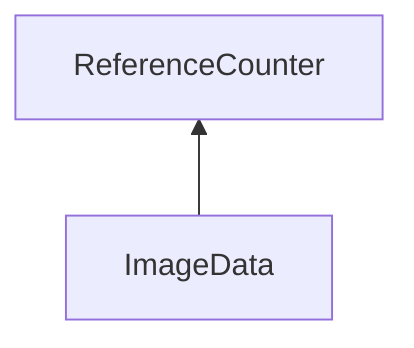

| public |
{:.api_label}

#### Inheritance Graph

## Description

## Public Functions

|
| ------: | ----------------- |
|  | |
|  | **[ImageData](#classGUI_1_1ImageData_1ac6d2d1e33d2c7edf4d18fa4bbafc7c10)**( [Util::Reference](classUtil_1_1Reference) < [Util::Bitmap](classUtil_1_1Bitmap) > _bitmap) |
|  | |
|  | **[~ImageData](#classGUI_1_1ImageData_1a9aa7629d5c047e9a593000b1d72da675)**() |
|  | |
| uint8_t * | **[getLocalData](#classGUI_1_1ImageData_1a80ba3d87e3d34530763c9e83e4fb4d6c)**() |
|  | |
| const uint8_t * | **[getLocalData](#classGUI_1_1ImageData_1a48a0f83701d3ed0665447ff5d43a3f44)**() const |
|  | |
| const [Util::Reference](classUtil_1_1Reference) < [Util::Bitmap](classUtil_1_1Bitmap) > | **[getBitmap](#classGUI_1_1ImageData_1a05860593eee15dfd07ebca7d4cf2b2c8)**() const |
|  | |
| void | **[updateData](#classGUI_1_1ImageData_1acc350dde8812d26ca89305dae4dffa50)**(const [Util::Bitmap](classUtil_1_1Bitmap) & bitmap) |
|  | |
| bool | **[enable](#classGUI_1_1ImageData_1a45c56ac342f3027221ca1258988d9bd1)**() |
|  | |
| void | **[disable](#classGUI_1_1ImageData_1adc1eb50952d561322819e018b98912fb)**() |
|  | |
| void | **[dataChanged](#classGUI_1_1ImageData_1a3f8b7506654efd74044b09eff03c40d1)**() |
|  | |
| [Util::Reference](classUtil_1_1Reference) < [Util::PixelAccessor](classUtil_1_1PixelAccessor) > | **[createPixelAccessor](#classGUI_1_1ImageData_1a2cd0f7591c1757d79e600da58c079041)**() |
|  | |
| bool | **[uploadGLTexture](#classGUI_1_1ImageData_1a0c96e9a172a5d6304f1b97090e1d614f)**() |
|  | |
| void | **[removeGLData](#classGUI_1_1ImageData_1a1cfff2d326a0b306d8348ab4ab49d04a)**() |
|  | |
| uint32_t | **[getTextureId](#classGUI_1_1ImageData_1abf1683f93ba1fdf51d22f0db3f6a91ad)**() |
{: .nohead .nowrap1 .api_section }

-------------------------------------------------------------------

## Documentation

### <small>function</small>  GUI::ImageData::ImageData {#classGUI_1_1ImageData_1ac6d2d1e33d2c7edf4d18fa4bbafc7c10}

| public |
{:.api_label}

|
| ------: | ----------------- |
|  |
|  **[ImageData](#classGUI_1_1ImageData_1ac6d2d1e33d2c7edf4d18fa4bbafc7c10)**( |  [Util::Reference](classUtil_1_1Reference) < [Util::Bitmap](classUtil_1_1Bitmap) > | **_bitmap** ) |
{: .nohead .nowrap1 .api_doc }

Defined in `GUI/Base/ImageData.h:50`{:style="float: right"}

-------------------------------------------------------------------

### <small>function</small>  GUI::ImageData::~ImageData {#classGUI_1_1ImageData_1a9aa7629d5c047e9a593000b1d72da675}

| public |
{:.api_label}

|
| ------: | ----------------- |
|  |
|  **[~ImageData](#classGUI_1_1ImageData_1a9aa7629d5c047e9a593000b1d72da675)**( |  ) |
{: .nohead .nowrap1 .api_doc }

Defined in `GUI/Base/ImageData.h:54`{:style="float: right"}

-------------------------------------------------------------------

### <small>function</small>  GUI::ImageData::getLocalData {#classGUI_1_1ImageData_1a80ba3d87e3d34530763c9e83e4fb4d6c}

| public |
{:.api_label}

|
| ------: | ----------------- |
|  |
| uint8_t * **[getLocalData](#classGUI_1_1ImageData_1a80ba3d87e3d34530763c9e83e4fb4d6c)**( |  ) |
{: .nohead .nowrap1 .api_doc }

Defined in `GUI/Base/ImageData.h:57`{:style="float: right"}

-------------------------------------------------------------------

### <small>function</small>  GUI::ImageData::getLocalData {#classGUI_1_1ImageData_1a48a0f83701d3ed0665447ff5d43a3f44}

| public | const |
{:.api_label}

|
| ------: | ----------------- |
|  |
| const uint8_t * **[getLocalData](#classGUI_1_1ImageData_1a48a0f83701d3ed0665447ff5d43a3f44)**( |  ) const |
{: .nohead .nowrap1 .api_doc }

Defined in `GUI/Base/ImageData.h:58`{:style="float: right"}

-------------------------------------------------------------------

### <small>function</small>  GUI::ImageData::getBitmap {#classGUI_1_1ImageData_1a05860593eee15dfd07ebca7d4cf2b2c8}

| public | const |
{:.api_label}

|
| ------: | ----------------- |
|  |
| const [Util::Reference](classUtil_1_1Reference) < [Util::Bitmap](classUtil_1_1Bitmap) > **[getBitmap](#classGUI_1_1ImageData_1a05860593eee15dfd07ebca7d4cf2b2c8)**( |  ) const |
{: .nohead .nowrap1 .api_doc }

Defined in `GUI/Base/ImageData.h:60`{:style="float: right"}

-------------------------------------------------------------------

### <small>function</small>  GUI::ImageData::updateData {#classGUI_1_1ImageData_1acc350dde8812d26ca89305dae4dffa50}

| public |
{:.api_label}

|
| ------: | ----------------- |
|  |
| void **[updateData](#classGUI_1_1ImageData_1acc350dde8812d26ca89305dae4dffa50)**( | const [Util::Bitmap](classUtil_1_1Bitmap) & | **bitmap** ) |
{: .nohead .nowrap1 .api_doc }

Defined in `GUI/Base/ImageData.h:64`{:style="float: right"}

-------------------------------------------------------------------

### <small>function</small>  GUI::ImageData::enable {#classGUI_1_1ImageData_1a45c56ac342f3027221ca1258988d9bd1}

| public |
{:.api_label}

|
| ------: | ----------------- |
|  |
| bool **[enable](#classGUI_1_1ImageData_1a45c56ac342f3027221ca1258988d9bd1)**( |  ) |
{: .nohead .nowrap1 .api_doc }

Defined in `GUI/Base/ImageData.h:66`{:style="float: right"}

-------------------------------------------------------------------

### <small>function</small>  GUI::ImageData::disable {#classGUI_1_1ImageData_1adc1eb50952d561322819e018b98912fb}

| public |
{:.api_label}

|
| ------: | ----------------- |
|  |
| void **[disable](#classGUI_1_1ImageData_1adc1eb50952d561322819e018b98912fb)**( |  ) |
{: .nohead .nowrap1 .api_doc }

Defined in `GUI/Base/ImageData.h:67`{:style="float: right"}

-------------------------------------------------------------------

### <small>function</small>  GUI::ImageData::dataChanged {#classGUI_1_1ImageData_1a3f8b7506654efd74044b09eff03c40d1}

| public |
{:.api_label}

|
| ------: | ----------------- |
|  |
| void **[dataChanged](#classGUI_1_1ImageData_1a3f8b7506654efd74044b09eff03c40d1)**( |  ) |
{: .nohead .nowrap1 .api_doc }

Defined in `GUI/Base/ImageData.h:68`{:style="float: right"}

-------------------------------------------------------------------

### <small>function</small>  GUI::ImageData::createPixelAccessor {#classGUI_1_1ImageData_1a2cd0f7591c1757d79e600da58c079041}

| public |
{:.api_label}

|
| ------: | ----------------- |
|  |
| [Util::Reference](classUtil_1_1Reference) < [Util::PixelAccessor](classUtil_1_1PixelAccessor) > **[createPixelAccessor](#classGUI_1_1ImageData_1a2cd0f7591c1757d79e600da58c079041)**( |  ) |
{: .nohead .nowrap1 .api_doc }

Defined in `GUI/Base/ImageData.h:70`{:style="float: right"}

-------------------------------------------------------------------

### <small>function</small>  GUI::ImageData::uploadGLTexture {#classGUI_1_1ImageData_1a0c96e9a172a5d6304f1b97090e1d614f}

| public |
{:.api_label}

|
| ------: | ----------------- |
|  |
| bool **[uploadGLTexture](#classGUI_1_1ImageData_1a0c96e9a172a5d6304f1b97090e1d614f)**( |  ) |
{: .nohead .nowrap1 .api_doc }

Defined in `GUI/Base/ImageData.h:72`{:style="float: right"}

-------------------------------------------------------------------

### <small>function</small>  GUI::ImageData::removeGLData {#classGUI_1_1ImageData_1a1cfff2d326a0b306d8348ab4ab49d04a}

| public |
{:.api_label}

|
| ------: | ----------------- |
|  |
| void **[removeGLData](#classGUI_1_1ImageData_1a1cfff2d326a0b306d8348ab4ab49d04a)**( |  ) |
{: .nohead .nowrap1 .api_doc }

Defined in `GUI/Base/ImageData.h:73`{:style="float: right"}

-------------------------------------------------------------------

### <small>function</small>  GUI::ImageData::getTextureId {#classGUI_1_1ImageData_1abf1683f93ba1fdf51d22f0db3f6a91ad}

| public |
{:.api_label}

|
| ------: | ----------------- |
|  |
| uint32_t **[getTextureId](#classGUI_1_1ImageData_1abf1683f93ba1fdf51d22f0db3f6a91ad)**( |  ) |
{: .nohead .nowrap1 .api_doc }

Defined in `GUI/Base/ImageData.h:74`{:style="float: right"}

-------------------------------------------------------------------

