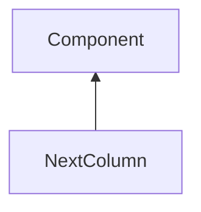

| public |
{:.api_label}

#### Inheritance Graph

## Description

## Public Attributes

|
| ------: | ----------------- |
|  | |
| float | **[additionalSpacing](#classGUI_1_1NextColumn_1ad225efdeb0891752ab15cffae88f1dd8)**  |
{: .nohead .nowrap1 .api_section }

## Public Functions

|
| ------: | ----------------- |
|  | |
|  | **[NextColumn](#classGUI_1_1NextColumn_1a104cfe9caa3a8edb086aac5d6f8dcf47)**( [GUI_Manager](classGUI_1_1GUI%5F%5FManager) & _gui, float _additionalSpacing) |
|  | |
|  | **[NextColumn](#classGUI_1_1NextColumn_1a813cb401303fb743c394875fa896e8fa)**(const [NextColumn](classGUI_1_1NextColumn) & c) |
|  | |
|  | **[~NextColumn](#classGUI_1_1NextColumn_1a02ef16a8b2beb944ad3899fde833aa4b)**() |
|  | |
| [Component](classGUI_1_1Component) * | **[clone](#classGUI_1_1NextColumn_1a091dec033cbe86ac0ea4b941ed54c587)**() const |
{: .nohead .nowrap1 .api_section }

-------------------------------------------------------------------

## Documentation

### <small>variable</small>  GUI::NextColumn::additionalSpacing {#classGUI_1_1NextColumn_1ad225efdeb0891752ab15cffae88f1dd8}

| public |
{:.api_label}

|
| ------: | ----------------- |
|  |
| float **[additionalSpacing](#classGUI_1_1NextColumn_1ad225efdeb0891752ab15cffae88f1dd8)**  |
{: .nohead .nowrap1 .api_doc }

Defined in `GUI/Components/LayoutHelper.h:40`{:style="float: right"}

-------------------------------------------------------------------

### <small>function</small>  GUI::NextColumn::NextColumn {#classGUI_1_1NextColumn_1a104cfe9caa3a8edb086aac5d6f8dcf47}

| public | inline |
{:.api_label}

|
| ------: | ----------------- |
|  |
|  **[NextColumn](#classGUI_1_1NextColumn_1a104cfe9caa3a8edb086aac5d6f8dcf47)**( |  [GUI_Manager](classGUI_1_1GUI%5F%5FManager) & | **_gui**, |
| | float | **_additionalSpacing** |
|   ) |
{: .nohead .nowrap1 .api_doc }

Defined in `GUI/Components/LayoutHelper.h:33`{:style="float: right"}

-------------------------------------------------------------------

### <small>function</small>  GUI::NextColumn::NextColumn {#classGUI_1_1NextColumn_1a813cb401303fb743c394875fa896e8fa}

| public | inline |
{:.api_label}

|
| ------: | ----------------- |
|  |
|  **[NextColumn](#classGUI_1_1NextColumn_1a813cb401303fb743c394875fa896e8fa)**( | const [NextColumn](classGUI_1_1NextColumn) & | **c** ) |
{: .nohead .nowrap1 .api_doc }

Defined in `GUI/Components/LayoutHelper.h:35`{:style="float: right"}

-------------------------------------------------------------------

### <small>function</small>  GUI::NextColumn::~NextColumn {#classGUI_1_1NextColumn_1a02ef16a8b2beb944ad3899fde833aa4b}

| public | inline | virtual |
{:.api_label}

|
| ------: | ----------------- |
|  |
|  **[~NextColumn](#classGUI_1_1NextColumn_1a02ef16a8b2beb944ad3899fde833aa4b)**( |  ) |
{: .nohead .nowrap1 .api_doc }

Defined in `GUI/Components/LayoutHelper.h:36`{:style="float: right"}

-------------------------------------------------------------------

### <small>function</small>  GUI::NextColumn::clone {#classGUI_1_1NextColumn_1a091dec033cbe86ac0ea4b941ed54c587}

| public | const | inline | virtual |
{:.api_label}

|
| ------: | ----------------- |
|  |
| [Component](classGUI_1_1Component) * **[clone](#classGUI_1_1NextColumn_1a091dec033cbe86ac0ea4b941ed54c587)**( |  ) const |
{: .nohead .nowrap1 .api_doc }

Defined in `GUI/Components/LayoutHelper.h:39`{:style="float: right"}

-------------------------------------------------------------------

