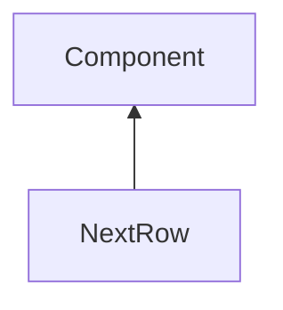

| public |
{:.api_label}

#### Inheritance Graph

## Description

## Public Attributes

|
| ------: | ----------------- |
|  | |
| float | **[additionalSpacing](#classGUI_1_1NextRow_1afb694a5e9d430e554c4a6a0afad45be4)**  |
{: .nohead .nowrap1 .api_section }

## Public Functions

|
| ------: | ----------------- |
|  | |
|  | **[NextRow](#classGUI_1_1NextRow_1af2f741996cb4c073f1ac191f40a3a4c3)**( [GUI_Manager](classGUI_1_1GUI%5F%5FManager) & _gui, float _additionalSpacing) |
|  | |
|  | **[NextRow](#classGUI_1_1NextRow_1ac800f4bd83c37e74fff48214d864ac44)**(const [NextRow](classGUI_1_1NextRow) & c) |
|  | |
|  | **[~NextRow](#classGUI_1_1NextRow_1ac4969bb9b836db3cc323afbf1933bf59)**() |
|  | |
| [Component](classGUI_1_1Component) * | **[clone](#classGUI_1_1NextRow_1a244e7a263d4b83b2f520a7bb1931c144)**() const |
{: .nohead .nowrap1 .api_section }

-------------------------------------------------------------------

## Documentation

### <small>variable</small>  GUI::NextRow::additionalSpacing {#classGUI_1_1NextRow_1afb694a5e9d430e554c4a6a0afad45be4}

| public |
{:.api_label}

|
| ------: | ----------------- |
|  |
| float **[additionalSpacing](#classGUI_1_1NextRow_1afb694a5e9d430e554c4a6a0afad45be4)**  |
{: .nohead .nowrap1 .api_doc }

Defined in `GUI/Components/LayoutHelper.h:27`{:style="float: right"}

-------------------------------------------------------------------

### <small>function</small>  GUI::NextRow::NextRow {#classGUI_1_1NextRow_1af2f741996cb4c073f1ac191f40a3a4c3}

| public | inline |
{:.api_label}

|
| ------: | ----------------- |
|  |
|  **[NextRow](#classGUI_1_1NextRow_1af2f741996cb4c073f1ac191f40a3a4c3)**( |  [GUI_Manager](classGUI_1_1GUI%5F%5FManager) & | **_gui**, |
| | float | **_additionalSpacing** |
|   ) |
{: .nohead .nowrap1 .api_doc }

Defined in `GUI/Components/LayoutHelper.h:21`{:style="float: right"}

-------------------------------------------------------------------

### <small>function</small>  GUI::NextRow::NextRow {#classGUI_1_1NextRow_1ac800f4bd83c37e74fff48214d864ac44}

| public | inline |
{:.api_label}

|
| ------: | ----------------- |
|  |
|  **[NextRow](#classGUI_1_1NextRow_1ac800f4bd83c37e74fff48214d864ac44)**( | const [NextRow](classGUI_1_1NextRow) & | **c** ) |
{: .nohead .nowrap1 .api_doc }

Defined in `GUI/Components/LayoutHelper.h:22`{:style="float: right"}

-------------------------------------------------------------------

### <small>function</small>  GUI::NextRow::~NextRow {#classGUI_1_1NextRow_1ac4969bb9b836db3cc323afbf1933bf59}

| public | inline | virtual |
{:.api_label}

|
| ------: | ----------------- |
|  |
|  **[~NextRow](#classGUI_1_1NextRow_1ac4969bb9b836db3cc323afbf1933bf59)**( |  ) |
{: .nohead .nowrap1 .api_doc }

Defined in `GUI/Components/LayoutHelper.h:23`{:style="float: right"}

-------------------------------------------------------------------

### <small>function</small>  GUI::NextRow::clone {#classGUI_1_1NextRow_1a244e7a263d4b83b2f520a7bb1931c144}

| public | const | inline | virtual |
{:.api_label}

|
| ------: | ----------------- |
|  |
| [Component](classGUI_1_1Component) * **[clone](#classGUI_1_1NextRow_1a244e7a263d4b83b2f520a7bb1931c144)**( |  ) const |
{: .nohead .nowrap1 .api_doc }

Defined in `GUI/Components/LayoutHelper.h:26`{:style="float: right"}

-------------------------------------------------------------------

