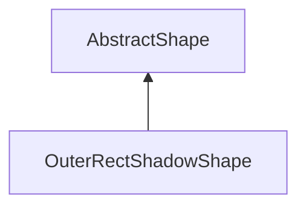

| public |
{:.api_label}

#### Inheritance Graph

## Description

[OuterRectShadowShape](classGUI_1_1OuterRectShadowShape) |> [AbstractShape](classGUI_1_1AbstractShape) .

## Public Attributes

|
| ------: | ----------------- |
|  | |
| float | **[size_top](#classGUI_1_1OuterRectShadowShape_1aa4f03abf10ad044f0b9b7054be71c2d6)**  |
|  | |
| float | **[size_bottom](#classGUI_1_1OuterRectShadowShape_1aa9c87d000ad92250794e83731216859e)**  |
|  | |
| float | **[size_left](#classGUI_1_1OuterRectShadowShape_1abd6ac402657ff684703816aff7d9e18c)**  |
|  | |
| float | **[size_right](#classGUI_1_1OuterRectShadowShape_1aaee998e3bc3b105ac9bf9fd74677248c)**  |
|  | |
| [Util::Color4ub](classUtil_1_1Color4ub) | **[color](#classGUI_1_1OuterRectShadowShape_1a4c3d94a19f53b23ffe934c82944fc6e3)**  |
{: .nohead .nowrap1 .api_section }

## Public Functions

|
| ------: | ----------------- |
|  | |
|  | **[OuterRectShadowShape](#classGUI_1_1OuterRectShadowShape_1a682b52acd7dec851a27cf93bd1fb5717)**(float _size_top, float _size_bottom, float _size_left, float _size_right,  [Util::Color4ub](classUtil_1_1Color4ub)  _color) |
|  | |
|  | **[~OuterRectShadowShape](#classGUI_1_1OuterRectShadowShape_1a443b0a9d3a32add1c62d208dc8c664d1)**() |
|  | |
| void | **[display](#classGUI_1_1OuterRectShadowShape_1a0ff250052dcdcc21d34f7d790b085de7)**(const [Geometry::Rect](namespaceGeometry#namespaceGeometry_1acedeea2f6bddd99f077df6f73901a875) & rect,  [flag_t](classGUI_1_1AbstractShape#classGUI_1_1AbstractShape_1a30ae7217ac48efbb16cf6053706fead5)  flag) |
|  | |
| [AbstractShape](classGUI_1_1AbstractShape) * | **[clone](#classGUI_1_1OuterRectShadowShape_1af6308f90494d0ea35c398a59a3ce29a3)**() |
{: .nohead .nowrap1 .api_section }

-------------------------------------------------------------------

## Documentation

### <small>variable</small>  GUI::OuterRectShadowShape::size_top {#classGUI_1_1OuterRectShadowShape_1aa4f03abf10ad044f0b9b7054be71c2d6}

| public |
{:.api_label}

|
| ------: | ----------------- |
|  |
| float **[size_top](#classGUI_1_1OuterRectShadowShape_1aa4f03abf10ad044f0b9b7054be71c2d6)**  |
{: .nohead .nowrap1 .api_doc }

Defined in `GUI/Style/StdShapes.h:80`{:style="float: right"}

-------------------------------------------------------------------

### <small>variable</small>  GUI::OuterRectShadowShape::size_bottom {#classGUI_1_1OuterRectShadowShape_1aa9c87d000ad92250794e83731216859e}

| public |
{:.api_label}

|
| ------: | ----------------- |
|  |
| float **[size_bottom](#classGUI_1_1OuterRectShadowShape_1aa9c87d000ad92250794e83731216859e)**  |
{: .nohead .nowrap1 .api_doc }

Defined in `GUI/Style/StdShapes.h:80`{:style="float: right"}

-------------------------------------------------------------------

### <small>variable</small>  GUI::OuterRectShadowShape::size_left {#classGUI_1_1OuterRectShadowShape_1abd6ac402657ff684703816aff7d9e18c}

| public |
{:.api_label}

|
| ------: | ----------------- |
|  |
| float **[size_left](#classGUI_1_1OuterRectShadowShape_1abd6ac402657ff684703816aff7d9e18c)**  |
{: .nohead .nowrap1 .api_doc }

Defined in `GUI/Style/StdShapes.h:80`{:style="float: right"}

-------------------------------------------------------------------

### <small>variable</small>  GUI::OuterRectShadowShape::size_right {#classGUI_1_1OuterRectShadowShape_1aaee998e3bc3b105ac9bf9fd74677248c}

| public |
{:.api_label}

|
| ------: | ----------------- |
|  |
| float **[size_right](#classGUI_1_1OuterRectShadowShape_1aaee998e3bc3b105ac9bf9fd74677248c)**  |
{: .nohead .nowrap1 .api_doc }

Defined in `GUI/Style/StdShapes.h:80`{:style="float: right"}

-------------------------------------------------------------------

### <small>variable</small>  GUI::OuterRectShadowShape::color {#classGUI_1_1OuterRectShadowShape_1a4c3d94a19f53b23ffe934c82944fc6e3}

| public |
{:.api_label}

|
| ------: | ----------------- |
|  |
| [Util::Color4ub](classUtil_1_1Color4ub) **[color](#classGUI_1_1OuterRectShadowShape_1a4c3d94a19f53b23ffe934c82944fc6e3)**  |
{: .nohead .nowrap1 .api_doc }

Defined in `GUI/Style/StdShapes.h:81`{:style="float: right"}

-------------------------------------------------------------------

### <small>function</small>  GUI::OuterRectShadowShape::OuterRectShadowShape {#classGUI_1_1OuterRectShadowShape_1a682b52acd7dec851a27cf93bd1fb5717}

| public | inline |
{:.api_label}

|
| ------: | ----------------- |
|  |
|  **[OuterRectShadowShape](#classGUI_1_1OuterRectShadowShape_1a682b52acd7dec851a27cf93bd1fb5717)**( | float | **_size_top**, |
| | float | **_size_bottom**, |
| | float | **_size_left**, |
| | float | **_size_right**, |
| |  [Util::Color4ub](classUtil_1_1Color4ub)  | **_color** |
|   ) |
{: .nohead .nowrap1 .api_doc }

Defined in `GUI/Style/StdShapes.h:72`{:style="float: right"}

-------------------------------------------------------------------

### <small>function</small>  GUI::OuterRectShadowShape::~OuterRectShadowShape {#classGUI_1_1OuterRectShadowShape_1a443b0a9d3a32add1c62d208dc8c664d1}

| public | inline | virtual |
{:.api_label}

|
| ------: | ----------------- |
|  |
|  **[~OuterRectShadowShape](#classGUI_1_1OuterRectShadowShape_1a443b0a9d3a32add1c62d208dc8c664d1)**( |  ) |
{: .nohead .nowrap1 .api_doc }

Defined in `GUI/Style/StdShapes.h:74`{:style="float: right"}

-------------------------------------------------------------------

### <small>function</small>  GUI::OuterRectShadowShape::display {#classGUI_1_1OuterRectShadowShape_1a0ff250052dcdcc21d34f7d790b085de7}

| public | virtual |
{:.api_label}

|
| ------: | ----------------- |
|  |
| void **[display](#classGUI_1_1OuterRectShadowShape_1a0ff250052dcdcc21d34f7d790b085de7)**( | const [Geometry::Rect](namespaceGeometry#namespaceGeometry_1acedeea2f6bddd99f077df6f73901a875) & | **rect**, |
| |  [flag_t](classGUI_1_1AbstractShape#classGUI_1_1AbstractShape_1a30ae7217ac48efbb16cf6053706fead5)  | **flag** |
|   ) |
{: .nohead .nowrap1 .api_doc }

Defined in `GUI/Style/StdShapes.h:77`{:style="float: right"}

-------------------------------------------------------------------

### <small>function</small>  GUI::OuterRectShadowShape::clone {#classGUI_1_1OuterRectShadowShape_1af6308f90494d0ea35c398a59a3ce29a3}

| public | inline | virtual |
{:.api_label}

|
| ------: | ----------------- |
|  |
| [AbstractShape](classGUI_1_1AbstractShape) * **[clone](#classGUI_1_1OuterRectShadowShape_1af6308f90494d0ea35c398a59a3ce29a3)**( |  ) |
{: .nohead .nowrap1 .api_doc }

Defined in `GUI/Style/StdShapes.h:78`{:style="float: right"}

-------------------------------------------------------------------

