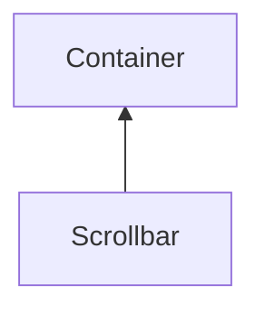

| public |
{:.api_label}

#### Inheritance Graph

## Description

## Public Static Attributes

|
| ------: | ----------------- |
|  | |
| const [flag_t](classGUI_1_1Component#classGUI_1_1Component_1aa86a1fd78119640545900da0f8f620bd) | **[VERTICAL](#classGUI_1_1Scrollbar_1ad918d06200ce2325517c9f7ae87423e6)**  |
{: .nohead .nowrap1 .api_section }

## Public Functions

|
| ------: | ----------------- |
|  | |
|  | **[Scrollbar](#classGUI_1_1Scrollbar_1ab834a3234b4a6d871931fa41410d727a)**( [GUI_Manager](classGUI_1_1GUI%5F%5FManager) & gui,  [flag_t](classGUI_1_1Component#classGUI_1_1Component_1aa86a1fd78119640545900da0f8f620bd)  flags) |
|  | |
|  | **[~Scrollbar](#classGUI_1_1Scrollbar_1a7167d62073191139c31eb4c12c1d8508)**() |
|  | |
| int | **[getMarkerSize](#classGUI_1_1Scrollbar_1aa2da0f7140f0516eea8933becf0e1776)**() const |
|  | |
| uint32_t | **[getMaxScrollPos](#classGUI_1_1Scrollbar_1a8f3480883e1484d7be6161905662b02c)**() const |
|  | |
| bool | **[isVertical](#classGUI_1_1Scrollbar_1a5cc51a19bd04886021e1236bae31e3b8)**() const |
|  | |
| void | **[setMaxScrollPos](#classGUI_1_1Scrollbar_1a700a0d5c4bfc58177cd79c6c0ac691e3)**(const uint32_t maxScrollPos) |
|  | |
| void | **[setScrollPos](#classGUI_1_1Scrollbar_1a4880592dbc661e60d23b97c5a00ab934)**(const uint32_t f) |
|  | |
| uint32_t | **[getScrollPos](#classGUI_1_1Scrollbar_1a331ec1c2d2f05c723e3c2cc85f411ebb)**() const |
|  | |
| void | **[updateScrollPos](#classGUI_1_1Scrollbar_1a1bddc4ea85d7c5a9413315eebec777d4)**(const int32_t f)   Sets the scrollPos and issues an dataChanged event to registered listeners. |
|  | |
| void | **[doLayout](#classGUI_1_1Scrollbar_1acc3a3a31479e289d285ae7387fe2be4c)**() |
{: .nohead .nowrap1 .api_section }

-------------------------------------------------------------------

## Documentation

### <small>variable</small>  GUI::Scrollbar::VERTICAL {#classGUI_1_1Scrollbar_1ad918d06200ce2325517c9f7ae87423e6}

| public | static |
{:.api_label}

|
| ------: | ----------------- |
|  |
| const [flag_t](classGUI_1_1Component#classGUI_1_1Component_1aa86a1fd78119640545900da0f8f620bd) **[VERTICAL](#classGUI_1_1Scrollbar_1ad918d06200ce2325517c9f7ae87423e6)**  |
{: .nohead .nowrap1 .api_doc }

Defined in `GUI/Components/Scrollbar.h:27`{:style="float: right"}

-------------------------------------------------------------------

### <small>function</small>  GUI::Scrollbar::Scrollbar {#classGUI_1_1Scrollbar_1ab834a3234b4a6d871931fa41410d727a}

| public |
{:.api_label}

|
| ------: | ----------------- |
|  |
|  **[Scrollbar](#classGUI_1_1Scrollbar_1ab834a3234b4a6d871931fa41410d727a)**( |  [GUI_Manager](classGUI_1_1GUI%5F%5FManager) & | **gui**, |
| |  [flag_t](classGUI_1_1Component#classGUI_1_1Component_1aa86a1fd78119640545900da0f8f620bd)  | **flags** |
|   ) |
{: .nohead .nowrap1 .api_doc }

Defined in `GUI/Components/Scrollbar.h:29`{:style="float: right"}

-------------------------------------------------------------------

### <small>function</small>  GUI::Scrollbar::~Scrollbar {#classGUI_1_1Scrollbar_1a7167d62073191139c31eb4c12c1d8508}

| public | virtual |
{:.api_label}

|
| ------: | ----------------- |
|  |
|  **[~Scrollbar](#classGUI_1_1Scrollbar_1a7167d62073191139c31eb4c12c1d8508)**( |  ) |
{: .nohead .nowrap1 .api_doc }

Defined in `GUI/Components/Scrollbar.h:30`{:style="float: right"}

-------------------------------------------------------------------

### <small>function</small>  GUI::Scrollbar::getMarkerSize {#classGUI_1_1Scrollbar_1aa2da0f7140f0516eea8933becf0e1776}

| public | const |
{:.api_label}

|
| ------: | ----------------- |
|  |
| int **[getMarkerSize](#classGUI_1_1Scrollbar_1aa2da0f7140f0516eea8933becf0e1776)**( |  ) const |
{: .nohead .nowrap1 .api_doc }

Defined in `GUI/Components/Scrollbar.h:32`{:style="float: right"}

-------------------------------------------------------------------

### <small>function</small>  GUI::Scrollbar::getMaxScrollPos {#classGUI_1_1Scrollbar_1a8f3480883e1484d7be6161905662b02c}

| public | const | inline |
{:.api_label}

|
| ------: | ----------------- |
|  |
| uint32_t **[getMaxScrollPos](#classGUI_1_1Scrollbar_1a8f3480883e1484d7be6161905662b02c)**( |  ) const |
{: .nohead .nowrap1 .api_doc }

Defined in `GUI/Components/Scrollbar.h:33`{:style="float: right"}

-------------------------------------------------------------------

### <small>function</small>  GUI::Scrollbar::isVertical {#classGUI_1_1Scrollbar_1a5cc51a19bd04886021e1236bae31e3b8}

| public | const | inline |
{:.api_label}

|
| ------: | ----------------- |
|  |
| bool **[isVertical](#classGUI_1_1Scrollbar_1a5cc51a19bd04886021e1236bae31e3b8)**( |  ) const |
{: .nohead .nowrap1 .api_doc }

Defined in `GUI/Components/Scrollbar.h:34`{:style="float: right"}

-------------------------------------------------------------------

### <small>function</small>  GUI::Scrollbar::setMaxScrollPos {#classGUI_1_1Scrollbar_1a700a0d5c4bfc58177cd79c6c0ac691e3}

| public |
{:.api_label}

|
| ------: | ----------------- |
|  |
| void **[setMaxScrollPos](#classGUI_1_1Scrollbar_1a700a0d5c4bfc58177cd79c6c0ac691e3)**( | const uint32_t | **maxScrollPos** ) |
{: .nohead .nowrap1 .api_doc }

Defined in `GUI/Components/Scrollbar.h:35`{:style="float: right"}

-------------------------------------------------------------------

### <small>function</small>  GUI::Scrollbar::setScrollPos {#classGUI_1_1Scrollbar_1a4880592dbc661e60d23b97c5a00ab934}

| public |
{:.api_label}

|
| ------: | ----------------- |
|  |
| void **[setScrollPos](#classGUI_1_1Scrollbar_1a4880592dbc661e60d23b97c5a00ab934)**( | const uint32_t | **f** ) |
{: .nohead .nowrap1 .api_doc }

Defined in `GUI/Components/Scrollbar.h:36`{:style="float: right"}

-------------------------------------------------------------------

### <small>function</small>  GUI::Scrollbar::getScrollPos {#classGUI_1_1Scrollbar_1a331ec1c2d2f05c723e3c2cc85f411ebb}

| public | const | inline |
{:.api_label}

|
| ------: | ----------------- |
|  |
| uint32_t **[getScrollPos](#classGUI_1_1Scrollbar_1a331ec1c2d2f05c723e3c2cc85f411ebb)**( |  ) const |
{: .nohead .nowrap1 .api_doc }

Defined in `GUI/Components/Scrollbar.h:37`{:style="float: right"}

-------------------------------------------------------------------

### <small>function</small>  GUI::Scrollbar::updateScrollPos {#classGUI_1_1Scrollbar_1a1bddc4ea85d7c5a9413315eebec777d4}

| public |
{:.api_label}

|
| ------: | ----------------- |
|  |
| void **[updateScrollPos](#classGUI_1_1Scrollbar_1a1bddc4ea85d7c5a9413315eebec777d4)**( | const int32_t | **f** ) |
{: .nohead .nowrap1 .api_doc }

Sets the scrollPos and issues an dataChanged event to registered listeners.

Defined in `GUI/Components/Scrollbar.h:40`{:style="float: right"}

-------------------------------------------------------------------

### <small>function</small>  GUI::Scrollbar::doLayout {#classGUI_1_1Scrollbar_1acc3a3a31479e289d285ae7387fe2be4c}

| public | virtual |
{:.api_label}

|
| ------: | ----------------- |
|  |
| void **[doLayout](#classGUI_1_1Scrollbar_1acc3a3a31479e289d285ae7387fe2be4c)**( |  ) |
{: .nohead .nowrap1 .api_doc }

Defined in `GUI/Components/Scrollbar.h:43`{:style="float: right"}

-------------------------------------------------------------------

