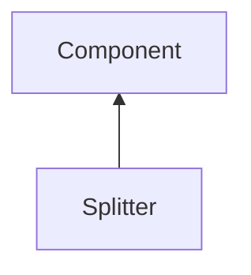

| public |
{:.api_label}

#### Inheritance Graph

## Description

Divides a container into two resizable parts. The [Splitter](classGUI_1_1Splitter) should always be the second child of overall three children of the parent. [Splitter](classGUI_1_1Splitter) |> [Component](classGUI_1_1Component) 

## Public Types

|
| ------: | ----------------- |
|  | |
| enum | **[splittingDirection_t](#classGUI_1_1Splitter_1a6ce1afcfe08b5200e8e2e8bafe9744ef)** {VERTICAL, HORIZONTAL} |
{: .nohead .nowrap1 .api_section }

## Public Functions

|
| ------: | ----------------- |
|  | |
|  | **[Splitter](#classGUI_1_1Splitter_1a84611a752f71cb4d8d3333d2eb169046)**( [GUI_Manager](classGUI_1_1GUI%5F%5FManager) & gui,  [splittingDirection_t](classGUI_1_1Splitter#classGUI_1_1Splitter_1a6ce1afcfe08b5200e8e2e8bafe9744ef)  _direction,  [flag_t](classGUI_1_1Component#classGUI_1_1Component_1aa86a1fd78119640545900da0f8f620bd)  flags) |
|  | |
|  | **[~Splitter](#classGUI_1_1Splitter_1a491fc5d860aede22c568904d902340bb)**() |
|  | |
| [splittingDirection_t](classGUI_1_1Splitter#classGUI_1_1Splitter_1a6ce1afcfe08b5200e8e2e8bafe9744ef) | **[getDirection](#classGUI_1_1Splitter_1a36ad70e005d25dae5eb979008a7d7cd3)**() const |
|  | |
| void | **[doLayout](#classGUI_1_1Splitter_1a716a8284c61cf5eca495d924aab175d3)**() |
{: .nohead .nowrap1 .api_section }

-------------------------------------------------------------------

## Documentation

### <small>enum</small>  GUI::Splitter::splittingDirection_t {#classGUI_1_1Splitter_1a6ce1afcfe08b5200e8e2e8bafe9744ef}

| public |
{:.api_label}

|
| ------: | ----------------- |
|  |
| enum **[splittingDirection_t](#classGUI_1_1Splitter_1a6ce1afcfe08b5200e8e2e8bafe9744ef)** |
{: .nohead .nowrap1 .api_doc }

| Enumerator |  | Description | 
| ---------- | -- | ----------- | 
| Enumerator |  | Description | 
| VERTICAL   |  |             | 
| HORIZONTAL |  |             | 

Defined in `GUI/Components/Splitter.h:28`{:style="float: right"}

-------------------------------------------------------------------

### <small>function</small>  GUI::Splitter::Splitter {#classGUI_1_1Splitter_1a84611a752f71cb4d8d3333d2eb169046}

| public |
{:.api_label}

|
| ------: | ----------------- |
|  |
|  **[Splitter](#classGUI_1_1Splitter_1a84611a752f71cb4d8d3333d2eb169046)**( |  [GUI_Manager](classGUI_1_1GUI%5F%5FManager) & | **gui**, |
| |  [splittingDirection_t](classGUI_1_1Splitter#classGUI_1_1Splitter_1a6ce1afcfe08b5200e8e2e8bafe9744ef)  | **_direction**, |
| |  [flag_t](classGUI_1_1Component#classGUI_1_1Component_1aa86a1fd78119640545900da0f8f620bd)  | **flags** |
|   ) |
{: .nohead .nowrap1 .api_doc }

Defined in `GUI/Components/Splitter.h:29`{:style="float: right"}

-------------------------------------------------------------------

### <small>function</small>  GUI::Splitter::~Splitter {#classGUI_1_1Splitter_1a491fc5d860aede22c568904d902340bb}

| public | virtual |
{:.api_label}

|
| ------: | ----------------- |
|  |
|  **[~Splitter](#classGUI_1_1Splitter_1a491fc5d860aede22c568904d902340bb)**( |  ) |
{: .nohead .nowrap1 .api_doc }

Defined in `GUI/Components/Splitter.h:30`{:style="float: right"}

-------------------------------------------------------------------

### <small>function</small>  GUI::Splitter::getDirection {#classGUI_1_1Splitter_1a36ad70e005d25dae5eb979008a7d7cd3}

| public | const | inline |
{:.api_label}

|
| ------: | ----------------- |
|  |
| [splittingDirection_t](classGUI_1_1Splitter#classGUI_1_1Splitter_1a6ce1afcfe08b5200e8e2e8bafe9744ef) **[getDirection](#classGUI_1_1Splitter_1a36ad70e005d25dae5eb979008a7d7cd3)**( |  ) const |
{: .nohead .nowrap1 .api_doc }

Defined in `GUI/Components/Splitter.h:32`{:style="float: right"}

-------------------------------------------------------------------

### <small>function</small>  GUI::Splitter::doLayout {#classGUI_1_1Splitter_1a716a8284c61cf5eca495d924aab175d3}

| public | virtual |
{:.api_label}

|
| ------: | ----------------- |
|  |
| void **[doLayout](#classGUI_1_1Splitter_1a716a8284c61cf5eca495d924aab175d3)**( |  ) |
{: .nohead .nowrap1 .api_doc }

Defined in `GUI/Components/Splitter.h:35`{:style="float: right"}

-------------------------------------------------------------------

