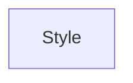

| public |
{:.api_label}

#### Inheritance Graph

## Description

## Public Static Functions

|
| ------: | ----------------- |
|  | |
| [AbstractShape](classGUI_1_1AbstractShape) * | **[createButtonShape](#classGUI_1_1Style_1a5303299be93da71bbcba251366cca319)**(float _roundnessTL, float _roundnessTR, float _roundnessBL, float _roundnessBR) |
|  | |
| [AbstractShape](classGUI_1_1AbstractShape) * | **[getButtonShape](#classGUI_1_1Style_1ad94ef54eb066a79c674a7ec8a106c8ab)**() |
|  | |
| void | **[initStyleManager](#classGUI_1_1Style_1ace8e9f979ddec646d7921dade46f2285)**( [StyleManager](classGUI_1_1StyleManager) & m) |
{: .nohead .nowrap1 .api_section }

-------------------------------------------------------------------

## Documentation

### <small>function</small>  GUI::Style::createButtonShape {#classGUI_1_1Style_1a5303299be93da71bbcba251366cca319}

| public | static |
{:.api_label}

|
| ------: | ----------------- |
|  |
| [AbstractShape](classGUI_1_1AbstractShape) * **[createButtonShape](#classGUI_1_1Style_1a5303299be93da71bbcba251366cca319)**( | float | **_roundnessTL**, |
| | float | **_roundnessTR**, |
| | float | **_roundnessBL**, |
| | float | **_roundnessBR** |
|   ) |
{: .nohead .nowrap1 .api_doc }

Defined in `GUI/Style/Style.h:33`{:style="float: right"}

-------------------------------------------------------------------

### <small>function</small>  GUI::Style::getButtonShape {#classGUI_1_1Style_1ad94ef54eb066a79c674a7ec8a106c8ab}

| public | static |
{:.api_label}

|
| ------: | ----------------- |
|  |
| [AbstractShape](classGUI_1_1AbstractShape) * **[getButtonShape](#classGUI_1_1Style_1ad94ef54eb066a79c674a7ec8a106c8ab)**( |  ) |
{: .nohead .nowrap1 .api_doc }

Defined in `GUI/Style/Style.h:35`{:style="float: right"}

-------------------------------------------------------------------

### <small>function</small>  GUI::Style::initStyleManager {#classGUI_1_1Style_1ace8e9f979ddec646d7921dade46f2285}

| public | static |
{:.api_label}

|
| ------: | ----------------- |
|  |
| void **[initStyleManager](#classGUI_1_1Style_1ace8e9f979ddec646d7921dade46f2285)**( |  [StyleManager](classGUI_1_1StyleManager) & | **m** ) |
{: .nohead .nowrap1 .api_doc }

Defined in `GUI/Style/Style.h:37`{:style="float: right"}

-------------------------------------------------------------------

