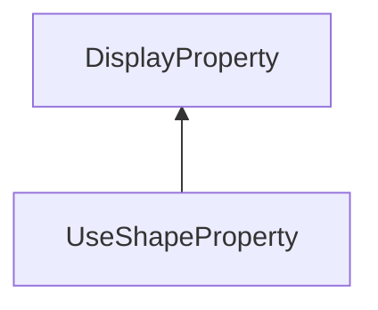

| public |
{:.api_label}

#### Inheritance Graph

## Description

 [UseShapeProperty](classGUI_1_1UseShapeProperty) |> [DisplayProperty](classGUI_1_1DisplayProperty) Apply the Shape of another property (prop2).

## Public Functions

|
| ------: | ----------------- |
|  | |
|  | **[UseShapeProperty](#classGUI_1_1UseShapeProperty_1ae3a6ce7f1d9fb6ff2aa0608e6bfa2581)**( [propertyId_t](namespaceGUI#namespaceGUI_1a1a514ecc9ea4ec5de3e7cf43a883e550)  _propertyId,  [propertyId_t](namespaceGUI#namespaceGUI_1a1a514ecc9ea4ec5de3e7cf43a883e550)  _prop2) |
|  | |
|  | **[~UseShapeProperty](#classGUI_1_1UseShapeProperty_1a5f868850e489e8e710d1d2a397c85c0c)**() |
|  | |
| void | **[doEnable](#classGUI_1_1UseShapeProperty_1a4101cf700439b008a3325f4d01b2affd)**( [StyleManager](classGUI_1_1StyleManager) & s)   |> [DisplayProperty](classGUI_1_1DisplayProperty) |
|  | |
| void | **[doDisable](#classGUI_1_1UseShapeProperty_1a8d23695b05523f3491f460669be22897)**( [StyleManager](classGUI_1_1StyleManager) & s) |
{: .nohead .nowrap1 .api_section }

-------------------------------------------------------------------

## Documentation

### <small>function</small>  GUI::UseShapeProperty::UseShapeProperty {#classGUI_1_1UseShapeProperty_1ae3a6ce7f1d9fb6ff2aa0608e6bfa2581}

| public | inline |
{:.api_label}

|
| ------: | ----------------- |
|  |
|  **[UseShapeProperty](#classGUI_1_1UseShapeProperty_1ae3a6ce7f1d9fb6ff2aa0608e6bfa2581)**( |  [propertyId_t](namespaceGUI#namespaceGUI_1a1a514ecc9ea4ec5de3e7cf43a883e550)  | **_propertyId**, |
| |  [propertyId_t](namespaceGUI#namespaceGUI_1a1a514ecc9ea4ec5de3e7cf43a883e550)  | **_prop2** |
|   ) |
{: .nohead .nowrap1 .api_doc }

Defined in `GUI/Base/Properties.h:94`{:style="float: right"}

-------------------------------------------------------------------

### <small>function</small>  GUI::UseShapeProperty::~UseShapeProperty {#classGUI_1_1UseShapeProperty_1a5f868850e489e8e710d1d2a397c85c0c}

| public | inline | virtual |
{:.api_label}

|
| ------: | ----------------- |
|  |
|  **[~UseShapeProperty](#classGUI_1_1UseShapeProperty_1a5f868850e489e8e710d1d2a397c85c0c)**( |  ) |
{: .nohead .nowrap1 .api_doc }

Defined in `GUI/Base/Properties.h:95`{:style="float: right"}

-------------------------------------------------------------------

### <small>function</small>  GUI::UseShapeProperty::doEnable {#classGUI_1_1UseShapeProperty_1a4101cf700439b008a3325f4d01b2affd}

| public | virtual |
{:.api_label}

|
| ------: | ----------------- |
|  |
| void **[doEnable](#classGUI_1_1UseShapeProperty_1a4101cf700439b008a3325f4d01b2affd)**( |  [StyleManager](classGUI_1_1StyleManager) & | **s** ) |
{: .nohead .nowrap1 .api_doc }

|> [DisplayProperty](classGUI_1_1DisplayProperty) 

Defined in `GUI/Base/Properties.h:98`{:style="float: right"}

-------------------------------------------------------------------

### <small>function</small>  GUI::UseShapeProperty::doDisable {#classGUI_1_1UseShapeProperty_1a8d23695b05523f3491f460669be22897}

| public | virtual |
{:.api_label}

|
| ------: | ----------------- |
|  |
| void **[doDisable](#classGUI_1_1UseShapeProperty_1a8d23695b05523f3491f460669be22897)**( |  [StyleManager](classGUI_1_1StyleManager) & | **s** ) |
{: .nohead .nowrap1 .api_doc }

Defined in `GUI/Base/Properties.h:99`{:style="float: right"}

-------------------------------------------------------------------

