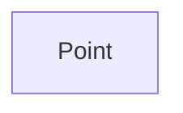

| public |
{:.api_label}

#### Inheritance Graph

## Description

Capsule for an immutable position.

**Author**: Benjamin Eikel, Claudius Jähn

**Date**: 2011-12-02

## Public Types

|
| ------: | ----------------- |
|  | |
| typedef Vector_t | **[vector_t](#classGeometry_1_1Point_1a4253e6c336d926234170c38e59511e5c)**  |
{: .nohead .nowrap1 .api_section }

## Public Functions

|
| ------: | ----------------- |
|  | |
|  | **[Point](#classGeometry_1_1Point_1adc516728aba4ba15574e45636a0a5494)**(const Vector_t & pos) |
|  | |
| bool | **[operator==](#classGeometry_1_1Point_1a3a026a9ff33325cb012c1b6e43b966c8)**(const [Point](classGeometry_1_1Point) & other) const |
|  | |
| const Vector_t & | **[getPosition](#classGeometry_1_1Point_1ac4c3c8df45a5935e7902a18c1f19b0d6)**() const |
{: .nohead .nowrap1 .api_section }

-------------------------------------------------------------------

## Documentation

### <small>typedef</small>  Geometry::Point::vector_t {#classGeometry_1_1Point_1a4253e6c336d926234170c38e59511e5c}

| public |
{:.api_label}

|
| ------: | ----------------- |
|  |
| typedef Vector_t **[vector_t](#classGeometry_1_1Point_1a4253e6c336d926234170c38e59511e5c)**  |
{: .nohead .nowrap1 .api_doc }

Defined in `Geometry/Point.h:28`{:style="float: right"}

-------------------------------------------------------------------

### <small>function</small>  Geometry::Point::Point {#classGeometry_1_1Point_1adc516728aba4ba15574e45636a0a5494}

| public | inline | explicit |
{:.api_label}

|
| ------: | ----------------- |
|  |
|  **[Point](#classGeometry_1_1Point_1adc516728aba4ba15574e45636a0a5494)**( | const Vector_t & | **pos** ) |
{: .nohead .nowrap1 .api_doc }

Defined in `Geometry/Point.h:30`{:style="float: right"}

-------------------------------------------------------------------

### <small>function</small>  Geometry::Point::operator== {#classGeometry_1_1Point_1a3a026a9ff33325cb012c1b6e43b966c8}

| public | const | inline |
{:.api_label}

|
| ------: | ----------------- |
|  |
| bool **[operator==](#classGeometry_1_1Point_1a3a026a9ff33325cb012c1b6e43b966c8)**( | const [Point](classGeometry_1_1Point) & | **other** ) const |
{: .nohead .nowrap1 .api_doc }

Defined in `Geometry/Point.h:33`{:style="float: right"}

-------------------------------------------------------------------

### <small>function</small>  Geometry::Point::getPosition {#classGeometry_1_1Point_1ac4c3c8df45a5935e7902a18c1f19b0d6}

| public | const | inline |
{:.api_label}

|
| ------: | ----------------- |
|  |
| const Vector_t & **[getPosition](#classGeometry_1_1Point_1ac4c3c8df45a5935e7902a18c1f19b0d6)**( |  ) const |
{: .nohead .nowrap1 .api_doc }

Defined in `Geometry/Point.h:37`{:style="float: right"}

-------------------------------------------------------------------

