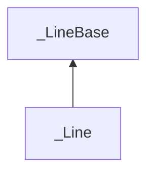

| public |
{:.api_label}

#### Inheritance Graph

## Description

Line defined by an*origin*and a*direction*. Points p on the line fulfill the equation p =*origin*+*direction** t for arbitrary values of t.

## Public Functions

|
| ------: | ----------------- |
|  | |
|  | **[_Line](#classGeometry_1_1%5F%5FLine_1a1859796b6efd7dd9c3e8e02318f8af39)**(const vec_t & _origin, const vec_t & _direction) |
|  | |
|  | **[_Line](#classGeometry_1_1%5F%5FLine_1ab5b2b2d543eaf07ebab9303383b63c1e)**() |
|  | |
| std::pair< value_t, value_t > | **[getClosestValues](#classGeometry_1_1%5F%5FLine_1ac624dc12faae6a5dadbe83dc11e33673)**(const [line_t](classGeometry_1_1%5F%5FLine) & lineB) const |
|  | |
| std::pair< value_t, value_t > | **[getClosestValues](#classGeometry_1_1%5F%5FLine_1af8414c49589cae947cc18566a8a6c614)**(const [ray_t](classGeometry_1_1%5F%5FRay) & ray) const |
|  | |
| vec_t | **[getClosestPointToRay](#classGeometry_1_1%5F%5FLine_1a60be3892674f49c17b98011d053c60b3)**(const [ray_t](classGeometry_1_1%5F%5FRay) & ray) const |
|  | |
| void | **[normalize](#classGeometry_1_1%5F%5FLine_1a5ea9f003cb98fee0dccaf3f2e2a5d942)**() |
|  | |
| void | **[setDirection](#classGeometry_1_1%5F%5FLine_1ac094dae4354c669ca113de715d27669b)**(const vec_t & newDirection) |
|  | |
| void | **[setOrigin](#classGeometry_1_1%5F%5FLine_1af18705bdfa1f4b17096ef49aca2f7c77)**(const vec_t & newOrigin) |
{: .nohead .nowrap1 .api_section }

-------------------------------------------------------------------

## Documentation

### <small>function</small>  Geometry::_Line::_Line {#classGeometry_1_1__Line_1a1859796b6efd7dd9c3e8e02318f8af39}

| public | inline |
{:.api_label}

|
| ------: | ----------------- |
|  |
|  **[_Line](#classGeometry_1_1%5F%5FLine_1a1859796b6efd7dd9c3e8e02318f8af39)**( | const vec_t & | **_origin**, |
| | const vec_t & | **_direction** |
|   ) |
{: .nohead .nowrap1 .api_doc }

Defined in `Geometry/Line.h:142`{:style="float: right"}

-------------------------------------------------------------------

### <small>function</small>  Geometry::_Line::_Line {#classGeometry_1_1__Line_1ab5b2b2d543eaf07ebab9303383b63c1e}

| public | inline |
{:.api_label}

|
| ------: | ----------------- |
|  |
|  **[_Line](#classGeometry_1_1%5F%5FLine_1ab5b2b2d543eaf07ebab9303383b63c1e)**( |  ) |
{: .nohead .nowrap1 .api_doc }

Defined in `Geometry/Line.h:146`{:style="float: right"}

-------------------------------------------------------------------

### <small>function</small>  Geometry::_Line::getClosestValues {#classGeometry_1_1__Line_1ac624dc12faae6a5dadbe83dc11e33673}

| public | const | inline |
{:.api_label}

|
| ------: | ----------------- |
|  |
| std::pair< value_t, value_t > **[getClosestValues](#classGeometry_1_1%5F%5FLine_1ac624dc12faae6a5dadbe83dc11e33673)**( | const [line_t](classGeometry_1_1%5F%5FLine) & | **lineB** ) const |
{: .nohead .nowrap1 .api_doc }

Calculate a pair of points (= values for points) on this line and the given*lineB*that is closest to each other.

#### Parameters
**lineB**
:  The second line

#### Returns
pair(parameterA,parameterB) Return value that can be used to calculate the point on the lines

> **Note**: The function* [_Line<_T>::getPoint](classGeometry_1_1%5F%5FLineBase#classGeometry_1_1%5F%5FLineBase_1a88fe304ea210b3731917159f07a43721) *can be used with the returned parameters as argument to calculate the points.

> **Note**: The direction vectors is required to have unit length.

**Author**: Benjamin Eikel

**Date**: 2010-10-14

Defined in `Geometry/Line.h:163`{:style="float: right"}

-------------------------------------------------------------------

### <small>function</small>  Geometry::_Line::getClosestValues {#classGeometry_1_1__Line_1af8414c49589cae947cc18566a8a6c614}

| public | const | inline |
{:.api_label}

|
| ------: | ----------------- |
|  |
| std::pair< value_t, value_t > **[getClosestValues](#classGeometry_1_1%5F%5FLine_1af8414c49589cae947cc18566a8a6c614)**( | const [ray_t](classGeometry_1_1%5F%5FRay) & | **ray** ) const |
{: .nohead .nowrap1 .api_doc }

Calculate a pair of points (= values for points) on this line and given*ray*that is closest to each other.

#### Parameters
**ray**
:  The ray

#### Returns
pair(parameterA,parameterB) Return value that can be used to calculate the point on the line and the ray

> **Note**: The function* [_Line<_T>::getPoint](classGeometry_1_1%5F%5FLineBase#classGeometry_1_1%5F%5FLineBase_1a88fe304ea210b3731917159f07a43721) *and* [_Ray<_T>::getPoint](classGeometry_1_1%5F%5FLineBase#classGeometry_1_1%5F%5FLineBase_1a88fe304ea210b3731917159f07a43721) *can be used with the returned parameters as argument to calculate the points.

> **Note**: The direction vectors is required to have unit length.

**Author**: Benjamin Eikel

**Date**: 2010-10-14

Defined in `Geometry/Line.h:206`{:style="float: right"}

-------------------------------------------------------------------

### <small>function</small>  Geometry::_Line::getClosestPointToRay {#classGeometry_1_1__Line_1a60be3892674f49c17b98011d053c60b3}

| public | const | inline |
{:.api_label}

|
| ------: | ----------------- |
|  |
| vec_t **[getClosestPointToRay](#classGeometry_1_1%5F%5FLine_1a60be3892674f49c17b98011d053c60b3)**( | const [ray_t](classGeometry_1_1%5F%5FRay) & | **ray** ) const |
{: .nohead .nowrap1 .api_doc }

Defined in `Geometry/Line.h:244`{:style="float: right"}

-------------------------------------------------------------------

### <small>function</small>  Geometry::_Line::normalize {#classGeometry_1_1__Line_1a5ea9f003cb98fee0dccaf3f2e2a5d942}

| public | inline |
{:.api_label}

|
| ------: | ----------------- |
|  |
| void **[normalize](#classGeometry_1_1%5F%5FLine_1a5ea9f003cb98fee0dccaf3f2e2a5d942)**( |  ) |
{: .nohead .nowrap1 .api_doc }

Defined in `Geometry/Line.h:248`{:style="float: right"}

-------------------------------------------------------------------

### <small>function</small>  Geometry::_Line::setDirection {#classGeometry_1_1__Line_1ac094dae4354c669ca113de715d27669b}

| public | inline |
{:.api_label}

|
| ------: | ----------------- |
|  |
| void **[setDirection](#classGeometry_1_1%5F%5FLine_1ac094dae4354c669ca113de715d27669b)**( | const vec_t & | **newDirection** ) |
{: .nohead .nowrap1 .api_doc }

Defined in `Geometry/Line.h:251`{:style="float: right"}

-------------------------------------------------------------------

### <small>function</small>  Geometry::_Line::setOrigin {#classGeometry_1_1__Line_1af18705bdfa1f4b17096ef49aca2f7c77}

| public | inline |
{:.api_label}

|
| ------: | ----------------- |
|  |
| void **[setOrigin](#classGeometry_1_1%5F%5FLine_1af18705bdfa1f4b17096ef49aca2f7c77)**( | const vec_t & | **newOrigin** ) |
{: .nohead .nowrap1 .api_doc }

Defined in `Geometry/Line.h:254`{:style="float: right"}

-------------------------------------------------------------------

