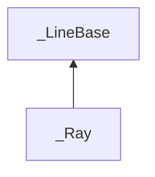

| public |
{:.api_label}

#### Inheritance Graph

## Description

Ray defined by an*origin*and a*direction*. Points p on the ray fulfill the equation p =*origin*+*direction** t for t >= 0.

## Public Functions

|
| ------: | ----------------- |
|  | |
|  | **[_Ray](#classGeometry_1_1%5F%5FRay_1a02dd637110702c8793cf531fca19b5c0)**(const vec_t & _origin, const vec_t & _direction) |
|  | |
|  | **[_Ray](#classGeometry_1_1%5F%5FRay_1a4f9695a834ef515dd5f2b74634a90765)**() |
|  | |
| std::pair< value_t, value_t > | **[getClosestValues](#classGeometry_1_1%5F%5FRay_1a422b77c0892781e857b1e0d9570aa7a2)**(const [_Line](classGeometry_1_1%5F%5FLine) < vec_t > & line) const |
|  | |
| void | **[normalize](#classGeometry_1_1%5F%5FRay_1aa4c957b80c46060c66808d9ec2285422)**() |
|  | |
| void | **[setDirection](#classGeometry_1_1%5F%5FRay_1aeb53f4a0c76a073b5d169dece15a55f1)**(const vec_t & newDirection) |
|  | |
| void | **[setOrigin](#classGeometry_1_1%5F%5FRay_1a9501d2dce297caa206aabf0a9983d59c)**(const vec_t & newOrigin) |
{: .nohead .nowrap1 .api_section }

-------------------------------------------------------------------

## Documentation

### <small>function</small>  Geometry::_Ray::_Ray {#classGeometry_1_1__Ray_1a02dd637110702c8793cf531fca19b5c0}

| public | inline |
{:.api_label}

|
| ------: | ----------------- |
|  |
|  **[_Ray](#classGeometry_1_1%5F%5FRay_1a02dd637110702c8793cf531fca19b5c0)**( | const vec_t & | **_origin**, |
| | const vec_t & | **_direction** |
|   ) |
{: .nohead .nowrap1 .api_doc }

Defined in `Geometry/Line.h:278`{:style="float: right"}

-------------------------------------------------------------------

### <small>function</small>  Geometry::_Ray::_Ray {#classGeometry_1_1__Ray_1a4f9695a834ef515dd5f2b74634a90765}

| public | inline |
{:.api_label}

|
| ------: | ----------------- |
|  |
|  **[_Ray](#classGeometry_1_1%5F%5FRay_1a4f9695a834ef515dd5f2b74634a90765)**( |  ) |
{: .nohead .nowrap1 .api_doc }

Defined in `Geometry/Line.h:281`{:style="float: right"}

-------------------------------------------------------------------

### <small>function</small>  Geometry::_Ray::getClosestValues {#classGeometry_1_1__Ray_1a422b77c0892781e857b1e0d9570aa7a2}

| public | const | inline |
{:.api_label}

|
| ------: | ----------------- |
|  |
| std::pair< value_t, value_t > **[getClosestValues](#classGeometry_1_1%5F%5FRay_1a422b77c0892781e857b1e0d9570aa7a2)**( | const [_Line](classGeometry_1_1%5F%5FLine) < vec_t > & | **line** ) const |
{: .nohead .nowrap1 .api_doc }

*See also*: _Line::getClosestValues(Ray)

Defined in `Geometry/Line.h:284`{:style="float: right"}

-------------------------------------------------------------------

### <small>function</small>  Geometry::_Ray::normalize {#classGeometry_1_1__Ray_1aa4c957b80c46060c66808d9ec2285422}

| public | inline |
{:.api_label}

|
| ------: | ----------------- |
|  |
| void **[normalize](#classGeometry_1_1%5F%5FRay_1aa4c957b80c46060c66808d9ec2285422)**( |  ) |
{: .nohead .nowrap1 .api_doc }

Defined in `Geometry/Line.h:288`{:style="float: right"}

-------------------------------------------------------------------

### <small>function</small>  Geometry::_Ray::setDirection {#classGeometry_1_1__Ray_1aeb53f4a0c76a073b5d169dece15a55f1}

| public | inline |
{:.api_label}

|
| ------: | ----------------- |
|  |
| void **[setDirection](#classGeometry_1_1%5F%5FRay_1aeb53f4a0c76a073b5d169dece15a55f1)**( | const vec_t & | **newDirection** ) |
{: .nohead .nowrap1 .api_doc }

Defined in `Geometry/Line.h:291`{:style="float: right"}

-------------------------------------------------------------------

### <small>function</small>  Geometry::_Ray::setOrigin {#classGeometry_1_1__Ray_1a9501d2dce297caa206aabf0a9983d59c}

| public | inline |
{:.api_label}

|
| ------: | ----------------- |
|  |
| void **[setOrigin](#classGeometry_1_1%5F%5FRay_1a9501d2dce297caa206aabf0a9983d59c)**( | const vec_t & | **newOrigin** ) |
{: .nohead .nowrap1 .api_doc }

Defined in `Geometry/Line.h:294`{:style="float: right"}

-------------------------------------------------------------------

