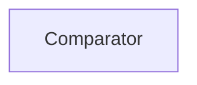

| public |
{:.api_label}

#### Inheritance Graph

## Description

comparator class for comparing vectors when using as key in a map or set comparison is done by values only not by pointers so different vectors with same values are equal

## Public Functions

|
| ------: | ----------------- |
|  | |
| bool | **[operator()](#classGeometry_1_1%5F%5FVec2_1_1Comparator_1ada26f4a71d92c9f9265df7fd66577d49)**(const [vec2_t](classGeometry_1_1%5F%5FVec2#classGeometry_1_1%5F%5FVec2_1a64037a3e8219bd00cef0f8db56482f00) & a, const [vec2_t](classGeometry_1_1%5F%5FVec2#classGeometry_1_1%5F%5FVec2_1a64037a3e8219bd00cef0f8db56482f00) & b) const |
|  | |
| bool | **[operator()](#classGeometry_1_1%5F%5FVec2_1_1Comparator_1a489a29915f7a079808427a5deef918da)**(const [vec2_t](classGeometry_1_1%5F%5FVec2#classGeometry_1_1%5F%5FVec2_1a64037a3e8219bd00cef0f8db56482f00) * a, const [vec2_t](classGeometry_1_1%5F%5FVec2#classGeometry_1_1%5F%5FVec2_1a64037a3e8219bd00cef0f8db56482f00) * b) const |
{: .nohead .nowrap1 .api_section }

-------------------------------------------------------------------

## Documentation

### <small>function</small>  Geometry::_Vec2::Comparator::operator() {#classGeometry_1_1__Vec2_1_1Comparator_1ada26f4a71d92c9f9265df7fd66577d49}

| public | const | inline |
{:.api_label}

|
| ------: | ----------------- |
|  |
| bool **[operator()](#classGeometry_1_1%5F%5FVec2_1_1Comparator_1ada26f4a71d92c9f9265df7fd66577d49)**( | const [vec2_t](classGeometry_1_1%5F%5FVec2#classGeometry_1_1%5F%5FVec2_1a64037a3e8219bd00cef0f8db56482f00) & | **a**, |
| | const [vec2_t](classGeometry_1_1%5F%5FVec2#classGeometry_1_1%5F%5FVec2_1a64037a3e8219bd00cef0f8db56482f00) & | **b** |
|   ) const |
{: .nohead .nowrap1 .api_doc }

Defined in `Geometry/Vec2.h:37`{:style="float: right"}

-------------------------------------------------------------------

### <small>function</small>  Geometry::_Vec2::Comparator::operator() {#classGeometry_1_1__Vec2_1_1Comparator_1a489a29915f7a079808427a5deef918da}

| public | const | inline |
{:.api_label}

|
| ------: | ----------------- |
|  |
| bool **[operator()](#classGeometry_1_1%5F%5FVec2_1_1Comparator_1a489a29915f7a079808427a5deef918da)**( | const [vec2_t](classGeometry_1_1%5F%5FVec2#classGeometry_1_1%5F%5FVec2_1a64037a3e8219bd00cef0f8db56482f00) * | **a**, |
| | const [vec2_t](classGeometry_1_1%5F%5FVec2#classGeometry_1_1%5F%5FVec2_1a64037a3e8219bd00cef0f8db56482f00) * | **b** |
|   ) const |
{: .nohead .nowrap1 .api_doc }

Defined in `Geometry/Vec2.h:43`{:style="float: right"}

-------------------------------------------------------------------

