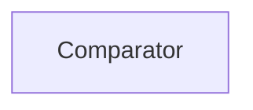

| public |
{:.api_label}

#### Inheritance Graph

## Description

comparator class for comparing vectors when using as key in a map or set comparison is done by values only not by pointers so different vectors with same values are equal

## Public Functions

|
| ------: | ----------------- |
|  | |
| bool | **[operator()](#classGeometry_1_1%5F%5FVec3_1_1Comparator_1aa8b5c61bf70bca249fe144d7f1439adf)**(const [vec3_t](classGeometry_1_1%5F%5FVec3#classGeometry_1_1%5F%5FVec3_1ab59ee3b31e4b941162cdd7bedaece403) & a, const [vec3_t](classGeometry_1_1%5F%5FVec3#classGeometry_1_1%5F%5FVec3_1ab59ee3b31e4b941162cdd7bedaece403) & b) const |
|  | |
| bool | **[operator()](#classGeometry_1_1%5F%5FVec3_1_1Comparator_1ac8251a8cbdd5f5b7ec441a6901990634)**(const [vec3_t](classGeometry_1_1%5F%5FVec3#classGeometry_1_1%5F%5FVec3_1ab59ee3b31e4b941162cdd7bedaece403) * a, const [vec3_t](classGeometry_1_1%5F%5FVec3#classGeometry_1_1%5F%5FVec3_1ab59ee3b31e4b941162cdd7bedaece403) * b) const |
{: .nohead .nowrap1 .api_section }

-------------------------------------------------------------------

## Documentation

### <small>function</small>  Geometry::_Vec3::Comparator::operator() {#classGeometry_1_1__Vec3_1_1Comparator_1aa8b5c61bf70bca249fe144d7f1439adf}

| public | const | inline |
{:.api_label}

|
| ------: | ----------------- |
|  |
| bool **[operator()](#classGeometry_1_1%5F%5FVec3_1_1Comparator_1aa8b5c61bf70bca249fe144d7f1439adf)**( | const [vec3_t](classGeometry_1_1%5F%5FVec3#classGeometry_1_1%5F%5FVec3_1ab59ee3b31e4b941162cdd7bedaece403) & | **a**, |
| | const [vec3_t](classGeometry_1_1%5F%5FVec3#classGeometry_1_1%5F%5FVec3_1ab59ee3b31e4b941162cdd7bedaece403) & | **b** |
|   ) const |
{: .nohead .nowrap1 .api_doc }

Defined in `Geometry/Vec3.h:40`{:style="float: right"}

-------------------------------------------------------------------

### <small>function</small>  Geometry::_Vec3::Comparator::operator() {#classGeometry_1_1__Vec3_1_1Comparator_1ac8251a8cbdd5f5b7ec441a6901990634}

| public | const | inline |
{:.api_label}

|
| ------: | ----------------- |
|  |
| bool **[operator()](#classGeometry_1_1%5F%5FVec3_1_1Comparator_1ac8251a8cbdd5f5b7ec441a6901990634)**( | const [vec3_t](classGeometry_1_1%5F%5FVec3#classGeometry_1_1%5F%5FVec3_1ab59ee3b31e4b941162cdd7bedaece403) * | **a**, |
| | const [vec3_t](classGeometry_1_1%5F%5FVec3#classGeometry_1_1%5F%5FVec3_1ab59ee3b31e4b941162cdd7bedaece403) * | **b** |
|   ) const |
{: .nohead .nowrap1 .api_doc }

Defined in `Geometry/Vec3.h:48`{:style="float: right"}

-------------------------------------------------------------------

