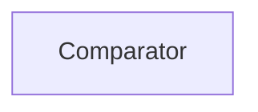

| public |
{:.api_label}

#### Inheritance Graph

## Description

comparator class for comparing vectors when using as key in a map or set comparison is done by values only not by pointers so different vectors with same values are equal

## Public Functions

|
| ------: | ----------------- |
|  | |
| bool | **[operator()](#classGeometry_1_1%5F%5FVec4_1_1Comparator_1ab410e62ab71257016d004133af7fb80e)**(const [_Vec4](classGeometry_1_1%5F%5FVec4) & a, const [_Vec4](classGeometry_1_1%5F%5FVec4) & b) const |
|  | |
| bool | **[operator()](#classGeometry_1_1%5F%5FVec4_1_1Comparator_1a480977c96fd62584076d6055f682d615)**(const [_Vec4](classGeometry_1_1%5F%5FVec4) * a, const [_Vec4](classGeometry_1_1%5F%5FVec4) * b) const |
{: .nohead .nowrap1 .api_section }

-------------------------------------------------------------------

## Documentation

### <small>function</small>  Geometry::_Vec4::Comparator::operator() {#classGeometry_1_1__Vec4_1_1Comparator_1ab410e62ab71257016d004133af7fb80e}

| public | const | inline |
{:.api_label}

|
| ------: | ----------------- |
|  |
| bool **[operator()](#classGeometry_1_1%5F%5FVec4_1_1Comparator_1ab410e62ab71257016d004133af7fb80e)**( | const [_Vec4](classGeometry_1_1%5F%5FVec4) & | **a**, |
| | const [_Vec4](classGeometry_1_1%5F%5FVec4) & | **b** |
|   ) const |
{: .nohead .nowrap1 .api_doc }

Defined in `Geometry/Vec4.h:40`{:style="float: right"}

-------------------------------------------------------------------

### <small>function</small>  Geometry::_Vec4::Comparator::operator() {#classGeometry_1_1__Vec4_1_1Comparator_1a480977c96fd62584076d6055f682d615}

| public | const | inline |
{:.api_label}

|
| ------: | ----------------- |
|  |
| bool **[operator()](#classGeometry_1_1%5F%5FVec4_1_1Comparator_1a480977c96fd62584076d6055f682d615)**( | const [_Vec4](classGeometry_1_1%5F%5FVec4) * | **a**, |
| | const [_Vec4](classGeometry_1_1%5F%5FVec4) * | **b** |
|   ) const |
{: .nohead .nowrap1 .api_doc }

Defined in `Geometry/Vec4.h:50`{:style="float: right"}

-------------------------------------------------------------------

