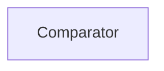

| public |
{:.api_label}

#### Inheritance Graph

## Description

comparator class for comparing vectors when using as key in a map or set comparison is done by values only not by pointers so different vectors with same values are equal

## Public Functions

|
| ------: | ----------------- |
|  | |
| bool | **[operator()](#classGeometry_1_1%5F%5FVecN_1_1Comparator_1ac50a0d8f5108fa5e83e41d1758406c18)**(const [vecN_t](classGeometry_1_1%5F%5FVecN#classGeometry_1_1%5F%5FVecN_1a5012b40a570072d45d606e92cac82d42) & a, const [vecN_t](classGeometry_1_1%5F%5FVecN#classGeometry_1_1%5F%5FVecN_1a5012b40a570072d45d606e92cac82d42) & b) const |
|  | |
| bool | **[operator()](#classGeometry_1_1%5F%5FVecN_1_1Comparator_1a2dc5bbf14a4a6c576cc571dcd9c09f28)**(const [vecN_t](classGeometry_1_1%5F%5FVecN#classGeometry_1_1%5F%5FVecN_1a5012b40a570072d45d606e92cac82d42) * a, const [vecN_t](classGeometry_1_1%5F%5FVecN#classGeometry_1_1%5F%5FVecN_1a5012b40a570072d45d606e92cac82d42) * b) const |
{: .nohead .nowrap1 .api_section }

-------------------------------------------------------------------

## Documentation

### <small>function</small>  Geometry::_VecN::Comparator::operator() {#classGeometry_1_1__VecN_1_1Comparator_1ac50a0d8f5108fa5e83e41d1758406c18}

| public | const | inline |
{:.api_label}

|
| ------: | ----------------- |
|  |
| bool **[operator()](#classGeometry_1_1%5F%5FVecN_1_1Comparator_1ac50a0d8f5108fa5e83e41d1758406c18)**( | const [vecN_t](classGeometry_1_1%5F%5FVecN#classGeometry_1_1%5F%5FVecN_1a5012b40a570072d45d606e92cac82d42) & | **a**, |
| | const [vecN_t](classGeometry_1_1%5F%5FVecN#classGeometry_1_1%5F%5FVecN_1a5012b40a570072d45d606e92cac82d42) & | **b** |
|   ) const |
{: .nohead .nowrap1 .api_doc }

Defined in `Geometry/VecN.h:45`{:style="float: right"}

-------------------------------------------------------------------

### <small>function</small>  Geometry::_VecN::Comparator::operator() {#classGeometry_1_1__VecN_1_1Comparator_1a2dc5bbf14a4a6c576cc571dcd9c09f28}

| public | const | inline |
{:.api_label}

|
| ------: | ----------------- |
|  |
| bool **[operator()](#classGeometry_1_1%5F%5FVecN_1_1Comparator_1a2dc5bbf14a4a6c576cc571dcd9c09f28)**( | const [vecN_t](classGeometry_1_1%5F%5FVecN#classGeometry_1_1%5F%5FVecN_1a5012b40a570072d45d606e92cac82d42) * | **a**, |
| | const [vecN_t](classGeometry_1_1%5F%5FVecN#classGeometry_1_1%5F%5FVecN_1a5012b40a570072d45d606e92cac82d42) * | **b** |
|   ) const |
{: .nohead .nowrap1 .api_doc }

Defined in `Geometry/VecN.h:61`{:style="float: right"}

-------------------------------------------------------------------

