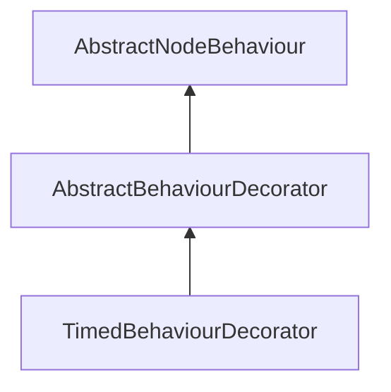

| public |
{:.api_label}

#### Inheritance Graph

## Description

## Public Functions

|
| ------: | ----------------- |
|  | |
|  | **[AbstractBehaviourDecorator](#classMinSG_1_1AbstractBehaviourDecorator_1a391a2b754449e8932652d819fcc60785)**( [AbstractBehaviour](classMinSG_1_1AbstractBehaviour) * decorated) |
|  | |
|  | **[~AbstractBehaviourDecorator](#classMinSG_1_1AbstractBehaviourDecorator_1a6549ac3cba89ec8ab7c0a385cbb5e393)**() |
|  | |
| [AbstractBehaviour](classMinSG_1_1AbstractBehaviour) * | **[getDecorated](#classMinSG_1_1AbstractBehaviourDecorator_1aff1207ada09fb12075803cb9e734ba01)**() |
|  | |
| [AbstractBehaviour](classMinSG_1_1AbstractBehaviour) * | **[getDecoratedRoot](#classMinSG_1_1AbstractBehaviourDecorator_1af50b005a2f13ce619cd50933ab3d4718)**() |
|  | |
| void | **[onNodeChanged](#classMinSG_1_1AbstractBehaviourDecorator_1a63d87cc95c1a3571aa02cb7b77c0d495)**( [Node](classMinSG_1_1Node) * void)   o |
{: .nohead .nowrap1 .api_section }

-------------------------------------------------------------------

## Documentation

### <small>function</small>  MinSG::AbstractBehaviourDecorator::AbstractBehaviourDecorator {#classMinSG_1_1AbstractBehaviourDecorator_1a391a2b754449e8932652d819fcc60785}

| public |
{:.api_label}

|
| ------: | ----------------- |
|  |
|  **[AbstractBehaviourDecorator](#classMinSG_1_1AbstractBehaviourDecorator_1a391a2b754449e8932652d819fcc60785)**( |  [AbstractBehaviour](classMinSG_1_1AbstractBehaviour) * | **decorated** ) |
{: .nohead .nowrap1 .api_doc }

Defined in `MinSG/Ext/Behaviours/AbstractBehaviourDecorator.h:23`{:style="float: right"}

-------------------------------------------------------------------

### <small>function</small>  MinSG::AbstractBehaviourDecorator::~AbstractBehaviourDecorator {#classMinSG_1_1AbstractBehaviourDecorator_1a6549ac3cba89ec8ab7c0a385cbb5e393}

| public | inline | virtual |
{:.api_label}

|
| ------: | ----------------- |
|  |
|  **[~AbstractBehaviourDecorator](#classMinSG_1_1AbstractBehaviourDecorator_1a6549ac3cba89ec8ab7c0a385cbb5e393)**( |  ) |
{: .nohead .nowrap1 .api_doc }

Defined in `MinSG/Ext/Behaviours/AbstractBehaviourDecorator.h:24`{:style="float: right"}

-------------------------------------------------------------------

### <small>function</small>  MinSG::AbstractBehaviourDecorator::getDecorated {#classMinSG_1_1AbstractBehaviourDecorator_1aff1207ada09fb12075803cb9e734ba01}

| public | inline |
{:.api_label}

|
| ------: | ----------------- |
|  |
| [AbstractBehaviour](classMinSG_1_1AbstractBehaviour) * **[getDecorated](#classMinSG_1_1AbstractBehaviourDecorator_1aff1207ada09fb12075803cb9e734ba01)**( |  ) |
{: .nohead .nowrap1 .api_doc }

Returns the decorated Behaviour.
#### Returns
 [AbstractBehaviour](classMinSG_1_1AbstractBehaviour) 

> **Note**: The returned Behaviour can be another decorator.

Defined in `MinSG/Ext/Behaviours/AbstractBehaviourDecorator.h:32`{:style="float: right"}

-------------------------------------------------------------------

### <small>function</small>  MinSG::AbstractBehaviourDecorator::getDecoratedRoot {#classMinSG_1_1AbstractBehaviourDecorator_1af50b005a2f13ce619cd50933ab3d4718}

| public |
{:.api_label}

|
| ------: | ----------------- |
|  |
| [AbstractBehaviour](classMinSG_1_1AbstractBehaviour) * **[getDecoratedRoot](#classMinSG_1_1AbstractBehaviourDecorator_1af50b005a2f13ce619cd50933ab3d4718)**( |  ) |
{: .nohead .nowrap1 .api_doc }

Returns the root of decorated behaviours
#### Returns
 [AbstractBehaviour](classMinSG_1_1AbstractBehaviour) 

> **Note**: When you have decorated decorators like Behaviour <Decorator1 <Decorator2 <Decorator3 this method returns the Behaviour at the top

Defined in `MinSG/Ext/Behaviours/AbstractBehaviourDecorator.h:42`{:style="float: right"}

-------------------------------------------------------------------

### <small>function</small>  MinSG::AbstractBehaviourDecorator::onNodeChanged {#classMinSG_1_1AbstractBehaviourDecorator_1a63d87cc95c1a3571aa02cb7b77c0d495}

| public | virtual |
{:.api_label}

|
| ------: | ----------------- |
|  |
| void **[onNodeChanged](#classMinSG_1_1AbstractBehaviourDecorator_1a63d87cc95c1a3571aa02cb7b77c0d495)**( |  [Node](classMinSG_1_1Node) * | **void** ) |
{: .nohead .nowrap1 .api_doc }

o

Defined in `MinSG/Ext/Behaviours/AbstractBehaviourDecorator.h:45`{:style="float: right"}

-------------------------------------------------------------------

