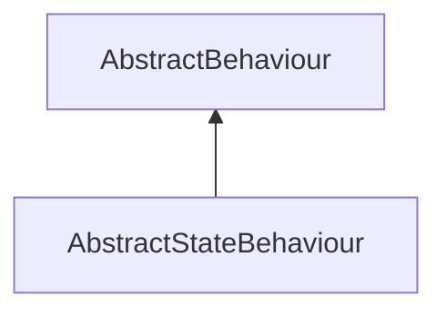

| public |
{:.api_label}

#### Inheritance Graph

## Description

## Public Functions

|
| ------: | ----------------- |
|  | |
|  | **[AbstractStateBehaviour](#classMinSG_1_1AbstractStateBehaviour_1adcddf6ae074f232025332b2da7fb32ad)**( [State](classMinSG_1_1State) * state) |
|  | |
|  | **[~AbstractStateBehaviour](#classMinSG_1_1AbstractStateBehaviour_1a510b2d400a25f8a825b4f45b5ba8d91e)**() |
|  | |
| [State](classMinSG_1_1State) * | **[getState](#classMinSG_1_1AbstractStateBehaviour_1a24142c4418161988f8381a8566749191)**() const |
{: .nohead .nowrap1 .api_section }

-------------------------------------------------------------------

## Documentation

### <small>function</small>  MinSG::AbstractStateBehaviour::AbstractStateBehaviour {#classMinSG_1_1AbstractStateBehaviour_1adcddf6ae074f232025332b2da7fb32ad}

| public |
{:.api_label}

|
| ------: | ----------------- |
|  |
|  **[AbstractStateBehaviour](#classMinSG_1_1AbstractStateBehaviour_1adcddf6ae074f232025332b2da7fb32ad)**( |  [State](classMinSG_1_1State) * | **state** ) |
{: .nohead .nowrap1 .api_doc }

Defined in `MinSG/Core/Behaviours/AbstractBehaviour.h:94`{:style="float: right"}

-------------------------------------------------------------------

### <small>function</small>  MinSG::AbstractStateBehaviour::~AbstractStateBehaviour {#classMinSG_1_1AbstractStateBehaviour_1a510b2d400a25f8a825b4f45b5ba8d91e}

| public | inline | virtual |
{:.api_label}

|
| ------: | ----------------- |
|  |
|  **[~AbstractStateBehaviour](#classMinSG_1_1AbstractStateBehaviour_1a510b2d400a25f8a825b4f45b5ba8d91e)**( |  ) |
{: .nohead .nowrap1 .api_doc }

Defined in `MinSG/Core/Behaviours/AbstractBehaviour.h:95`{:style="float: right"}

-------------------------------------------------------------------

### <small>function</small>  MinSG::AbstractStateBehaviour::getState {#classMinSG_1_1AbstractStateBehaviour_1a24142c4418161988f8381a8566749191}

| public | const |
{:.api_label}

|
| ------: | ----------------- |
|  |
| [State](classMinSG_1_1State) * **[getState](#classMinSG_1_1AbstractStateBehaviour_1a24142c4418161988f8381a8566749191)**( |  ) const |
{: .nohead .nowrap1 .api_doc }

Defined in `MinSG/Core/Behaviours/AbstractBehaviour.h:97`{:style="float: right"}

-------------------------------------------------------------------

