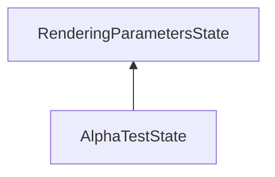

| public |
{:.api_label}

#### Inheritance Graph

## Description

## Public Functions

|
| ------: | ----------------- |
|  | |
|  | **[AlphaTestState](#classMinSG_1_1AlphaTestState_1a941c120fbe5657de3b749d5c554190d6)**() |
|  | |
|  | **[AlphaTestState](#classMinSG_1_1AlphaTestState_1a82ea68978043cc984e08884439b1938b)**(const [Rendering::AlphaTestParameters](classRendering_1_1AlphaTestParameters) & newParameter) |
|  | |
|  | **[AlphaTestState](#classMinSG_1_1AlphaTestState_1ab116e51a0369d225bfd46f76c02933e2)**(const [AlphaTestState](classMinSG_1_1AlphaTestState) & other) |
|  | |
|  | **[~AlphaTestState](#classMinSG_1_1AlphaTestState_1a3a5b9940f21600ea6159b8f6a8060668)**() |
|  | |
| [AlphaTestState](classMinSG_1_1AlphaTestState) * | **[clone](#classMinSG_1_1AlphaTestState_1a60126bc3ed18f83c83557f03bc434389)**() const   Create a duplicate of this [State](classMinSG_1_1State) object. |
{: .nohead .nowrap1 .api_section }

-------------------------------------------------------------------

## Documentation

### <small>function</small>  MinSG::AlphaTestState::AlphaTestState {#classMinSG_1_1AlphaTestState_1a941c120fbe5657de3b749d5c554190d6}

| public | inline |
{:.api_label}

|
| ------: | ----------------- |
|  |
|  **[AlphaTestState](#classMinSG_1_1AlphaTestState_1a941c120fbe5657de3b749d5c554190d6)**( |  ) |
{: .nohead .nowrap1 .api_doc }

Defined in `MinSG/Core/States/AlphaTestState.h:23`{:style="float: right"}

-------------------------------------------------------------------

### <small>function</small>  MinSG::AlphaTestState::AlphaTestState {#classMinSG_1_1AlphaTestState_1a82ea68978043cc984e08884439b1938b}

| public | inline | explicit |
{:.api_label}

|
| ------: | ----------------- |
|  |
|  **[AlphaTestState](#classMinSG_1_1AlphaTestState_1a82ea68978043cc984e08884439b1938b)**( | const [Rendering::AlphaTestParameters](classRendering_1_1AlphaTestParameters) & | **newParameter** ) |
{: .nohead .nowrap1 .api_doc }

Defined in `MinSG/Core/States/AlphaTestState.h:25`{:style="float: right"}

-------------------------------------------------------------------

### <small>function</small>  MinSG::AlphaTestState::AlphaTestState {#classMinSG_1_1AlphaTestState_1ab116e51a0369d225bfd46f76c02933e2}

| public | inline |
{:.api_label}

|
| ------: | ----------------- |
|  |
|  **[AlphaTestState](#classMinSG_1_1AlphaTestState_1ab116e51a0369d225bfd46f76c02933e2)**( | const [AlphaTestState](classMinSG_1_1AlphaTestState) & | **other** ) |
{: .nohead .nowrap1 .api_doc }

Defined in `MinSG/Core/States/AlphaTestState.h:27`{:style="float: right"}

-------------------------------------------------------------------

### <small>function</small>  MinSG::AlphaTestState::~AlphaTestState {#classMinSG_1_1AlphaTestState_1a3a5b9940f21600ea6159b8f6a8060668}

| public | inline | virtual |
{:.api_label}

|
| ------: | ----------------- |
|  |
|  **[~AlphaTestState](#classMinSG_1_1AlphaTestState_1a3a5b9940f21600ea6159b8f6a8060668)**( |  ) |
{: .nohead .nowrap1 .api_doc }

Defined in `MinSG/Core/States/AlphaTestState.h:29`{:style="float: right"}

-------------------------------------------------------------------

### <small>function</small>  MinSG::AlphaTestState::clone {#classMinSG_1_1AlphaTestState_1a60126bc3ed18f83c83557f03bc434389}

| public | const | inline | virtual |
{:.api_label}

|
| ------: | ----------------- |
|  |
| [AlphaTestState](classMinSG_1_1AlphaTestState) * **[clone](#classMinSG_1_1AlphaTestState_1a60126bc3ed18f83c83557f03bc434389)**( |  ) const |
{: .nohead .nowrap1 .api_doc }

Create a duplicate of this [State](classMinSG_1_1State) object.

Defined in `MinSG/Core/States/AlphaTestState.h:31`{:style="float: right"}

-------------------------------------------------------------------

