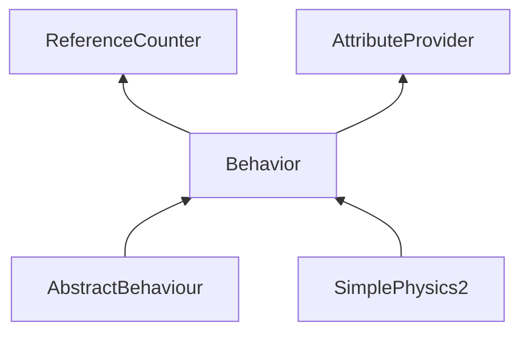

| public |
{:.api_label}

#### Inheritance Graph



## Description


 [Behavior](classMinSG_1_1Behavior) base class.

To start a behavior for an object (without BehaviorManager):

```cpp
Util::Reference<Behavior> b = new SpecificBehavior; // Create Behavior object (can be used for several objects)
auto status = b->createBehaviorStatus();            // Prepare BehaviorStatus for animated object 
Util::requireObjectExtension<BehaviorMyObjectReference>(status)->setMyObject(myObject); // start behavior for the object

while(!status.isFinished()){ // execute until finished
        status->getBehavior()->execute( *status.get(), getCurrentTime() );
        // ...
}

```


> **Note**: Use a BehaviorManager for managing behavior statuses.


## Public Types

|
| ------: | ----------------- |
|  | |
| enum | **[behaviourResult_t](#classMinSG_1_1Behavior_1afbd60a8df73dc581d2d00a1483f630ef)** {CONTINUE, FINISHED} |
|  | |
| typedef double | **[timestamp_t](#classMinSG_1_1Behavior_1a5a2c4437843f9fce32c9840894799c8f)**  |
{: .nohead .nowrap1 .api_section }


## Public Functions

|
| ------: | ----------------- |
|  | |
|  | **[Behavior](#classMinSG_1_1Behavior_1a98942bdc7589436fcd59eb55c8406dc5)**() <br/> (ctor) |
|  | |
|  | **[~Behavior](#classMinSG_1_1Behavior_1a3e960ccff7b59c90136ad35f3d15d361)**() <br/> (dtor) |
|  | |
| [Util::Reference](classUtil_1_1Reference) < [BehaviorStatus](classMinSG_1_1BehaviorStatus) > | **[createBehaviorStatus](#classMinSG_1_1Behavior_1a459c694c3cdb73ccba8a397e344b9f8e)**() |
|  | |
| [behaviourResult_t](classMinSG_1_1Behavior#classMinSG_1_1Behavior_1afbd60a8df73dc581d2d00a1483f630ef) | **[execute](#classMinSG_1_1Behavior_1ab4bae6705695178a5a9de818c21b700b)**( [BehaviorStatus](classMinSG_1_1BehaviorStatus) & state,  [timestamp_t](classMinSG_1_1Behavior#classMinSG_1_1Behavior_1a5a2c4437843f9fce32c9840894799c8f)  currentTimeSec) |
|  | |
| void | **[finalize](#classMinSG_1_1Behavior_1a186f3e008cce5c21064529fc163065a8)**( [BehaviorStatus](classMinSG_1_1BehaviorStatus) & state) |
{: .nohead .nowrap1 .api_section }


-------------------------------------------------------------------

## Documentation

### <small>enum</small><br/> MinSG::Behavior::behaviourResult_t {#classMinSG_1_1Behavior_1afbd60a8df73dc581d2d00a1483f630ef}

| public |
{:.api_label}

|
| ------: | ----------------- |
|  |
| enum **[behaviourResult_t](#classMinSG_1_1Behavior_1afbd60a8df73dc581d2d00a1483f630ef)** |
{: .nohead .nowrap1 .api_doc }

| Enumerator |  | Description | 
| ---------- | -- | ----------- | 
| Enumerator |  | Description | 
| CONTINUE   |  |             | 
| FINISHED   |  |             | 


<sub>Defined in `MinSG/Core/Behaviours/Behavior.h:47`</sub>{:style="float: right"}

-------------------------------------------------------------------

### <small>typedef</small><br/> MinSG::Behavior::timestamp_t {#classMinSG_1_1Behavior_1a5a2c4437843f9fce32c9840894799c8f}

| public |
{:.api_label}

|
| ------: | ----------------- |
|  |
| typedef double **[timestamp_t](#classMinSG_1_1Behavior_1a5a2c4437843f9fce32c9840894799c8f)**  |
{: .nohead .nowrap1 .api_doc }


<sub>Defined in `MinSG/Core/Behaviours/Behavior.h:46`</sub>{:style="float: right"}

-------------------------------------------------------------------

### <small>function</small><br/> MinSG::Behavior::Behavior {#classMinSG_1_1Behavior_1a98942bdc7589436fcd59eb55c8406dc5}

| public |
{:.api_label}

|
| ------: | ----------------- |
|  |
|  **[Behavior](#classMinSG_1_1Behavior_1a98942bdc7589436fcd59eb55c8406dc5)**( |  ) |
{: .nohead .nowrap1 .api_doc }

(ctor)


<sub>Defined in `MinSG/Core/Behaviours/Behavior.h:50`</sub>{:style="float: right"}

-------------------------------------------------------------------

### <small>function</small><br/> MinSG::Behavior::~Behavior {#classMinSG_1_1Behavior_1a3e960ccff7b59c90136ad35f3d15d361}

| public | inline | virtual |
{:.api_label}

|
| ------: | ----------------- |
|  |
|  **[~Behavior](#classMinSG_1_1Behavior_1a3e960ccff7b59c90136ad35f3d15d361)**( |  ) |
{: .nohead .nowrap1 .api_doc }

(dtor)


<sub>Defined in `MinSG/Core/Behaviours/Behavior.h:53`</sub>{:style="float: right"}

-------------------------------------------------------------------

### <small>function</small><br/> MinSG::Behavior::createBehaviorStatus {#classMinSG_1_1Behavior_1a459c694c3cdb73ccba8a397e344b9f8e}

| public |
{:.api_label}

|
| ------: | ----------------- |
|  |
| [Util::Reference](classUtil_1_1Reference) < [BehaviorStatus](classMinSG_1_1BehaviorStatus) > **[createBehaviorStatus](#classMinSG_1_1Behavior_1a459c694c3cdb73ccba8a397e344b9f8e)**( |  ) |
{: .nohead .nowrap1 .api_doc }


<sub>Defined in `MinSG/Core/Behaviours/Behavior.h:55`</sub>{:style="float: right"}

-------------------------------------------------------------------

### <small>function</small><br/> MinSG::Behavior::execute {#classMinSG_1_1Behavior_1ab4bae6705695178a5a9de818c21b700b}

| public |
{:.api_label}

|
| ------: | ----------------- |
|  |
| [behaviourResult_t](classMinSG_1_1Behavior#classMinSG_1_1Behavior_1afbd60a8df73dc581d2d00a1483f630ef) **[execute](#classMinSG_1_1Behavior_1ab4bae6705695178a5a9de818c21b700b)**( |  [BehaviorStatus](classMinSG_1_1BehaviorStatus) & | **state**, |
| |  [timestamp_t](classMinSG_1_1Behavior#classMinSG_1_1Behavior_1a5a2c4437843f9fce32c9840894799c8f)  | **currentTimeSec** |
|   ) |
{: .nohead .nowrap1 .api_doc }


<sub>Defined in `MinSG/Core/Behaviours/Behavior.h:56`</sub>{:style="float: right"}

-------------------------------------------------------------------

### <small>function</small><br/> MinSG::Behavior::finalize {#classMinSG_1_1Behavior_1a186f3e008cce5c21064529fc163065a8}

| public |
{:.api_label}

|
| ------: | ----------------- |
|  |
| void **[finalize](#classMinSG_1_1Behavior_1a186f3e008cce5c21064529fc163065a8)**( |  [BehaviorStatus](classMinSG_1_1BehaviorStatus) & | **state** ) |
{: .nohead .nowrap1 .api_doc }


Finalize the given BehaviorState.
> **Note**: An already finalized state is silently ignored.


<sub>Defined in `MinSG/Core/Behaviours/Behavior.h:60`</sub>{:style="float: right"}

-------------------------------------------------------------------

