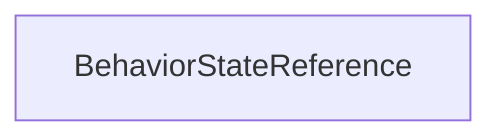

| public |
{:.api_label}

#### Inheritance Graph

## Description

## Public Functions

|
| ------: | ----------------- |
|  | |
| [State](classMinSG_1_1State) * | **[getState](#classMinSG_1_1BehaviorStateReference_1a92228c55b1f6e6e94f8916e6fa3e0ae3)**() const |
|  | |
| void | **[setState](#classMinSG_1_1BehaviorStateReference_1ad9b1adc3e4b6a3ce8839ec6324e6f7c2)**( [State](classMinSG_1_1State) * s) |
|  | |
| [State](classMinSG_1_1State) * | **[requireState](#classMinSG_1_1BehaviorStateReference_1a7db15003dcbb8bc88c6996f73bfc1258)**() const   Return the referenced [State](classMinSG_1_1State) or throw an exception if not set. |
{: .nohead .nowrap1 .api_section }

-------------------------------------------------------------------

## Documentation

### <small>function</small>  MinSG::BehaviorStateReference::getState {#classMinSG_1_1BehaviorStateReference_1a92228c55b1f6e6e94f8916e6fa3e0ae3}

| public | const | inline |
{:.api_label}

|
| ------: | ----------------- |
|  |
| [State](classMinSG_1_1State) * **[getState](#classMinSG_1_1BehaviorStateReference_1a92228c55b1f6e6e94f8916e6fa3e0ae3)**( |  ) const |
{: .nohead .nowrap1 .api_doc }

Defined in `MinSG/Core/Behaviours/BehaviorStatusExtensions.h:38`{:style="float: right"}

-------------------------------------------------------------------

### <small>function</small>  MinSG::BehaviorStateReference::setState {#classMinSG_1_1BehaviorStateReference_1ad9b1adc3e4b6a3ce8839ec6324e6f7c2}

| public | inline |
{:.api_label}

|
| ------: | ----------------- |
|  |
| void **[setState](#classMinSG_1_1BehaviorStateReference_1ad9b1adc3e4b6a3ce8839ec6324e6f7c2)**( |  [State](classMinSG_1_1State) * | **s** ) |
{: .nohead .nowrap1 .api_doc }

Defined in `MinSG/Core/Behaviours/BehaviorStatusExtensions.h:39`{:style="float: right"}

-------------------------------------------------------------------

### <small>function</small>  MinSG::BehaviorStateReference::requireState {#classMinSG_1_1BehaviorStateReference_1a7db15003dcbb8bc88c6996f73bfc1258}

| public | const |
{:.api_label}

|
| ------: | ----------------- |
|  |
| [State](classMinSG_1_1State) * **[requireState](#classMinSG_1_1BehaviorStateReference_1a7db15003dcbb8bc88c6996f73bfc1258)**( |  ) const |
{: .nohead .nowrap1 .api_doc }

Return the referenced [State](classMinSG_1_1State) or throw an exception if not set.

Defined in `MinSG/Core/Behaviours/BehaviorStatusExtensions.h:41`{:style="float: right"}

-------------------------------------------------------------------

