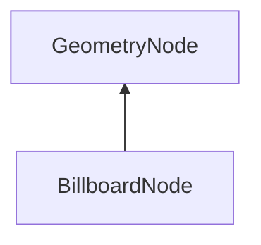

| public |
{:.api_label}

#### Inheritance Graph

## Description

A rectangle which automatically rotates to face the observer. [ [BillboardNode](classMinSG_1_1BillboardNode) ]> [ [GeometryNode](classMinSG_1_1GeometryNode) ]|> [ [Node](classMinSG_1_1Node) ] 2010-08-07 CJ

## Public Functions

|
| ------: | ----------------- |
|  | |
|  | **[BillboardNode](#classMinSG_1_1BillboardNode_1a680b23561e9da9ae6f34d2374140949b)**( [Geometry::Rect](namespaceGeometry#namespaceGeometry_1acedeea2f6bddd99f077df6f73901a875)  _rect, bool rotateUpAxis, bool rotateRightAxis) |
|  | |
|  | **[~BillboardNode](#classMinSG_1_1BillboardNode_1a1f3a2ce8fcc7a43588284aa521fb7cc8)**() |
|  | |
| const [Geometry::Rect](namespaceGeometry#namespaceGeometry_1acedeea2f6bddd99f077df6f73901a875) & | **[getRect](#classMinSG_1_1BillboardNode_1aabdf34d6c51e72107d7a9f40fd7a9f20)**() const |
|  | |
| void | **[setRect](#classMinSG_1_1BillboardNode_1a6a1e119183e8aa2bee5c597bf3c8e970)**( [Geometry::Rect](namespaceGeometry#namespaceGeometry_1acedeea2f6bddd99f077df6f73901a875)  _rect) |
|  | |
| bool | **[getRotateUpAxis](#classMinSG_1_1BillboardNode_1ae4964f2222a26a757e027b068ab7de92)**() const |
|  | |
| bool | **[getRotateRightAxis](#classMinSG_1_1BillboardNode_1a01059e4bbdc7344aded0043f7fd35630)**() const |
|  | |
| void | **[doDisplay](#classMinSG_1_1BillboardNode_1a46d30f745ee4fea2666d2d937a02bb6a)**( [FrameContext](classMinSG_1_1FrameContext) & context, const [RenderParam](classMinSG_1_1RenderParam) & rp)   |> [ [Node](classMinSG_1_1Node) ] |
{: .nohead .nowrap1 .api_section }

-------------------------------------------------------------------

## Documentation

### <small>function</small>  MinSG::BillboardNode::BillboardNode {#classMinSG_1_1BillboardNode_1a680b23561e9da9ae6f34d2374140949b}

| public |
{:.api_label}

|
| ------: | ----------------- |
|  |
|  **[BillboardNode](#classMinSG_1_1BillboardNode_1a680b23561e9da9ae6f34d2374140949b)**( |  [Geometry::Rect](namespaceGeometry#namespaceGeometry_1acedeea2f6bddd99f077df6f73901a875)  | **_rect**, |
| | bool | **rotateUpAxis**, |
| | bool | **rotateRightAxis** |
|   ) |
{: .nohead .nowrap1 .api_doc }

#### Parameters
**rotateUpAxis**
:  Orient the up-axis automatically orthogonal to the camera For clouds and fog probably "true", for trees and peoable probably "false"

**rotateRightAxis**
:  Orient the right-axis automatically orthogonal to the camera E.g. for multiscreen support

Defined in `MinSG/Ext/Nodes/BillboardNode.h:37`{:style="float: right"}

-------------------------------------------------------------------

### <small>function</small>  MinSG::BillboardNode::~BillboardNode {#classMinSG_1_1BillboardNode_1a1f3a2ce8fcc7a43588284aa521fb7cc8}

| public | virtual |
{:.api_label}

|
| ------: | ----------------- |
|  |
|  **[~BillboardNode](#classMinSG_1_1BillboardNode_1a1f3a2ce8fcc7a43588284aa521fb7cc8)**( |  ) |
{: .nohead .nowrap1 .api_doc }

Defined in `MinSG/Ext/Nodes/BillboardNode.h:38`{:style="float: right"}

-------------------------------------------------------------------

### <small>function</small>  MinSG::BillboardNode::getRect {#classMinSG_1_1BillboardNode_1aabdf34d6c51e72107d7a9f40fd7a9f20}

| public | const | inline |
{:.api_label}

|
| ------: | ----------------- |
|  |
| const [Geometry::Rect](namespaceGeometry#namespaceGeometry_1acedeea2f6bddd99f077df6f73901a875) & **[getRect](#classMinSG_1_1BillboardNode_1aabdf34d6c51e72107d7a9f40fd7a9f20)**( |  ) const |
{: .nohead .nowrap1 .api_doc }

Defined in `MinSG/Ext/Nodes/BillboardNode.h:40`{:style="float: right"}

-------------------------------------------------------------------

### <small>function</small>  MinSG::BillboardNode::setRect {#classMinSG_1_1BillboardNode_1a6a1e119183e8aa2bee5c597bf3c8e970}

| public |
{:.api_label}

|
| ------: | ----------------- |
|  |
| void **[setRect](#classMinSG_1_1BillboardNode_1a6a1e119183e8aa2bee5c597bf3c8e970)**( |  [Geometry::Rect](namespaceGeometry#namespaceGeometry_1acedeea2f6bddd99f077df6f73901a875)  | **_rect** ) |
{: .nohead .nowrap1 .api_doc }

Defined in `MinSG/Ext/Nodes/BillboardNode.h:41`{:style="float: right"}

-------------------------------------------------------------------

### <small>function</small>  MinSG::BillboardNode::getRotateUpAxis {#classMinSG_1_1BillboardNode_1ae4964f2222a26a757e027b068ab7de92}

| public | const | inline |
{:.api_label}

|
| ------: | ----------------- |
|  |
| bool **[getRotateUpAxis](#classMinSG_1_1BillboardNode_1ae4964f2222a26a757e027b068ab7de92)**( |  ) const |
{: .nohead .nowrap1 .api_doc }

Defined in `MinSG/Ext/Nodes/BillboardNode.h:42`{:style="float: right"}

-------------------------------------------------------------------

### <small>function</small>  MinSG::BillboardNode::getRotateRightAxis {#classMinSG_1_1BillboardNode_1a01059e4bbdc7344aded0043f7fd35630}

| public | const | inline |
{:.api_label}

|
| ------: | ----------------- |
|  |
| bool **[getRotateRightAxis](#classMinSG_1_1BillboardNode_1a01059e4bbdc7344aded0043f7fd35630)**( |  ) const |
{: .nohead .nowrap1 .api_doc }

Defined in `MinSG/Ext/Nodes/BillboardNode.h:43`{:style="float: right"}

-------------------------------------------------------------------

### <small>function</small>  MinSG::BillboardNode::doDisplay {#classMinSG_1_1BillboardNode_1a46d30f745ee4fea2666d2d937a02bb6a}

| public | virtual |
{:.api_label}

|
| ------: | ----------------- |
|  |
| void **[doDisplay](#classMinSG_1_1BillboardNode_1a46d30f745ee4fea2666d2d937a02bb6a)**( |  [FrameContext](classMinSG_1_1FrameContext) & | **context**, |
| | const [RenderParam](classMinSG_1_1RenderParam) & | **rp** |
|   ) |
{: .nohead .nowrap1 .api_doc }

|> [ [Node](classMinSG_1_1Node) ]

Defined in `MinSG/Ext/Nodes/BillboardNode.h:46`{:style="float: right"}

-------------------------------------------------------------------

