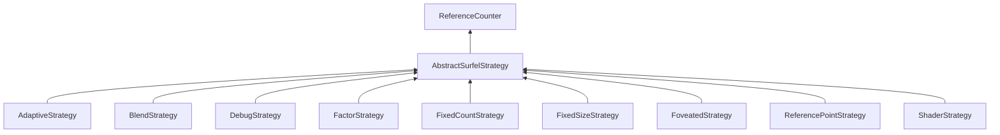

| public |
{:.api_label}

#### Inheritance Graph

## Description

## Public Functions

|
| ------: | ----------------- |
|  | |
|  | **[AbstractSurfelStrategy](#classMinSG_1_1BlueSurfels_1_1AbstractSurfelStrategy_1a28e5b914c2701ec0f89fabb3dbade906)**(float priority) |
|  | |
|  | **[~AbstractSurfelStrategy](#classMinSG_1_1BlueSurfels_1_1AbstractSurfelStrategy_1a035fffff406229656590878f85170a39)**() |
|  | |
| bool | **[prepare](#classMinSG_1_1BlueSurfels_1_1AbstractSurfelStrategy_1a0a9ea3dff3651213e3ae3c0a366261d6)**( [MinSG::FrameContext](classMinSG_1_1FrameContext) & context,  [MinSG::Node](classMinSG_1_1Node) * node) |
|  | |
| bool | **[update](#classMinSG_1_1BlueSurfels_1_1AbstractSurfelStrategy_1ae9c8cc7eb23f3de2a3aec216bc148e56)**( [MinSG::FrameContext](classMinSG_1_1FrameContext) & context,  [MinSG::Node](classMinSG_1_1Node) * node,  [SurfelObject](structMinSG_1_1BlueSurfels_1_1SurfelObject) & surfel) |
|  | |
| bool | **[beforeRendering](#classMinSG_1_1BlueSurfels_1_1AbstractSurfelStrategy_1a9466960ca11976292b2ca2ec148dfacd)**( [MinSG::FrameContext](classMinSG_1_1FrameContext) & context) |
|  | |
| void | **[afterRendering](#classMinSG_1_1BlueSurfels_1_1AbstractSurfelStrategy_1af0f27bbfeb335711651750726eb6891c)**( [MinSG::FrameContext](classMinSG_1_1FrameContext) & context) |
|  | |
| float | **[getPriority](#classMinSG_1_1BlueSurfels_1_1AbstractSurfelStrategy_1aaa99c2a1bee71f7d1c9d9e311570fb7b)**() const |
|  | |
| void | **[setEnabled](#classMinSG_1_1BlueSurfels_1_1AbstractSurfelStrategy_1a64bf9c0f2eecd581d8dec76a4b32f0f6)**(bool v) |
|  | |
| bool | **[isEnabled](#classMinSG_1_1BlueSurfels_1_1AbstractSurfelStrategy_1af72a28b486ab513f701a55de975e15a9)**() const |
{: .nohead .nowrap1 .api_section }

-------------------------------------------------------------------

## Documentation

### <small>function</small>  MinSG::BlueSurfels::AbstractSurfelStrategy::AbstractSurfelStrategy {#classMinSG_1_1BlueSurfels_1_1AbstractSurfelStrategy_1a28e5b914c2701ec0f89fabb3dbade906}

| public | inline |
{:.api_label}

|
| ------: | ----------------- |
|  |
|  **[AbstractSurfelStrategy](#classMinSG_1_1BlueSurfels_1_1AbstractSurfelStrategy_1a28e5b914c2701ec0f89fabb3dbade906)**( | float | **priority** ) |
{: .nohead .nowrap1 .api_doc }

Defined in `MinSG/Ext/BlueSurfels/Strategies/AbstractSurfelStrategy.h:56`{:style="float: right"}

-------------------------------------------------------------------

### <small>function</small>  MinSG::BlueSurfels::AbstractSurfelStrategy::~AbstractSurfelStrategy {#classMinSG_1_1BlueSurfels_1_1AbstractSurfelStrategy_1a035fffff406229656590878f85170a39}

| public | virtual |
{:.api_label}

|
| ------: | ----------------- |
|  |
|  **[~AbstractSurfelStrategy](#classMinSG_1_1BlueSurfels_1_1AbstractSurfelStrategy_1a035fffff406229656590878f85170a39)**( |  ) |
{: .nohead .nowrap1 .api_doc }

Defined in `MinSG/Ext/BlueSurfels/Strategies/AbstractSurfelStrategy.h:58`{:style="float: right"}

-------------------------------------------------------------------

### <small>function</small>  MinSG::BlueSurfels::AbstractSurfelStrategy::prepare {#classMinSG_1_1BlueSurfels_1_1AbstractSurfelStrategy_1a0a9ea3dff3651213e3ae3c0a366261d6}

| public | inline | virtual |
{:.api_label}

|
| ------: | ----------------- |
|  |
| bool **[prepare](#classMinSG_1_1BlueSurfels_1_1AbstractSurfelStrategy_1a0a9ea3dff3651213e3ae3c0a366261d6)**( |  [MinSG::FrameContext](classMinSG_1_1FrameContext) & | **context**, |
| |  [MinSG::Node](classMinSG_1_1Node) * | **node** |
|   ) |
{: .nohead .nowrap1 .api_doc }

Defined in `MinSG/Ext/BlueSurfels/Strategies/AbstractSurfelStrategy.h:59`{:style="float: right"}

-------------------------------------------------------------------

### <small>function</small>  MinSG::BlueSurfels::AbstractSurfelStrategy::update {#classMinSG_1_1BlueSurfels_1_1AbstractSurfelStrategy_1ae9c8cc7eb23f3de2a3aec216bc148e56}

| public | inline | virtual |
{:.api_label}

|
| ------: | ----------------- |
|  |
| bool **[update](#classMinSG_1_1BlueSurfels_1_1AbstractSurfelStrategy_1ae9c8cc7eb23f3de2a3aec216bc148e56)**( |  [MinSG::FrameContext](classMinSG_1_1FrameContext) & | **context**, |
| |  [MinSG::Node](classMinSG_1_1Node) * | **node**, |
| |  [SurfelObject](structMinSG_1_1BlueSurfels_1_1SurfelObject) & | **surfel** |
|   ) |
{: .nohead .nowrap1 .api_doc }

Defined in `MinSG/Ext/BlueSurfels/Strategies/AbstractSurfelStrategy.h:60`{:style="float: right"}

-------------------------------------------------------------------

### <small>function</small>  MinSG::BlueSurfels::AbstractSurfelStrategy::beforeRendering {#classMinSG_1_1BlueSurfels_1_1AbstractSurfelStrategy_1a9466960ca11976292b2ca2ec148dfacd}

| public | inline | virtual |
{:.api_label}

|
| ------: | ----------------- |
|  |
| bool **[beforeRendering](#classMinSG_1_1BlueSurfels_1_1AbstractSurfelStrategy_1a9466960ca11976292b2ca2ec148dfacd)**( |  [MinSG::FrameContext](classMinSG_1_1FrameContext) & | **context** ) |
{: .nohead .nowrap1 .api_doc }

Defined in `MinSG/Ext/BlueSurfels/Strategies/AbstractSurfelStrategy.h:61`{:style="float: right"}

-------------------------------------------------------------------

### <small>function</small>  MinSG::BlueSurfels::AbstractSurfelStrategy::afterRendering {#classMinSG_1_1BlueSurfels_1_1AbstractSurfelStrategy_1af0f27bbfeb335711651750726eb6891c}

| public | inline | virtual |
{:.api_label}

|
| ------: | ----------------- |
|  |
| void **[afterRendering](#classMinSG_1_1BlueSurfels_1_1AbstractSurfelStrategy_1af0f27bbfeb335711651750726eb6891c)**( |  [MinSG::FrameContext](classMinSG_1_1FrameContext) & | **context** ) |
{: .nohead .nowrap1 .api_doc }

Defined in `MinSG/Ext/BlueSurfels/Strategies/AbstractSurfelStrategy.h:62`{:style="float: right"}

-------------------------------------------------------------------

### <small>function</small>  MinSG::BlueSurfels::AbstractSurfelStrategy::getPriority {#classMinSG_1_1BlueSurfels_1_1AbstractSurfelStrategy_1aaa99c2a1bee71f7d1c9d9e311570fb7b}

| public | const | inline |
{:.api_label}

|
| ------: | ----------------- |
|  |
| float **[getPriority](#classMinSG_1_1BlueSurfels_1_1AbstractSurfelStrategy_1aaa99c2a1bee71f7d1c9d9e311570fb7b)**( |  ) const |
{: .nohead .nowrap1 .api_doc }

Defined in `MinSG/Ext/BlueSurfels/Strategies/AbstractSurfelStrategy.h:64`{:style="float: right"}

-------------------------------------------------------------------

### <small>function</small>  MinSG::BlueSurfels::AbstractSurfelStrategy::setEnabled {#classMinSG_1_1BlueSurfels_1_1AbstractSurfelStrategy_1a64bf9c0f2eecd581d8dec76a4b32f0f6}

| public | inline |
{:.api_label}

|
| ------: | ----------------- |
|  |
| void **[setEnabled](#classMinSG_1_1BlueSurfels_1_1AbstractSurfelStrategy_1a64bf9c0f2eecd581d8dec76a4b32f0f6)**( | bool | **v** ) |
{: .nohead .nowrap1 .api_doc }

Defined in `MinSG/Ext/BlueSurfels/Strategies/AbstractSurfelStrategy.h:65`{:style="float: right"}

-------------------------------------------------------------------

### <small>function</small>  MinSG::BlueSurfels::AbstractSurfelStrategy::isEnabled {#classMinSG_1_1BlueSurfels_1_1AbstractSurfelStrategy_1af72a28b486ab513f701a55de975e15a9}

| public | const | inline |
{:.api_label}

|
| ------: | ----------------- |
|  |
| bool **[isEnabled](#classMinSG_1_1BlueSurfels_1_1AbstractSurfelStrategy_1af72a28b486ab513f701a55de975e15a9)**( |  ) const |
{: .nohead .nowrap1 .api_doc }

Defined in `MinSG/Ext/BlueSurfels/Strategies/AbstractSurfelStrategy.h:66`{:style="float: right"}

-------------------------------------------------------------------

