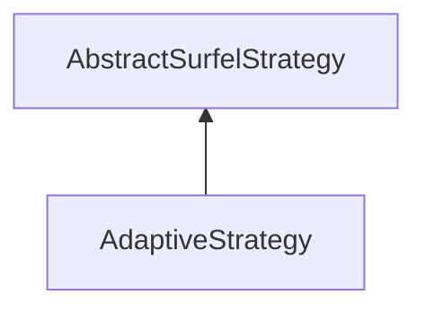

| public |
{:.api_label}

#### Inheritance Graph

## Description

## Public Functions

|
| ------: | ----------------- |
|  | |
|  | **[AdaptiveStrategy](#classMinSG_1_1BlueSurfels_1_1AdaptiveStrategy_1a4dea4f356a9f17adc201bf4819a8e855)**() |
|  | |
| bool | **[prepare](#classMinSG_1_1BlueSurfels_1_1AdaptiveStrategy_1a49e509ca508b2030e574c84f3c80d40e)**( [MinSG::FrameContext](classMinSG_1_1FrameContext) & context,  [MinSG::Node](classMinSG_1_1Node) * node) |
|  | |
| bool | **[update](#classMinSG_1_1BlueSurfels_1_1AdaptiveStrategy_1a178baef83f09a91e2228a83ff1192214)**( [MinSG::FrameContext](classMinSG_1_1FrameContext) & context,  [MinSG::Node](classMinSG_1_1Node) * node,  [SurfelObject](structMinSG_1_1BlueSurfels_1_1SurfelObject) & surfel) |
|  | |
| void | **[afterRendering](#classMinSG_1_1BlueSurfels_1_1AdaptiveStrategy_1ac15b1e6edb072d61af5d2c338efdf6c4)**( [MinSG::FrameContext](classMinSG_1_1FrameContext) & context) |
{: .nohead .nowrap1 .api_section }

-------------------------------------------------------------------

## Documentation

### <small>function</small>  MinSG::BlueSurfels::AdaptiveStrategy::AdaptiveStrategy {#classMinSG_1_1BlueSurfels_1_1AdaptiveStrategy_1a4dea4f356a9f17adc201bf4819a8e855}

| public | inline |
{:.api_label}

|
| ------: | ----------------- |
|  |
|  **[AdaptiveStrategy](#classMinSG_1_1BlueSurfels_1_1AdaptiveStrategy_1a4dea4f356a9f17adc201bf4819a8e855)**( |  ) |
{: .nohead .nowrap1 .api_doc }

Defined in `MinSG/Ext/BlueSurfels/Strategies/AdaptiveStrategy.h:25`{:style="float: right"}

-------------------------------------------------------------------

### <small>function</small>  MinSG::BlueSurfels::AdaptiveStrategy::prepare {#classMinSG_1_1BlueSurfels_1_1AdaptiveStrategy_1a49e509ca508b2030e574c84f3c80d40e}

| public | virtual |
{:.api_label}

|
| ------: | ----------------- |
|  |
| bool **[prepare](#classMinSG_1_1BlueSurfels_1_1AdaptiveStrategy_1a49e509ca508b2030e574c84f3c80d40e)**( |  [MinSG::FrameContext](classMinSG_1_1FrameContext) & | **context**, |
| |  [MinSG::Node](classMinSG_1_1Node) * | **node** |
|   ) |
{: .nohead .nowrap1 .api_doc }

Defined in `MinSG/Ext/BlueSurfels/Strategies/AdaptiveStrategy.h:26`{:style="float: right"}

-------------------------------------------------------------------

### <small>function</small>  MinSG::BlueSurfels::AdaptiveStrategy::update {#classMinSG_1_1BlueSurfels_1_1AdaptiveStrategy_1a178baef83f09a91e2228a83ff1192214}

| public | virtual |
{:.api_label}

|
| ------: | ----------------- |
|  |
| bool **[update](#classMinSG_1_1BlueSurfels_1_1AdaptiveStrategy_1a178baef83f09a91e2228a83ff1192214)**( |  [MinSG::FrameContext](classMinSG_1_1FrameContext) & | **context**, |
| |  [MinSG::Node](classMinSG_1_1Node) * | **node**, |
| |  [SurfelObject](structMinSG_1_1BlueSurfels_1_1SurfelObject) & | **surfel** |
|   ) |
{: .nohead .nowrap1 .api_doc }

Defined in `MinSG/Ext/BlueSurfels/Strategies/AdaptiveStrategy.h:27`{:style="float: right"}

-------------------------------------------------------------------

### <small>function</small>  MinSG::BlueSurfels::AdaptiveStrategy::afterRendering {#classMinSG_1_1BlueSurfels_1_1AdaptiveStrategy_1ac15b1e6edb072d61af5d2c338efdf6c4}

| public | virtual |
{:.api_label}

|
| ------: | ----------------- |
|  |
| void **[afterRendering](#classMinSG_1_1BlueSurfels_1_1AdaptiveStrategy_1ac15b1e6edb072d61af5d2c338efdf6c4)**( |  [MinSG::FrameContext](classMinSG_1_1FrameContext) & | **context** ) |
{: .nohead .nowrap1 .api_doc }

Defined in `MinSG/Ext/BlueSurfels/Strategies/AdaptiveStrategy.h:28`{:style="float: right"}

-------------------------------------------------------------------

