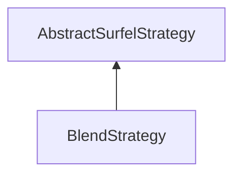

| public |
{:.api_label}

#### Inheritance Graph

## Description

## Public Functions

|
| ------: | ----------------- |
|  | |
|  | **[BlendStrategy](#classMinSG_1_1BlueSurfels_1_1BlendStrategy_1aa7188766275ca2d9f8498bc99cd9d3b7)**() |
|  | |
| bool | **[update](#classMinSG_1_1BlueSurfels_1_1BlendStrategy_1ae6c491527f44dfb1a722694f1ccb3a0e)**( [MinSG::FrameContext](classMinSG_1_1FrameContext) & context,  [MinSG::Node](classMinSG_1_1Node) * node,  [SurfelObject](structMinSG_1_1BlueSurfels_1_1SurfelObject) & surfel) |
{: .nohead .nowrap1 .api_section }

-------------------------------------------------------------------

## Documentation

### <small>function</small>  MinSG::BlueSurfels::BlendStrategy::BlendStrategy {#classMinSG_1_1BlueSurfels_1_1BlendStrategy_1aa7188766275ca2d9f8498bc99cd9d3b7}

| public | inline |
{:.api_label}

|
| ------: | ----------------- |
|  |
|  **[BlendStrategy](#classMinSG_1_1BlueSurfels_1_1BlendStrategy_1aa7188766275ca2d9f8498bc99cd9d3b7)**( |  ) |
{: .nohead .nowrap1 .api_doc }

Defined in `MinSG/Ext/BlueSurfels/Strategies/CommonStrategies.h:55`{:style="float: right"}

-------------------------------------------------------------------

### <small>function</small>  MinSG::BlueSurfels::BlendStrategy::update {#classMinSG_1_1BlueSurfels_1_1BlendStrategy_1ae6c491527f44dfb1a722694f1ccb3a0e}

| public | virtual |
{:.api_label}

|
| ------: | ----------------- |
|  |
| bool **[update](#classMinSG_1_1BlueSurfels_1_1BlendStrategy_1ae6c491527f44dfb1a722694f1ccb3a0e)**( |  [MinSG::FrameContext](classMinSG_1_1FrameContext) & | **context**, |
| |  [MinSG::Node](classMinSG_1_1Node) * | **node**, |
| |  [SurfelObject](structMinSG_1_1BlueSurfels_1_1SurfelObject) & | **surfel** |
|   ) |
{: .nohead .nowrap1 .api_doc }

Defined in `MinSG/Ext/BlueSurfels/Strategies/CommonStrategies.h:56`{:style="float: right"}

-------------------------------------------------------------------

