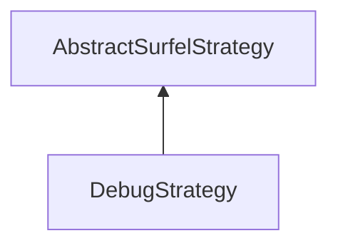

| public |
{:.api_label}

#### Inheritance Graph

## Description

## Public Functions

|
| ------: | ----------------- |
|  | |
|  | **[DebugStrategy](#classMinSG_1_1BlueSurfels_1_1DebugStrategy_1a458ccada0b856ad76e01e0acd570ac61)**() |
|  | |
| bool | **[prepare](#classMinSG_1_1BlueSurfels_1_1DebugStrategy_1a35c64a786acd3045a67eb95ceba4cc00)**( [MinSG::FrameContext](classMinSG_1_1FrameContext) & context,  [MinSG::Node](classMinSG_1_1Node) * node) |
|  | |
| bool | **[update](#classMinSG_1_1BlueSurfels_1_1DebugStrategy_1a248cb803bd664ba803cc9b8d302715d7)**( [MinSG::FrameContext](classMinSG_1_1FrameContext) & context,  [MinSG::Node](classMinSG_1_1Node) * node,  [SurfelObject](structMinSG_1_1BlueSurfels_1_1SurfelObject) & surfel) |
|  | |
| bool | **[beforeRendering](#classMinSG_1_1BlueSurfels_1_1DebugStrategy_1a47fa043044ac3a529995258212c9f2f3)**( [MinSG::FrameContext](classMinSG_1_1FrameContext) & context) |
|  | |
| void | **[afterRendering](#classMinSG_1_1BlueSurfels_1_1DebugStrategy_1a2fb8f263fd6ea79fc8c828e9a8a0d2fa)**( [MinSG::FrameContext](classMinSG_1_1FrameContext) & context) |
|  | |
| bool | **[getFixSurfels](#classMinSG_1_1BlueSurfels_1_1DebugStrategy_1a507088cd98467dfccaf2f222ecb1a841)**() const |
|  | |
| void | **[setFixSurfels](#classMinSG_1_1BlueSurfels_1_1DebugStrategy_1a9bad476421b2bc6f79fbfe78cd942191)**(bool value) |
|  | |
| void | **[setHeatmap](#classMinSG_1_1BlueSurfels_1_1DebugStrategy_1a96fa175b04441d9c69b11bbbac614911)**( [Rendering::Texture](classRendering_1_1Texture) * texture) |
|  | |
| [Rendering::Texture](classRendering_1_1Texture) * | **[getHeatmap](#classMinSG_1_1BlueSurfels_1_1DebugStrategy_1ae86fecedfe536338fa78cd2afe1534da)**() const |
{: .nohead .nowrap1 .api_section }

-------------------------------------------------------------------

## Documentation

### <small>function</small>  MinSG::BlueSurfels::DebugStrategy::DebugStrategy {#classMinSG_1_1BlueSurfels_1_1DebugStrategy_1a458ccada0b856ad76e01e0acd570ac61}

| public |
{:.api_label}

|
| ------: | ----------------- |
|  |
|  **[DebugStrategy](#classMinSG_1_1BlueSurfels_1_1DebugStrategy_1a458ccada0b856ad76e01e0acd570ac61)**( |  ) |
{: .nohead .nowrap1 .api_doc }

Defined in `MinSG/Ext/BlueSurfels/Strategies/CommonStrategies.h:71`{:style="float: right"}

-------------------------------------------------------------------

### <small>function</small>  MinSG::BlueSurfels::DebugStrategy::prepare {#classMinSG_1_1BlueSurfels_1_1DebugStrategy_1a35c64a786acd3045a67eb95ceba4cc00}

| public | virtual |
{:.api_label}

|
| ------: | ----------------- |
|  |
| bool **[prepare](#classMinSG_1_1BlueSurfels_1_1DebugStrategy_1a35c64a786acd3045a67eb95ceba4cc00)**( |  [MinSG::FrameContext](classMinSG_1_1FrameContext) & | **context**, |
| |  [MinSG::Node](classMinSG_1_1Node) * | **node** |
|   ) |
{: .nohead .nowrap1 .api_doc }

Defined in `MinSG/Ext/BlueSurfels/Strategies/CommonStrategies.h:72`{:style="float: right"}

-------------------------------------------------------------------

### <small>function</small>  MinSG::BlueSurfels::DebugStrategy::update {#classMinSG_1_1BlueSurfels_1_1DebugStrategy_1a248cb803bd664ba803cc9b8d302715d7}

| public | virtual |
{:.api_label}

|
| ------: | ----------------- |
|  |
| bool **[update](#classMinSG_1_1BlueSurfels_1_1DebugStrategy_1a248cb803bd664ba803cc9b8d302715d7)**( |  [MinSG::FrameContext](classMinSG_1_1FrameContext) & | **context**, |
| |  [MinSG::Node](classMinSG_1_1Node) * | **node**, |
| |  [SurfelObject](structMinSG_1_1BlueSurfels_1_1SurfelObject) & | **surfel** |
|   ) |
{: .nohead .nowrap1 .api_doc }

Defined in `MinSG/Ext/BlueSurfels/Strategies/CommonStrategies.h:73`{:style="float: right"}

-------------------------------------------------------------------

### <small>function</small>  MinSG::BlueSurfels::DebugStrategy::beforeRendering {#classMinSG_1_1BlueSurfels_1_1DebugStrategy_1a47fa043044ac3a529995258212c9f2f3}

| public | virtual |
{:.api_label}

|
| ------: | ----------------- |
|  |
| bool **[beforeRendering](#classMinSG_1_1BlueSurfels_1_1DebugStrategy_1a47fa043044ac3a529995258212c9f2f3)**( |  [MinSG::FrameContext](classMinSG_1_1FrameContext) & | **context** ) |
{: .nohead .nowrap1 .api_doc }

Defined in `MinSG/Ext/BlueSurfels/Strategies/CommonStrategies.h:74`{:style="float: right"}

-------------------------------------------------------------------

### <small>function</small>  MinSG::BlueSurfels::DebugStrategy::afterRendering {#classMinSG_1_1BlueSurfels_1_1DebugStrategy_1a2fb8f263fd6ea79fc8c828e9a8a0d2fa}

| public | virtual |
{:.api_label}

|
| ------: | ----------------- |
|  |
| void **[afterRendering](#classMinSG_1_1BlueSurfels_1_1DebugStrategy_1a2fb8f263fd6ea79fc8c828e9a8a0d2fa)**( |  [MinSG::FrameContext](classMinSG_1_1FrameContext) & | **context** ) |
{: .nohead .nowrap1 .api_doc }

Defined in `MinSG/Ext/BlueSurfels/Strategies/CommonStrategies.h:75`{:style="float: right"}

-------------------------------------------------------------------

### <small>function</small>  MinSG::BlueSurfels::DebugStrategy::getFixSurfels {#classMinSG_1_1BlueSurfels_1_1DebugStrategy_1a507088cd98467dfccaf2f222ecb1a841}

| public | const | inline |
{:.api_label}

|
| ------: | ----------------- |
|  |
| bool **[getFixSurfels](#classMinSG_1_1BlueSurfels_1_1DebugStrategy_1a507088cd98467dfccaf2f222ecb1a841)**( |  ) const |
{: .nohead .nowrap1 .api_doc }

Defined in `MinSG/Ext/BlueSurfels/Strategies/CommonStrategies.h:76`{:style="float: right"}

-------------------------------------------------------------------

### <small>function</small>  MinSG::BlueSurfels::DebugStrategy::setFixSurfels {#classMinSG_1_1BlueSurfels_1_1DebugStrategy_1a9bad476421b2bc6f79fbfe78cd942191}

| public |
{:.api_label}

|
| ------: | ----------------- |
|  |
| void **[setFixSurfels](#classMinSG_1_1BlueSurfels_1_1DebugStrategy_1a9bad476421b2bc6f79fbfe78cd942191)**( | bool | **value** ) |
{: .nohead .nowrap1 .api_doc }

Defined in `MinSG/Ext/BlueSurfels/Strategies/CommonStrategies.h:77`{:style="float: right"}

-------------------------------------------------------------------

### <small>function</small>  MinSG::BlueSurfels::DebugStrategy::setHeatmap {#classMinSG_1_1BlueSurfels_1_1DebugStrategy_1a96fa175b04441d9c69b11bbbac614911}

| public |
{:.api_label}

|
| ------: | ----------------- |
|  |
| void **[setHeatmap](#classMinSG_1_1BlueSurfels_1_1DebugStrategy_1a96fa175b04441d9c69b11bbbac614911)**( |  [Rendering::Texture](classRendering_1_1Texture) * | **texture** ) |
{: .nohead .nowrap1 .api_doc }

Defined in `MinSG/Ext/BlueSurfels/Strategies/CommonStrategies.h:81`{:style="float: right"}

-------------------------------------------------------------------

### <small>function</small>  MinSG::BlueSurfels::DebugStrategy::getHeatmap {#classMinSG_1_1BlueSurfels_1_1DebugStrategy_1ae86fecedfe536338fa78cd2afe1534da}

| public | const |
{:.api_label}

|
| ------: | ----------------- |
|  |
| [Rendering::Texture](classRendering_1_1Texture) * **[getHeatmap](#classMinSG_1_1BlueSurfels_1_1DebugStrategy_1ae86fecedfe536338fa78cd2afe1534da)**( |  ) const |
{: .nohead .nowrap1 .api_doc }

Defined in `MinSG/Ext/BlueSurfels/Strategies/CommonStrategies.h:82`{:style="float: right"}

-------------------------------------------------------------------

